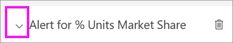
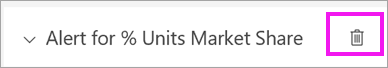

# Oktatóanyag: Riasztások beállítása Power BI-irányítópultokon

[!INCLUDE[consumer-appliesto-ynnn](../includes/consumer-appliesto-ynnn.md)]

[!INCLUDE [power-bi-service-new-look-include](../includes/power-bi-service-new-look-include.md)]

Riasztásokat állíthat be, amelyek figyelmeztetik, ha az irányítópultjain lévő adatok változásai a beállított korlátok alá vagy fölé esnek. Csak a jelentések vizualizációiról rögzített csempéken, és kizárólag mérőműszerekhez, KPI-khez és kártyákhoz állíthatók be riasztások. 

A *felhasználók* riasztásokat adhatnak hozzá a **Saját munkaterületen** létrehozott irányítópultokon található csempékhez. A *felhasználók* a [prémium szintű kapacitásban](end-user-license.md) velük megosztott irányítópultokon található csempékhez is hozzáadhatnak riasztásokat. Ha Power BI Pro-licenccel rendelkezik, bármely más munkaterületen lévő csempékhez is állíthat be riasztásokat.
Ezt a funkciót még fejlesztjük, ezért olvassa el [az alábbi Tippek és hibaelhárítás szakaszt](#tips-and-troubleshooting).

Mindenki csak a saját riasztásait látja, még az irányítópult megosztása esetén is. A rendszer teljes mértékben szinkronizálja az adatriasztásokat a platformok között, így [a Power BI mobilalkalmazásokban](mobile/mobile-set-data-alerts-in-the-mobile-apps.md) és a Power BI szolgáltatásban is beállíthatja és megtekintheti őket. 

> [!WARNING]
> Ezek a riasztások az adatokkal kapcsolatos információval szolgálnak. Ha Power BI-adatait egy mobileszközön követi, és az adott eszközt ellopják, javasoljuk, hogy a Power BI szolgáltatásban tiltsa le az összes riasztást.
> 

Ez az oktatóanyag a következőket mutatja be.
> [!div class="checklist"]
> * Ki állíthat be riasztásokat
> * Mely vizualizációk támogatják a riasztásokat
> * Kik láthatják a riasztásaimat
> * Működnek-e a riasztások a Power BI Desktopban és Mobile-ban
> * Riasztás létrehozásának módja
> * Hol fogom megkapni a riasztásaimat

Ha még nem regisztrált a Power BI-ra, a kezdés előtt [hozzon létre egy ingyenes próbaverziós fiókot](https://app.powerbi.com/signupredirect?pbi_source=web).

Ebben a példában egy irányítópult kártyacsempéjét használjuk az Értékesítés és Marketing mintaalkalmazásból. Ez az alkalmazás a [Microsoft AppSource-on](https://appsource.microsoft.com) érhető el. Az alkalmazás beszerzéséhez az [értékesítési és marketingalkalmazás telepítését és használatát](end-user-app-marketing.md) ismertető cikk nyújt segítséget.

1. Az irányítópult egyik mérőműszer-, KPI- vagy kártyacsempéjén kattintson a három pontra (…).
   
   
2. A harang ikon  vagy a **Riasztások kezelése** lehetőség kiválasztásával adhat hozzá egy vagy több riasztást a **% Units market share** (Egységek piaci részesedése %-ban) csempéhez.

   

   
1. A **Riasztások kezelése** panelen válassza a **+ Riasztási szabály hozzáadása** lehetőséget.  Ügyeljen rá, hogy a csúszka **Be** állásba legyen kapcsolva, és adjon címet a riasztásnak. A címek segítségével könnyebben felismerheti a riasztásokat.
   
   
4. Görgessen le, és adja meg a riasztás adatait.  Ebben a példában most egy olyan riasztást hozunk létre, amely naponta küld értesítést, ha a piaci részesedésünk eléri vagy meghaladja a 35 értéket. A riasztások az Értesítési központban jelennek meg. Azt is beállítjuk, hogy a Power BI egy e-mailt is küldjön.
   
   
5. Válassza a **Mentés és bezárás** lehetőséget.
 
   > [!NOTE]
   > A riasztások kizárólag a frissített adatokon működnek. Az egyes adatok frissítésekor a Power BI ellenőrzi, hogy az adott adathoz van-e beállítva riasztás. Ha az adott adat elérte a riasztási küszöböt, a riasztás aktiválódik. 
   > 

## Riasztások fogadása
Ha egy követett adat eléri valamelyik beállított küszöböt, több dolog történik. Először is a Power BI ellenőrzi, hogy eltelt-e legalább egy óra vagy 24 óra (a választott beállítástól függően) az utolsó riasztás óta. Ha az adat meghaladja a küszöböt, a rendszer mindenképp riasztást küld.

Ezután a Power BI egy riasztást küld az Értesítési központba, valamint választhatóan az e-mail-fiókjába is. Az egyes riasztásokban közvetlen hivatkozás mutat az adatokra. Kattintson a hivatkozásra a vonatkozó csempe megtekintéséhez.  

1. Ha úgy konfigurálta a riasztást, hogy az e-mailben is értesítse, valami ilyesmit talál majd a bejövő levelei közt. Ezt a riasztást egy másik irányítópulton állítottuk be. Ez az irányítópult a Használhatósági csapat által elvégzett feladatokat követi nyomon.
   
   
2. A Power BI egy üzenetet küld az **Értesítési központba**, és egy új riasztás ikont jelenít meg az érintett csempén.
   
   
3. A riasztás részleteinek megtekintéséhez nyissa meg az Értesítési központot.
   
    
   
  

## Riasztások kezelése

A riasztásokat többféle módon is kezelheti: Az irányítópult csempéjén, a Power BI-beállítások menüjében, illetve egy adott csempén az [iPhone-on futó Power BI Mobile alkalmazásban](mobile/mobile-set-data-alerts-in-the-mobile-apps.md) vagy a [Windows 10-hez készült Power BI Mobile alkalmazásban](mobile/mobile-set-data-alerts-in-the-mobile-apps.md).

### Magáról a csempéről

1. Ha módosítani vagy törölni szeretné egy adott csempe valamelyik riasztását, nyissa meg újra a **Riasztások kezelése** ablakot a harang ikon  kiválasztásával. Az adott csempéhez beállított összes riasztás megjelenik.
   
    .
2. A riasztás módosításához válassza a neve mellett balra található nyilat.
   
    .
3. A riasztás módosításához válassza a neve mellett jobbra található kukát.
   
      

### A Power BI Beállítások menüjéből

1. Kattintson a fogaskerék ikonra a Power BI menüsorán.
   
    .
2. A **Beállítások** alatt válassza a **Riasztások** elemet.
   
    
3. Erről a felületről be- és kikapcsolhatja a riasztásokat, megnyithatja a **Riasztások kezelése** ablakot a riasztás módosításához, vagy akár törölheti is a riasztást.

## Tippek és hibaelhárítás 

* Ha nem tud egy kijelzőre, KPI-re vagy kártyára vonatkozó riasztást beállítani, kérjen segítséget a bérlői rendszergazdától. Időnként a riasztások ki vannak kapcsolva, vagy nem érhetők el az irányítópulthoz vagy az irányítópult-csempék bizonyos típusaihoz.
* A riasztások kizárólag a frissített adatokon működnek. Statikus adatokon nem. A Microsoft által megadott minták többsége statikus. 
* Megosztott tartalom fogadásához és megtekintéséhez Power BI Pro vagy Prémium licenc szükséges. További információ: [Milyen licencem van?](end-user-license.md).
* A riasztások olyan vizualizációkon állíthatók be, amelyeket egy jelentésből egy irányítópulton rögzített streamelési adathalmazokból hozott létre. Nem állíthatók be riasztások a közvetlenül az irányítópulton, a **Csempe hozzáadása** > **Egyéni streamelési adatok** funkcióval létrehozott csempéken.

## Erőforrások felszabadítása
A riasztások törlésére vonatkozó utasítások fent olvashatók. Röviden összefoglalva válassza a fogaskerék ikont a Power BI menüsorán. A **Beállítások** alatt válassza a **Riasztások** elemet, és törölje a riasztást.

> [!div class="nextstepaction"]
> [Adatriasztások beállítása mobileszközökön](mobile/mobile-set-data-alerts-in-the-mobile-apps.md)

