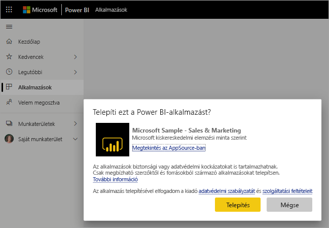

# Az értékesítési és marketing mintaalkalmazás telepítése és használata a Power BI szolgáltatásban

[!INCLUDE[consumer-appliesto-yyny](../includes/consumer-appliesto-yyny.md)]

Most, hogy már [ismeri a Power BI-tartalom beszerzésének alapjait](end-user-app-view.md), szerezze be a Marketing és értékesítési alkalmazást a Microsoft AppSource (appsource.com) webhelyről. 

## Microsoft AppSource (appsource.com)
Az alkalmazást ezzel a hivatkozással töltheti le: [Marketing és értékesítés alkalmazás](https://appsource.microsoft.com/product/power-bi/microsoft-retail-analysis-sample.salesandmarketingsample?tab=Overview). A hivatkozás kiválasztásával megnyílik az alkalmazás letöltési lapja Microsoft AppSource-on. 

1. Lehet, hogy az alkalmazás beszerzéséhez először be kell jelentkeznie. Jelentkezzen be ugyanazzal az e-mail-címmel, amelyet a Power BI-hoz használ. 

    

2. Válassza a **Letöltés most** lehetőséget. 

    

3. Ha első alkalommal jelentkezik be a AppSource-on, el kell fogadnia a használati feltételeket. 

    

4. Megnyílik a Power BI szolgáltatás. Erősítse meg, hogy telepíteni szeretné ezt az alkalmazást.

    

5. A Power BI szolgáltatás az alkalmazás telepítése után egy üzenetet fog megjeleníteni arról, hogy a telepítés sikeres volt. Az alkalmazás megnyitásához válassza az **Ugrás az appra** lehetőséget. Attól függően, hogy a tervező hogyan hozta létre az alkalmazást, megjelenik vagy az alkalmazás irányítópultja, vagy az alkalmazás jelentése.

    

    Az alkalmazást közvetlenül az alkalmazások listájáról is megnyithatja az **Alkalmazások** lehetőség kiválasztásával, majd az **Értékesítés & Marketing** elem kiválasztásával.

    

6. Válassza ki, hogy az új alkalmazást megismerni szeretné-e, vagy testre szabni és megosztani azt. Mivel Microsoft-mintaalkalmazást választottunk ki, kezdjük a megismeréssel. 

    

7.  Az új alkalmazás az irányítópulttal nyílik meg. Az alkalmazás *tervezője* úgy is beállíthatta volna, hogy az alkalmazás a jelentéssel nyíljon meg.  

    

## Irányítópultok és jelentések használata az alkalmazásban
Szánjon rá egy kis időt, és ismerkedjen meg az alkalmazás részét képező irányítópulton és jelentéseken található adatokkal. Minden szokásos Power BI-művelethez hozzáférhet, többek között a szűréshez, a kijelöléshez, a rendezéshez és a részletezéshez.  Még egy kicsit zavaros, hogy mi a különbség az irányítópultok és a jelentések között?  Olvassa el az [irányítópultokról szóló cikket](end-user-dashboards.md), valamint a [jelentésekről szóló cikket](end-user-reports.md).  

## Következő lépések
* [Vissza az alkalmazás áttekintéséhez](end-user-apps.md)
* [Power BI-jelentés megtekintése](end-user-report-open.md)
* [A tartalom megosztásának egyéb módjai](end-user-shared-with-me.md)
