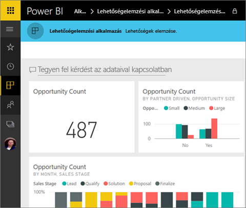
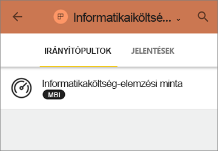
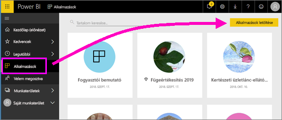
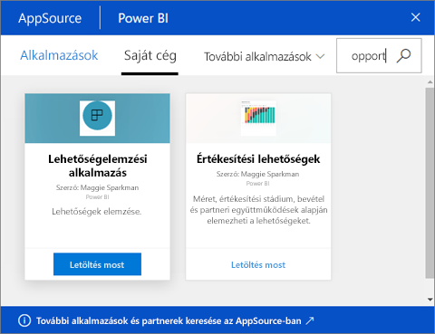
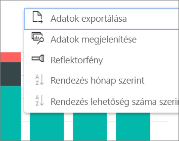

# Alkalmazások telepítése és használata irányítópultokkal és jelentésekkel a Power BI-ban
Most, hogy már tisztában van az [alkalmazások alapfogalmaival](end-user-apps.md), megismerkedhet az alkalmazások megnyitásával és kezelésével. 

## Új alkalmazás beszerzésének lehetőségei
Mint tudja, alkalmazáshoz több módon is hozzájuthat. Egy jelentéskészítő munkatárs automatikusan telepítheti az alkalmazást az Ön Power BI-fiókjába, vagy elküldheti az alkalmazásra mutató közvetlen hivatkozást. Felkeresheti az AppSource-ot is, ahol az Ön számára hozzáférhető alkalmazásokat kereshet a vállalaton belül, és azon kívül is. 

Mobileszközén a Power BI-ban alkalmazást csak közvetlen hivatkozásról telepíthet, az AppSource-ból nem. Ha a szerző automatikusan telepíti az alkalmazást, akkor az megjelenik az Ön alkalmazásainak listájában.

## Alkalmazás telepítése közvetlen hivatkozásról
Új alkalmazás saját telepítésének legegyszerűbb módja az, ha közvetlen hivatkozást szerez e-mailben az alkalmazás szerzőjétől.  

**A saját számítógépén** 

Amikor kiválasztja az e-mailben kapott hivatkozást, a böngészőben megnyílik a Power BI szolgáltatás ([https://powerbi.com](https://powerbi.com)). Erősítse meg, hogy telepíteni szeretné az alkalmazást, majd a Power BI megnyitja az alkalmazás kezdőlapját.

**iOS- vagy Android-mobileszközén** 

Ha mobileszközön nyitja meg az e-mailben szereplő hivatkozást, az alkalmazás automatikusan megnyílik, és megnyitja az alkalmazás tartalomjegyzékét a mobilalkalmazásban. 

## Alkalmazás beszerzése a Microsoft AppSource-ból
Alkalmazásokat a Microsoft AppSource-on is találhat, és onnan telepíthet. Csak azok az alkalmazások jelennek meg, amelyekhez hozzáférése van (tehát az alkalmazás készítője jogosultságot adott hozzá Önnek vagy mindenkinek).

1. Válassza az **Alkalmazások**  > **Alkalmazások letöltése** lehetőséget. 
   
     
2. Az AppSource-ban a **Saját szervezet** alatti kereséssel szűkítheti a találatok körét, és megtalálhatja a keresett alkalmazást.
   
     
3. A **Letöltés most** lehetőséget választva adhatja hozzá az Alkalmazások tartalomlistához. 

## Irányítópultok és jelentések használata az alkalmazásban
Most már dolgozhat az adatokkal az alkalmazás irányítópultjainak és jelentéseinek használatával. Minden szokásos Power BI-műveletet elér, mint amilyen a szűrés, a kijelölés, a rendezés és a részletezés. Egy táblából vagy a jelentés más vizualizációjából [exportálhatja az adatokat az Excelbe](end-user-export-data.md). Tudnivalók [a jelentések használatáról a Power BI-ban](end-user-reading-view.md). 

## Következő lépések
* [Power BI alkalmazások külső szolgáltatásokhoz](end-user-connect-to-services.md)
* Kérdése van? [Kérdezze meg a Power BI közösségét](http://community.powerbi.com/)

