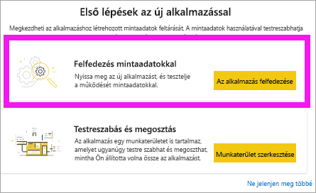

# Alkalmazások telepítése és használata irányítópultokkal és jelentésekkel a Power BI-ban
Most, hogy már tisztában van az [alkalmazások alapfogalmaival](end-user-apps.md), megismerkedhet az alkalmazások megnyitásával és kezelésével. 

## Új alkalmazás beszerzésének lehetőségei
Új alkalmazáshoz több módon is hozzájuthat. Egy jelentéskészítő munkatárs automatikusan telepítheti az alkalmazást az Ön Power BI-fiókjába, vagy elküldheti az alkalmazásra mutató közvetlen hivatkozást. Felkeresheti az AppSource-ot is, ahol az Ön számára hozzáférhető, alkalmazástervezők által készített alkalmazásokat kereshet a vállalaton belül, és azon kívül is. 

Mobileszközén a Power BI-ban alkalmazást csak közvetlen hivatkozásról telepíthet, az AppSource-ból nem. Ha a tervező automatikusan telepíti az alkalmazást, akkor az megjelenik az Ön alkalmazásainak listájában.

## Alkalmazás telepítése közvetlen hivatkozásról
Új alkalmazás saját telepítésének legegyszerűbb módja az, ha közvetlen hivatkozást szerez e-mailben az alkalmazás tervezőjétől.  

**A saját számítógépén** 

Amikor kiválasztja az e-mailben kapott hivatkozást, a Power BI szolgáltatás ([https://powerbi.com](https://powerbi.com)) megnyitja az alkalmazást a böngészőben. 

**iOS- vagy Android-mobileszközén** 

Ha mobileszközön nyitja meg az e-mailben szereplő hivatkozást, az alkalmazás automatikusan telepítve lesz, és megnyílik a mobilalkalmazásban. Előfordulhat, hogy először be kell jelentkeznie. 

## Alkalmazás beszerzése a Microsoft AppSource-ból
Alkalmazásokat a Microsoft AppSource-on is találhat, és onnan telepíthet. Csak azok az alkalmazások jelennek meg, amelyekhez hozzáférése van (tehát az alkalmazás készítője jogosultságot adott hozzá Önnek vagy mindenkinek).

1. Válassza az **Alkalmazások**  > **Alkalmazások beszerzése** lehetőséget. 
   
        
2. Az AppSource-ban a **Saját szervezet** alatti kereséssel szűkítheti a találatok körét, és megtalálhatja a keresett alkalmazást.
   
    
3. A **Letöltés most** lehetőséget választva adhatja hozzá az Alkalmazások tartalomlistához. 

## Alkalmazás beszerzése a Microsoft AppSource webhelyről (https://appsource.microsoft.com)
Ebben a példában egy Microsoft-mintaalkalmazást nyitunk meg. Az AppSource-on számos olyan alkalmazást talál, amely alkalmas az üzleti feladatainak elvégzéséhez használt szolgáltatásokhoz.  Ezek között olyan szolgáltatások vannak, mint például a Salesforce, a Microsoft Dynamics, a Google Analytics, a GitHub, a Zendesk, a Marketo és sok más. További információt az [Alkalmazások a Power BI-jal használt szolgáltatásokhoz](../service-connect-to-services.md) című témakörben talál. 

1. A böngészőben nyissa meg a https://appsource.microsoft.com webhelyet, majd válassza a **Power BI-alkalmazások** elemet.

    

2. Ha az **Összes megjelenítése** lehetőséget választja, megtekintheti a jelenleg elérhető összes Power BI-alkalmazás listáját. Görgetéssel keresse meg a **Microsoft-minta - Értékesítés & Marketing** nevű alkalmazást.

    

3. Válassza a **Letöltés most** lehetőséget, és fogadja el a használati feltételeket.

    

4. Erősítse meg, hogy telepíteni szeretné ezt az alkalmazást.

    

5. A Power BI szolgáltatás az alkalmazás telepítése után egy üzenetet fog megjeleníteni arról, hogy a telepítés sikeres volt. Az alkalmazás megnyitásához válassza az **Ugrás az appra** lehetőséget. Attól függően, hogy a tervező hogyan hozta létre az alkalmazást, megjelenik vagy az alkalmazás irányítópultja, vagy az alkalmazás jelentése.

    

    Az alkalmazást közvetlenül az alkalmazások listájáról is megnyithatja az **Alkalmazások** lehetőség kiválasztásával, majd az **Értékesítés & Marketing** elem kiválasztásával.

    

6. Válassza ki, hogy az új alkalmazást megismerni szeretné-e, vagy testre szabni és megosztani azt. Mivel Microsoft-mintaalkalmazást választottunk ki, kezdjük a megismeréssel. 

    

7.  Az új alkalmazás az irányítópulttal nyílik meg. Az alkalmazás *tervezője* úgy is beállíthatta volna, hogy az alkalmazás a jelentéssel nyíljon meg.  

    

## Irányítópultok és jelentések használata az alkalmazásban
Szánjon rá egy kis időt, és ismerkedjen meg az alkalmazás részét képező irányítópulton és jelentéseken található adatokkal. Minden szokásos Power BI-művelethez hozzáférhet, többek között a szűréshez, a kijelöléshez, a rendezéshez és a részletezéshez.  Még egy kicsit zavaros, hogy mi a különbség az irányítópultok és a jelentések között?  Olvassa el az [irányítópultokról szóló cikket](end-user-dashboards.md), valamint a [jelentésekről szóló cikket](end-user-reports.md).  

## Következő lépések
* [Vissza az alkalmazás áttekintéséhez](end-user-apps.md)
* [Power BI-jelentés megtekintése](end-user-report-open.md)
* [A tartalom megosztásának egyéb módjai](end-user-shared-with-me.md)
