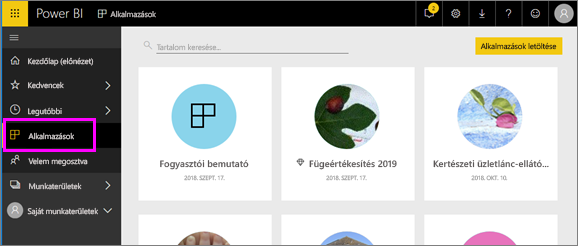

# Alkalmazások a Power BI-ban
## Mi a Power BI-alkalmazás?
Az *alkalmazás* egy olyan Power BI-tartalomtípus, amely az összetartozó irányítópultokat és jelentéseket egy helyen kombinálja. Egy alkalmazás egy vagy több irányítópultot és egy vagy több jelentést tartalmazhat egy csomagban. Az alkalmazásokat Power BI-*tervezők* hozzák létre, majd terjesztik és osztják meg az olyan *fogyasztókkal*, mint Ön. 

Alkalmazásai az **Alkalmazások** tartalomlistába vannak rendezve.

> [!NOTE]
> Az alkalmazás funkciójának használatához Power BI Pro-licencre van szükség. <!-- add link to how to figure out your license -->

## Alkalmazások ***tervezői*** és ***fogyasztói***
Szerepkörétől függően létrehozhat alkalmazásokat (ha tervező) saját maga vagy akár kollégái számára. Az is lehet, hogy mások által létrehozott alkalmazásokat kap és tölt le (fogyasztó). Ez a cikk az alkalmazások *fogyasztóinak* szól.

## Az alkalmazások előnyei
Az alkalmazásokat a Power BI szolgáltatásban ([https://powerbi.com](https://powerbi.com)) és mobileszközén is könnyen megtalálhatja és telepítheti. Egy alkalmazás telepítése után nem kell emlékeznie a sok különböző irányítópult nevére, mert mind együtt vannak egy alkalmazásban, a böngészőjében vagy a mobileszközén.

Valahányszor az alkalmazás szerzője frissítést bocsát ki, Ön automatikusan látja a változtatásokat. Az adatok frissítésének ütemezését is a szerző szabja meg, így azok naprakészségével sem Önnek kell törődnie. 

<!-- add conceptual art -->
## Új alkalmazás letöltése
Alkalmazásokat sokféleképpen be lehet szerezni. 
- Az alkalmazást annak szerzője automatikusan telepítheti az Ön Power BI-fiókjába, így amikor Ön megnyitja a Power BI-t, az új alkalmazás megjelenik az **Alkalmazások** tartalomlistában. 
- Az alkalmazás szerzője e-mailt küldhet Önnek egy közvetlenül az alkalmazásra mutató hivatkozással. A hivatkozás megnyitja az alkalmazást a Power BI-ban.
- Alkalmazásokat kereshet az AppSource-ban, ahol minden Ön által hozzáférhető alkalmazás megjelenik. Az AppSource a vállalatán belüli, és azon kívüli jelentéstervezők által közzétett alkalmazásokat is tartalmazza. Az AppSource-ban találhat akár egy Ön által már használt szolgáltatáshoz (például a Google Analyticshez, a GitHubhoz vagy a Microsoft Dynamicshoz) készült alkalmazást is. 
- Mobileszközén a Power BI-ban alkalmazást csak közvetlen hivatkozásról telepíthet, az AppSource-ból nem. Ha a szerző automatikusan telepíti az alkalmazást, akkor az megjelenik az Ön alkalmazásainak listájában.

## Következő lépés
* [Alkalmazás megnyitása és kezelése](end-user-app-view.md)

