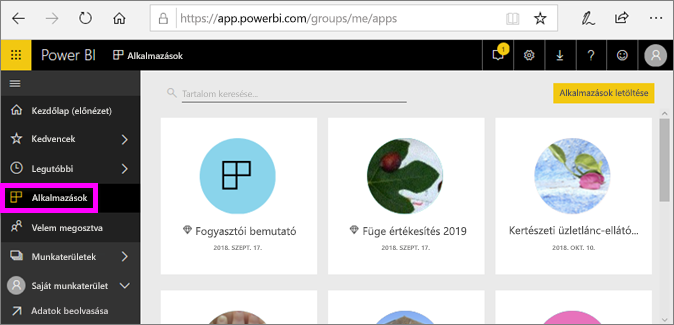
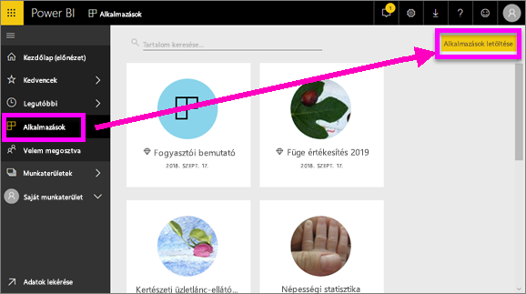
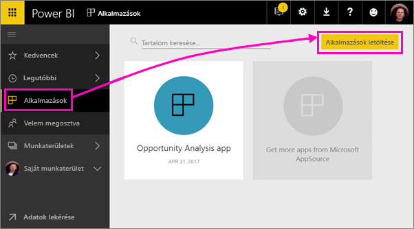
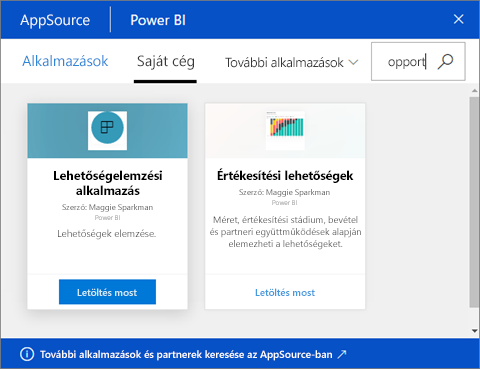
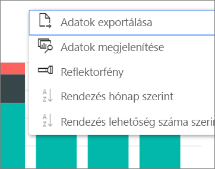

# Alkalmazások telepítése és használata irányítópultokkal és jelentésekkel a Power BI-ban
A Power BI-ban az *alkalmazások* egy helyen hozzák össze az összefüggő irányítópultokat és jelentéseket. Vállalata tagjai fontos üzleti információkat kezelő alkalmazásokat hoznak létre és terjesztenek. Az esetleg már eddig is használt [külső szolgáltatások](../service-connect-to-services.md), mint a Google Analytics és a Microsoft Dynamics CRM, szintén kínálnak Power BI-alkalmazásokat. 

Az alkalmazásokat a Power BI szolgáltatásban és mobileszközén is könnyen megtalálhatja és telepítheti. Egy alkalmazás telepítése után nem kell emlékeznie a sok különböző irányítópult nevére, mert mind együtt vannak egy alkalmazásban, a böngészőjében vagy a mobileszközén.

Valahányszor az alkalmazás szerzője frissítést bocsát ki, Ön automatikusan látja a változtatásokat. Az adatok frissítésének ütemezését is a szerző szabja meg, így azok naprakészségével sem Önnek kell törődnie. 

## Új alkalmazás letöltése
Alkalmazásokat sokféleképpen be lehet szerezni. Az alkalmazást a szerzője automatikusan telepítheti az Ön Power BI-fiókjában, elküldheti Önnek az alkalmazásra mutató közvetlen hivatkozást, vagy Ön is megkeresheti azt az AppSource-ban, ahol minden hozzáférhető alkalmazást megtalál. A mobileszközén a Power BI-ban csak közvetlen hivatkozásról telepíthet, az AppSource-ból nem. Ha a szerző automatikusan telepíti az alkalmazást, akkor az megjelenik az Ön alkalmazásainak listájában.

### Alkalmazás telepítése közvetlen hivatkozásról
Új alkalmazás saját telepítésének legegyszerűbb módja az, ha közvetlen hivatkozást szerez az alkalmazás szerzőjétől. A Power BI létrehoz egy telepítési hivatkozást, amelyet a szerző elküldhet Önnek.

**A saját számítógépén** 

A Power BI szolgáltatás ([https://powerbi.com](https://powerbi.com)) böngészőben történő megnyitásához kattintson az e-mailben található hivatkozásra. Erősítse meg, hogy telepíteni szeretné az alkalmazást, majd megnyílik az alkalmazás kezdőlapja.

**iOS- vagy Android-mobileszközén** 

Ha mobileszközön nyitja meg az e-mailben szereplő hivatkozást, az alkalmazás automatikusan megnyílik, és megnyitja az alkalmazás tartalomjegyzékét a mobilalkalmazásban. 

### Alkalmazás beszerzése a Microsoft AppSource-ból
A Microsoft AppSource-szal bármilyen alkalmazást megtalálhat és telepíthet, amelyhez hozzáférése van. 

1. Válassza az **Alkalmazások**  > **Alkalmazások letöltése** lehetőséget. 
   
     
2. Az AppSource-ban, a **Saját szervezet** területen kereséssel szűkítse az eredményeket, hogy megtalálja a keresett alkalmazást.
   
     
3. A **Letöltés most** lehetőséget választva adhatja hozzá az Alkalmazások oldalához. 

## Irányítópultok és jelentések használata az alkalmazásban
Most már dolgozhat az adatokkal az alkalmazás irányítópultjainak és jelentéseinek használatával. Minden szokásos Power BI-műveletet elér, mint amilyen a szűrés, a kijelölés, a rendezés és a részletezés. Tudnivalók [a jelentések használatáról a Power BI-ban](end-user-reading-view.md). 

## Következő lépések
[Power BI alkalmazások külső szolgáltatásokhoz](../service-connect-to-services.md)

