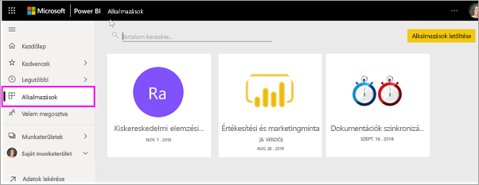

# Alkalmazások a Power BI-ban
## Mi a Power BI-alkalmazás?
Az *alkalmazás* egy olyan Power BI-tartalomtípus, amely az összetartozó irányítópultokat és jelentéseket egy helyen kombinálja. Egy alkalmazás egy vagy több irányítópultot és egy vagy több jelentést tartalmazhat egy csomagban. Az alkalmazásokat Power BI-*tervezők* hozzák létre, majd terjesztik és osztják meg az olyan *fogyasztókkal*, mint Ön. 

Alkalmazásai az **Alkalmazások** tartalomlistába vannak rendezve. Az alkalmazások megjelenítéséhez válassza az **Alkalmazások** lehetőséget. Ha az egérmutatót egy alkalmazás fölé helyezi, megtekintheti a legutóbbi frissítés dátumát és a tulajdonost. 

> [!NOTE]
> Az alkalmazás funkciójának használatához Power BI Pro-licencre van szükség. <!-- add link to how to figure out your license -->

## Alkalmazások ***tervezői*** és ***fogyasztói***
Szerepkörétől függően létrehozhat alkalmazásokat (ha *tervező*) saját maga vagy akár kollégái számára. Az is lehet, hogy mások által létrehozott alkalmazásokat kap és tölt le (*fogyasztó*). Ez a cikk az alkalmazások *fogyasztóinak* szól.

## Az alkalmazások előnyei
Az alkalmazásokkal egyszerűen oszthatók meg egyszerre a különböző típusú tartalmak. Az alkalmazások *tervezői* létrehozzák az irányítópultokat és a jelentéseket, és becsomagolják őket egy alkalmazásba. A *tervezők* ezután megosztják vagy közzéteszik az alkalmazást egy olyan helyen, ahol Ön, a *fogyasztó* elérheti azt. Mivel a kapcsolódó irányítópultok és jelentések egybe vannak csomagolva, könnyebben megtalálhatja és telepítheti őket mind a Power BI szolgáltatásban ([https://powerbi.com](https://powerbi.com)), mind a mobileszközén. Egy alkalmazás telepítése után nem kell emlékeznie a sok különböző irányítópult és jelentés nevére, mert mind együtt vannak egy alkalmazásban, a böngészőjében vagy a mobileszközén.

Valahányszor az alkalmazás szerzője frissítést bocsát ki, Ön automatikusan látja a változtatásokat. Az adatok frissítésének ütemezését is a szerző szabja meg, így azok naprakészségével sem Önnek kell törődnie. 

<!-- add conceptual art -->
## Új alkalmazás letöltése
Alkalmazásokat sokféleképpen be lehet szerezni. Ezek közül néhányat felsoroltunk alább.  Az alkalmazások beszerzésével és megismerésével kapcsolatos részletes utasításokért pedig tekintse meg az [Alkalmazás megnyitása és kezelése](end-user-app-view.md) című témakört.

- Az alkalmazást annak tervezője automatikusan telepítheti az Ön Power BI-fiókjába, így amikor Ön megnyitja a Power BI-t, az új alkalmazás megjelenik az **Alkalmazások** tartalomlistában. 
- Az alkalmazás tervezője elküldheti önnek e-mailben az alkalmazásra mutató közvetlen hivatkozást. A hivatkozás megnyitja az alkalmazást a Power BI-ban.
- Mobileszközén a Power BI-ban alkalmazást csak közvetlen hivatkozásról telepíthet, az AppSource-ból nem. Ha a szerző automatikusan telepíti az alkalmazást, akkor az megjelenik az Ön alkalmazásainak listájában.
- Alkalmazásokat kereshet az [AppSource-on](https://appsource.microsoft.com). Az AppSource a vállalatán belüli, és azon kívüli jelentéstervezők által közzétett alkalmazásokat is tartalmazza. Az AppSource-ban találhat akár egy Ön által már használt szolgáltatáshoz (például a Google Analyticshez, a GitHubhoz vagy a Microsoft Dynamicshoz) készült alkalmazást is. Olyan alkalmazásokat is találhat, amelyeket példaként használhat a Power BI megismeréséjez.  

## Következő lépés
* [Alkalmazás megnyitása és kezelése](end-user-app-view.md)
* [A tartalmak megosztásának egyéb módjai](end-user-shared-with-me.md)

