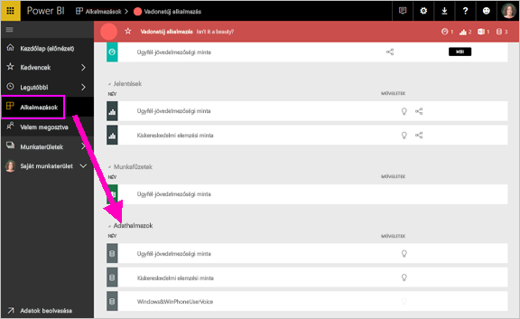
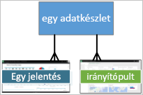
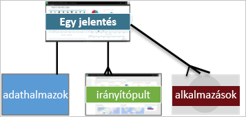
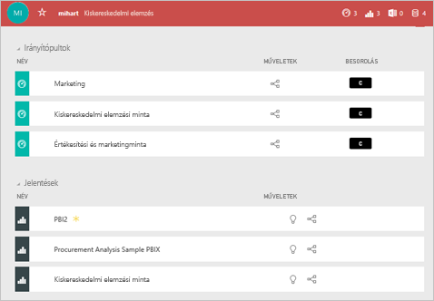

# A Power BI szolgáltatás alapfogalmai ***felhasználók*** számára

## Power BI-*felhasználók* és -*tervezők*
Ez a cikk feltételezi, hogy már elolvasta [a Power BI áttekintését](../power-bi-overview.md), és azonosította magát Power BI-***felhasználóként***. A felhasználók Power BI-tartalmakat, például irányítópultokat és jelentéseket fogadnak a munkatársaktól. A felhasználók a Power BI szolgáltatást, a Power BI webhelyalapú verzióját használják. 

Kétségtelenül találkozni fog a „Power BI Desktop” vagy „Desktop” kifejezéssel. Ezek az irányítópultokat és jelentéseket létrehozó, illetve megosztó *tervezők* által használt különálló eszközre utalnak. Fontos megjegyezni, hogy más Power BI-eszközök is vannak, felhasználóként azonban csak a Power BI szolgáltatással fog dolgozni. A cikk tartalma kizárólag a Power BI szolgáltatásra vonatkozik. 

## Terminológia és fogalmak
Ez a cikk nem a Power BI vizuális bemutatója, se nem gyakorlati oktatóanyag. Sokkal inkább egy áttekintő cikk, amely a Power BI szolgáltatással kapcsolatos terminológiát és fogalmakat ismerteti. Más szóval megismerkedhet a nyelvezettel és a környezettel. A Power BI szolgáltatás, és az azon belüli navigálás bemutatásához tekintse meg a szolgáltatás [bemutatóját](end-user-experience.md).

## A Power BI szolgáltatás megnyitása első alkalommal
A legtöbb Power BI-felhasználó úgy fér hozzá a Power BI szolgáltatáshoz, hogy 1) a vállalat licenceket vásárol, és 2) egy rendszergazda hozzárendeli ezeket a licenceket az Önhöz hasonló alkalmazottakhoz. 

Első lépésként nyisson meg egy böngészőt, és írja be az **app.powerbi.com** címet. A Power BI szolgáltatás első megnyitásakor egy ehhez hasonló oldalt fog látni.

A Power BI használata során személyre szabhatja, hogy mi jelenjen meg a webhely megnyitásakor.  Például vannak, akik azt szeretik, ha a Power BI a Kezdőlapot nyitja meg, mások pedig a kedvenc irányítópultjukat látják szívesen bejelentkezéskor. Az alábbiakban bemutatjuk, hogyan állíthatja be mindezt. 
- [Kezdőlap előnézete](https://powerbi.microsoft.com/blog/introducing-power-bi-home-and-global-search)    
- [Tartalom beállítása **kiemeltként**](end-user-featured.md) 

Mielőtt azonban belemennénk a részletekbe, nézzük meg, milyen elemekből épül fel a Power BI szolgáltatás.

## Power BI-***tartalom***
### A szolgáltatás elemeinek bemutatása
A Power BI 5 alapvető építőeleme a következő: ***vizualizációk***, ***irányítópultok***, ***jelentések***, ***alkalmazások*** és ***adatkészletek***. Ezeket más néven *Power BI*-***tartalmaknak*** nevezzük. A *tartalmak* pedig a ***munkaterületeken*** találhatók. Egy tipikus munkafolyamat a következő elemekből áll:  Egy Power BI-*tervező* (az alábbi ábrán sárgával jelölve) adatokat gyűjt bizonyos *adatkészletekből*, azokat elemzés céljából beviszi a Power BI-ba, *vizualizációkkal* teli *jelentéseket* készít, amelyek érdekes tényeket és megállapításokat tárnak fel, továbbá jelentésekből származó vizualizációkat rögzít egy irányítópulton, illetve jelentéseket és irányítópultokat oszt meg az Önhöz hasonló *felhasználókkal* (az alábbi ábrán feketével jelölve), *alkalmazások* vagy egyéb megosztott tartalmak formájában. 

Ez a munkafolyamat legalapvetőbb leírása. 
*  A ***Vizualizáció*** (vagy *visual*), a Power BI-*tervezők* által *jelentésekből* és  *adatkészletekből* származó adatok alapján létrehozott diagramok egy típusa. A *tervezők* általában a Power BI Desktopban készítik el a vizualizációkat. 

    További információk: [Vizualizációk Power BI-*felhasználók* számára](end-user-visualizations.md)

*  Az *adatkészlet* egy adatokat tartalmazó tároló. Például lehet egy Excel-fájl, amely az Egészségügyi Világszervezettől származik, vagy lehet egy vállalati tulajdonú ügyféladatbázis, esetleg egy Salesforce-fájl.  

*  Az *irányítópult* egy interaktív vizualizációkat, szöveget és grafikai elemeket tartalmazó képernyő. Az irányítópultok egy képernyőn gyűjtik össze a legfontosabb mérőszámokat, amellyel egy történetet mesélnek el, vagy választ adnak egy kérdésre. Az irányítópult tartalma egy vagy több jelentésből, és egy vagy több adatkészletből származik.

    További információk: [Irányítópultok Power BI-*felhasználók* számára](end-user-dashboards.md)

*  A *jelentés* egy vagy több oldalnyi interaktív vizualizációkból, szövegekből és grafikai elemekből áll, amelyek együtt egy jelentést alkotnak. A jelentések egyetlen adatkészleten alapulnak. A jelentés egyes oldalai gyakran egyetlen központi témakört fednek le, vagy egy kérdésre adnak választ.

    További információk: [Jelentések Power BI-*felhasználók* számára](end-user-reports.md)

*  *Alkalmazásnak* nevezzük az egymáshoz kapcsolódó irányítópultok és jelentések csomagját, amelyet a *tervezők* állítanak össze és osztanak meg. A *felhasználók* bizonyos alkalmazásokat automatikusan megkapnak, emellett azonban a munkatársak vagy a közösség által létrehozott egyéb alkalmazásokat is kereshetnek. Például az esetleg már eddig is használt olyan külső szolgáltatások, mint a Google Analytics és a Microsoft Dynamics CRM, szintén kínálnak Power BI-alkalmazásokat.

Tisztázzuk, hogy ha Ön új felhasználó, és első alkalommal jelentkezett be a Power BI szolgáltatásba, akkor egyelőre semmilyen irányítópulttal, alkalmazással vagy jelentéssel nem rendelkezik. 
_______________________________________________________

## Adathalmazok
Az *adatkészlet* olyan adatok gyűjteménye, amelyeket a *tervezők* importálnak, vagy amelyekhez csatlakoznak, majd azok alapján hoznak létre jelentéseket és irányítópultokat. Felhasználóként nem fog közvetlenül adatkészletekkel dolgozni, azonban hasznos ha tudja, hogy milyen szerepet töltenek be a rendszerben.  

Minden adatkészlet egyetlen adatforrásnak felel meg, például egy OneDrive-beli Excel-munkafüzetnek, egy helyszíni táblázatos SSAS-adatkészletnek vagy egy Salesforce-adatkészletnek. A rendszer számos különféle adatforrást támogat.

Ha egy tervező megoszt Önnel egy alkalmazást, láthatja, hogy mely adatkészletek szerepelnek benne. 

**EGY** adatkészlet:

* Újra és újra felhasználható.
* Számos különféle jelentésben is felhasználható.
* Az adott adatkészletből származó vizualizációk több különböző irányítópulton is megjelenhetnek.
  
  

A következő építőelem a vizualizáció.
__________________________________________________________

## Vizualizációk
A vizualizációk az adatokból nyert információkat jelenítik meg. A vizualizációk megkönnyítik a megállapítások értelmezését, mivel az agy gyorsabban feldolgoz egy képet, mint például egy számokból álló táblázatot.

A Power BI-ban többet között az alábbi vizualizációkkal találkozhat: vízesésdiagram, szalagdiagram, fatérkép, tortadiagram, tölcsérdiagram, kártyák, pontdiagram és mérőműszer-diagram. Részletes információkért tekintse meg a [Power BI-ban használt vizualizációk teljes listáját](../power-bi-visualization-types-for-reports-and-q-and-a.md).

   

A vizualizációk a közösségtől is származhatnak, ezeket *egyéni vizualizációknak* nevezzük. Ha olyan vizualizációt tartalmazó jelentést kap, amelyet nem ismer fel, akkor valószínűleg egyéni vizualizációról van szó. Ha az egyéni vizualizáció értelmezéséhez segítségre van szüksége, <!--[look up the name of the report or dashboard *designer*](end-user-owner.md)-->keresse meg a jelentés vagy az irányítópult *tervezőjének* nevét, és lépjen kapcsolatba vele.

Egy jelentés **EGYIK** vizualizációja...

* Újra és újra felhasználható ugyanabban a jelentésben a másolás/beillesztés művelettel.
* Több különböző irányítópulton is felhasználható.
__________________________________________________
## Jelentések
A Power BI-jelentések egy vagy több oldalnyi vizualizációból, szövegből és grafikai elemekből állnak. Egyetlen jelentés vizualizációi csak egy adatkészleten alapulhatnak. A *tervezők* megosztják a jelentéseket a *felhasználókkal*, akik *Olvasó nézetben* [használják a jelentéseket](end-user-reading-view.md).

**EGY** jelentés:

* Több irányítópulthoz is társítható (az adott jelentésről rögzített csempék több irányítópulton is megjelenhetnek).
* Csak egyetlen adatkészletből származó adatokból készíthető el.  
* Több alkalmazásban is szerepelhet.
  
  

________________________________________________

## Irányítópultok
Az irányítópult az alapjául szolgáló adatkészlet(ek) valamely részhalmazának egyedi nézetét jeleníti meg. A *tervezők* irányítópultokat hoznak létre, és egyénileg vagy egy alkalmazás részeként megosztják azokat a *felhasználókkal*. Egy irányítópult egyetlen vászonból áll, amely *csempéket*, grafikai elemeket és szöveget tartalmazhat. 

  

A csempe egy vizualizáció olyan leképezése, amelyet egy *tervező* *rögzít* például egy jelentésből egy irányítópultra.  Minden rögzített csempe egy, az irányítópultra rögzített [vizualizációt](end-user-visualizations.md) jelenít meg, amely egy adatkészleten alapul. A csempe egy teljes jelentésoldalt is tartalmazhat, és élő streamadatokat vagy videót is tartalmazhat. A *tervezők* sokféleképpen adhatnak csempét az irányítópulthoz, de ebben az áttekintő témakörben mindezek bemutatására nincs lehetőség. További információkért tekintse meg [Az irányítópult csempéi a Power BI szolgáltatásban](end-user-tiles.md) című oldalt. 

A felhasználók oldaláról nézve az irányítópultok nem szerkeszthetők. Azonban hozzáadhatnak megjegyzéseket, megtekinthetik a kapcsolódó adatokat, beállíthatnak kedvenceket, feliratkozhatnak stb. 

Mire használhatók az irányítópultok?  Lássunk néhány példát az irányítópultok felhasználására:

* Azért, hogy egy pillantással átláthassák a döntéshozatalhoz szükséges összes információt.
* Azért, hogy figyelhessék a munkájukkal kapcsolatos leglényegesebb információkat.
* Azért, hogy minden munkatárs naprakész információkkal rendelkezzen, és ugyanazokat az adatokat lássa és használja.
* Azért, hogy figyelhessék az üzleti folyamat, termék, vállalati egység, marketingkampány stb. állapotát.
* Azért, hogy egy nagyobb irányítópult személyre szabott nézetét hozzák létre – a számukra fontos összes metrikával.

**EGY** irányítópult:

* Több adatkészletből jeleníthet meg vizualizációkat.
* Több jelentésből jeleníthet meg vizualizációkat.
* Más eszközökből (pl. Excel) rögzített vizualizációkat is megjeleníthet.
  
  

________________________________________________

## Alkalmazások
Az irányítópultok és jelentések alkalmazásnak nevezett gyűjteményei egy csomagba rendezik a kapcsolódó tartalmakat. Az alkalmazásokat a Power BI-*tervezők* hozzák létre, és osztják meg egyénekkel, csoportokkal, az egész vállalattal vagy a nyilvánossággal. Felhasználóként biztos lehet abban, hogy Ön és a munkatársai ugyanazokkal az adatokkal, a valóság egyazon megbízható verziójával dolgoznak. 

Az alkalmazásokat a Power BI szolgáltatásban (https://powerbi.com)) és mobileszközén is könnyen megtalálhatja és telepítheti. Egy alkalmazás telepítése után nem kell emlékeznie a sok különböző irányítópult nevére, mert mind együtt vannak egy alkalmazásban, a böngészőjében vagy a mobileszközén. 

Ez az alkalmazás három egymáshoz kapcsolódó irányítópultot és három kapcsolódó jelentést tartalmaz, amelyek egy alkalmazást alkotnak.

Valahányszor az alkalmazás szerzője frissítést bocsát ki, Ön automatikusan látja a változtatásokat. Az adatok frissítésének ütemezését is a szerző szabja meg, így azok naprakészségével sem Önnek kell törődnie.

Alkalmazásokat sokféleképpen be lehet szerezni. Az alkalmazást a tervezője automatikusan telepítheti az Ön Power BI-fiókjában, elküldheti Önnek az alkalmazásra mutató közvetlen hivatkozást, vagy Ön is megkeresheti azt az AppSource-ban, ahol minden elérhető alkalmazást megtalál. A mobileszközén a Power BI-ban csak közvetlen hivatkozásról telepíthet alkalmazásokat, az AppSource-ból nem. Ha a tervező automatikusan telepíti az alkalmazást, akkor az megjelenik az Ön alkalmazásainak listájában.

Az alkalmazás telepítését követően kattintson rá az alkalmazások listájában, majd válassza ki, hogy melyik irányítópultot vagy jelentést szeretné elsőként megnyitni és tanulmányozni.   

Remélhetőleg ez cikk segített annak megértésében, hogy milyen elemekből épül fel a felhasználók szánt Power BI szolgáltatás. 

## Következő lépések
- A [Szószedet](end-user-glossary.md) áttekintése és könyvjelzővel történő ellátása    
- [Ismerkedés a Power BI szolgáltatással](end-user-experience.md)
- [A Power BI kifejezetten felhasználók számára írt áttekintésének](end-user-consumer.md) tanulmányozása    
- Tekintsen meg egy videót, amelyben Will ismerteti az alapfogalmakat, és végigvezeti a Power BI szolgáltatáson. <iframe width="560" height="315" src="https://www.youtube.com/embed/B2vd4MQrz4M" frameborder="0" allowfullscreen></iframe>