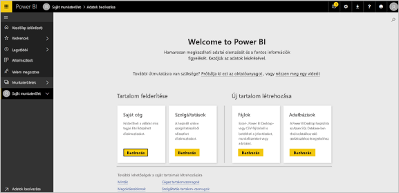

# A Power BI szolgáltatás alapfogalmai felhasználók számára

Ez a cikk feltételezi, hogy már elolvasta [a Power BI áttekintését](../power-bi-overview.md), és azonosította magát Power BI-***felhasználóként***. A felhasználók Power BI-tartalmakat, például irányítópultokat és jelentéseket fogadnak a munkatársaktól. A felhasználók a Power BI szolgáltatást, a Power BI webhelyalapú verzióját használják.

Minden bizonnyal találkozni fog a „Power BI Desktop”, vagy egyszerűen „Desktop” megnevezéssel. Ezt a különálló eszközt azok a *tervezők* használják, akik irányítópultokat és jelentéseket készítenek és osztanak meg Önnel. Fontos tudni, hogy más Power BI-eszközök is léteznek. Felhasználóként Ön csak a Power BI szolgáltatást fogja használni. Ennek a cikknek a tartalma kizárólag a Power BI szolgáltatásra vonatkozik.

## Terminológia és fogalmak

Ez a cikk nem a Power BI vizuális bemutatója, se nem gyakorlati oktatóanyag. Sokkal inkább egy áttekintő cikk, amely a Power BI szolgáltatással kapcsolatos terminológiát és fogalmakat ismerteti. A nyelvezetet és a környezetet ismerteti meg Önnel. A Power BI szolgáltatást és az azon belüli navigációt a [Gyorsútmutató – Eligazodás a Power BI szolgáltatásban](end-user-experience.md) című cikk mutatja be.

## A Power BI szolgáltatás megnyitása első alkalommal

A legtöbb Power BI-felhasználó úgy fér hozzá a Power BI szolgáltatáshoz, hogy 1) a vállalat licenceket vásárol, és 2) egy rendszergazda hozzárendeli a licenceket az Önhöz hasonló alkalmazottakhoz.

Első lépésként nyisson meg egy böngészőt, és írja be az **app.powerbi.com** címet. A Power BI szolgáltatás első megnyitásakor az alábbihoz hasonló oldal fogadja:

A Power BI használata során személyre szabhatja, hogy mi jelenjen meg a webhely megnyitásakor. Például vannak, akik azt szeretik, ha a Power BI a **Kezdőlapot** nyitja meg, mások pedig a kedvenc irányítópultjukat látják szívesen bejelentkezéskor. Ebből a cikkből megtanulja testre szabni a felületet.

- [A Power BI-kezdőlap és a globális keresés bemutatása](https://powerbi.microsoft.com/blog/introducing-power-bi-home-and-global-search)

- [Kiemelt irányítópultok a Power BI szolgáltatásban](end-user-featured.md)

Mielőtt azonban belemennénk a részletekbe, nézzük meg, milyen elemekből épül fel a Power BI szolgáltatás.

_______________________________________________________

## Power BI-tartalom

### A szolgáltatás elemeinek bemutatása

Felhasználói szempontból a Power BI öt alapvető építőeleme a következő: ***vizualizációk***, ***irányítópultok***, ***jelentések***, ***alkalmazások*** és ***adathalmazok***. Ezeket más néven *Power BI*-***tartalmaknak*** nevezzük. A *tartalmak* a ***munkaterületeken*** találhatók. Egy tipikus munkafolyamat az összes elemet magában foglalja: Egy Power BI-*tervező* (az alábbi ábrán sárgával jelölve) adatokat gyűjt bizonyos *adathalmazokból*, azokat elemzés céljából beviszi a Power BI-ba, *vizualizációkkal* teli *jelentéseket* készít, amelyek érdekes tényeket és megállapításokat tárnak fel, továbbá jelentésekből származó vizualizációkat rögzít egy irányítópulton, illetve jelentéseket és irányítópultokat oszt meg az Önhöz hasonló *felhasználókkal* (az alábbi ábrán feketével jelölve). A *tervező* ezeket *alkalmazások* vagy más típusú megosztott tartalmak formájában osztja meg.

Az alapok:

-  Egy ***vizualizáció*** egyfajta diagram, amelyet Power BI-*tervezők* készítenek. A vizualizációk a *jelentések* és *adathalmazok* adatait jelenítik meg. A *tervezők* általában a Power BI Desktopban készítik el a vizualizációkat.

    További információ: [Interakció vizualizációkkal jelentésekben, irányítópultokon és alkalmazásokban](end-user-visualizations.md).

-  Egy *adathalmaz* adatok tárolására szolgál. Ez lehet például egy az Egészségügyi Világszervezettől származó Excel-fájl. Ugyanígy lehet vállalati tulajdonban lévő ügyféladatbázis, vagy Salesforce-fájl is.  

-  Egy *irányítópult* interaktív vizualizációkat, szöveget és grafikai elemeket tartalmazó egyetlen képernyő. Az irányítópultok egy képernyőn gyűjtik össze a legfontosabb mérőszámokat, amellyel egy történetet mesélnek el, vagy választ adnak egy kérdésre. Az irányítópult tartalma egy vagy több jelentésből, és egy vagy több adatkészletből származik.

    További információ: [Irányítópultok a Power BI szolgáltatás felhasználói számára](end-user-dashboards.md).

-  Egy *jelentés* egy vagy több oldalnyi interaktív vizualizációkból, szövegekből és grafikai elemekből áll, amelyek együtt egy jelentést alkotnak. A Power BI egy jelentést egyetlen adathalmazra alapoz. A szolgáltatás gyakran úgy rendezi el a jelentésoldalakat, hogy azok egyetlen központi témakört fedjenek le, vagy egy kérdésre adjanak választ.

    További információ: [Jelentések a Power BI-ban](end-user-reports.md).

-  *Alkalmazásnak* nevezzük az egymáshoz kapcsolódó irányítópultok és jelentések csomagját, amelyet a *tervezők* állítanak össze és osztanak meg. A *felhasználók* bizonyos alkalmazásokat automatikusan megkapnak, emellett azonban a munkatársak vagy a közösség által létrehozott egyéb alkalmazásokat is kereshetnek. Például az esetleg már eddig is használt olyan külső szolgáltatások, mint a Google Analytics és a Microsoft Dynamics CRM, szintén kínálnak Power BI-alkalmazásokat.

Tisztázzuk, hogy ha Ön új felhasználó, és első alkalommal jelentkezett be a Power BI szolgáltatásba, akkor egyelőre semmilyen irányítópultot, alkalmazást vagy jelentést sem lát.

_______________________________________________________

## Adathalmazok

Az *adatkészlet* olyan adatok gyűjteménye, amelyeket a *tervezők* importálnak, vagy amelyekhez csatlakoznak, majd azok alapján hoznak létre jelentéseket és irányítópultokat. Felhasználóként nem fog közvetlenül adathalmazokkal dolgozni, mégis hasznos ha tudja, hogy milyen szerepet töltenek be a rendszerben.  

Minden adathalmaz ez adatok egyetlen forrásának felel meg. Ez a forrás lehet például egy OneDrive-on tárolt Excel-munkafüzet, egy helyszíni SQL Server Analysis Services táblázatos adathalmaza, vagy egy Salesforce-adathalmaz. A Power BI sokféle adatforrást támogat.

Amikor egy tervező alkalmazást oszt meg Önnel, látni fogja, hogy a tervező mely adathalmazokat foglalta bele az alkalmazásba.

Egy adathalmaz...

- Újra és újra felhasználható egy jelentéstervező által irányítópultok és jelentések létrehozásához

- Sok különböző jelentés létrehozására felhasználható

- Az erre az egy adathalmazra alapozott vizualizációk sok különböző irányítópulton is megjelenhetnek

  

A tervezők más munkaterületekről származó adathalmazokat is felhasználhatnak arra, hogy tartalmat (jelentéseket, irányítópultokat) hozzanak létre a saját munkaterületükön. A Power BI ezeket az adathalmazokat a hivatkozott adathalmaz ikonnal jeleníti meg:

A következő építőelem a vizualizáció.

_______________________________________________________

## Vizualizációk

A vizualizációk olyan elemzési eredményeket jelenítenek meg, amelyeket a Power BI nyert az adatokból. A vizualizációk megkönnyítik a megállapítások értelmezését, mivel az agy gyorsabban feldolgoz egy képet, mint egy számokból álló táblázatot.

A Power BI-ban többet között az alábbi vizualizációkkal találkozhat: vízesésdiagram, szalagdiagram, fatérkép, tortadiagram, tölcsérdiagram, kártyák, pontdiagram és mérőműszer-diagram:

   

Részletes információkért tekintse meg a [Power BI-ban használt vizualizációk teljes listáját](../power-bi-visualization-types-for-reports-and-q-and-a.md).

A közösségtől is beszerezhetők úgynevezett *egyéni vizualizációk*. Ha olyan vizualizációt tartalmazó jelentést kap, amelyet nem ismer fel, akkor valószínűleg egyéni vizualizációról van szó. Ha az egyéni vizualizáció értelmezéséhez segítségre van szüksége, keresse meg a jelentés vagy az irányítópult *tervezőjének* nevét, és lépjen kapcsolatba vele.

Egy jelentés egy vizualizációja...

- Többször is megjelenhet ugyanabban a jelentésben

- Több különböző irányítópulton is jelen lehet

_______________________________________________________

## Jelentések

A Power BI-jelentések egy vagy több oldalnyi vizualizációból, szövegből és grafikai elemekből állnak. Egyetlen jelentés vizualizációi csak egy adatkészleten alapulhatnak. A *tervezők* megosztják a jelentéseket a *felhasználókkal*, akik *Olvasó nézetben* [használják a jelentéseket](end-user-reading-view.md).

Egy jelentés...

- Több irányítópulthoz is társítható (az adott jelentésről rögzített csempék több irányítópulton is megjelenhetnek).

- Csak egyetlen adatkészletből származó adatokból készíthető el.  

- Több alkalmazásban is szerepelhet.

  

_______________________________________________________

## Irányítópultok

Az irányítópult az alapjául szolgáló adatkészlet(ek) valamely részhalmazának egyedi nézetét jeleníti meg. A *tervezők* irányítópultokat hoznak létre, és egyénileg vagy egy alkalmazás részeként megosztják azokat a *felhasználókkal*. Egy irányítópult egyetlen vászonból áll, amely *csempéket*, grafikai elemeket és szöveget tartalmazhat.

  

A csempe egy vizualizáció olyan leképezése, amelyet egy *tervező* *rögzít* például egy jelentésből egy irányítópultra. Minden rögzített csempe egy, az irányítópultra rögzített [vizualizációt](end-user-visualizations.md) jelenít meg, amelyet a Power BI hozott létre egy adathalmazból. A csempe egy teljes jelentésoldalt is tartalmazhat, és élő streamadatokat vagy videót is tartalmazhat. A *tervezők* sokféleképpen vehetnek fel csempéket az irányítópultokra. A sokféle lehetőség túlnő ennek az áttekintő cikknek a keretein. További információkért tekintse meg [Az irányítópult csempéi a Power BI szolgáltatásban](end-user-tiles.md) című oldalt.

A felhasználók nem szerkeszthetik az irányítópultokat. Azonban hozzáadhatnak megjegyzéseket, megtekinthetik a kapcsolódó adatokat, beállíthatnak kedvenceket, feliratkozhatnak stb.

Mire használhatók az irányítópultok?  Lássunk néhány példát az irányítópultok felhasználására:

- a döntéshozatalhoz szükséges összes információ áttekintésére egyetlen pillantással

- a munkával kapcsolatos leglényegesebb információk figyelésére

- arra, hogy az összes munkatárs ugyanazokat a naprakész információkat lássa és használja

- egy üzleti folyamat, termék, vállalati egység, marketingkampány stb. állapotának figyelésére

- Azért, hogy egy nagyobb irányítópult személyre szabott nézetét hozzák létre – a számukra fontos összes metrikával.

**EGY** irányítópult:

- Több adatkészletből jeleníthet meg vizualizációkat.

- Több jelentésből jeleníthet meg vizualizációkat.

- Más eszközökből (például. Excelből) rögzített vizualizációkat is megjeleníthet.

  

_______________________________________________________

## Alkalmazások

Az irányítópultok és jelentések alkalmazásnak nevezett gyűjteményei egy csomagba rendezik a kapcsolódó tartalmakat. Az alkalmazásokat a Power BI-*tervezők* hozzák létre, és osztják meg egyénekkel, csoportokkal, az egész vállalattal vagy a nyilvánossággal. Felhasználóként biztos lehet abban, hogy Ön és a munkatársai ugyanazokkal az adatokkal, a valóság egyazon megbízható verziójával dolgoznak.

Az alkalmazásokat a [Power BI szolgáltatásban](https://powerbi.com) és mobileszközén is könnyen megtalálhatja és telepítheti. Egy alkalmazás telepítése után nem kell fejben tartania a rengeteg különböző irányítópult nevét. Mindet egy helyen találja egy alkalmazásban, a böngészőben vagy a mobileszközén.

Ez az alkalmazás három egymáshoz kapcsolódó irányítópultot és három kapcsolódó jelentést tartalmaz, amelyek egy alkalmazást alkotnak.

Valahányszor az alkalmazás szerzője frissítést bocsát ki, Ön automatikusan látja a változtatásokat. A szerző határozza meg azt is, hogy milyen gyakran frissíti a Power BI az adatokat. Önnek nem kell azok naprakészen tartásával törődnie.

Alkalmazásokat sokféleképpen be lehet szerezni:

- Az alkalmazás tervezője automatikusan telepítheti az alkalmazást az Ön Power BI-fiókjában.

- Az alkalmazás tervezője küldhet önnek egy, az alkalmazásra mutató közvetlen hivatkozást.

- Rákereshet a [Microsoft AppSource-ban](https://appsource.microsoft.com/marketplace/apps?product=power-bi), ahol minden Ön által használható alkalmazás megjelenik.

A mobileszközén a Power BI-ban csak közvetlen hivatkozásról telepíthet alkalmazásokat, az AppSource-ból nem. Ha a tervező automatikusan telepíti az alkalmazást, akkor az megjelenik az Ön alkalmazásainak listájában.

Az alkalmazás telepítését követően kattintson rá az alkalmazások listájában, majd válassza ki, hogy melyik irányítópultot vagy jelentést szeretné elsőként megnyitni és tanulmányozni.

Remélhetőleg ez cikk segített annak megértésében, hogy milyen elemekből épül fel a felhasználóknak szánt Power BI szolgáltatás.

## Következő lépések

- A [Szószedet](end-user-glossary.md) áttekintése és könyvjelzővel történő ellátása

- [A Power BI szolgáltatás bemutatójának](end-user-experience.md) megtekintése

- [A Power BI kifejezetten felhasználók számára írt áttekintésének](end-user-consumer.md) tanulmányozása

- Egy videó megtekintése, amelyben Will ismerteti az alapfogalmakat, és végigvezeti Önt a Power BI szolgáltatáson.

    <iframe width="560" height="315" src="https://www.youtube.com/embed/B2vd4MQrz4M" frameborder="0" allowfullscreen></iframe>
