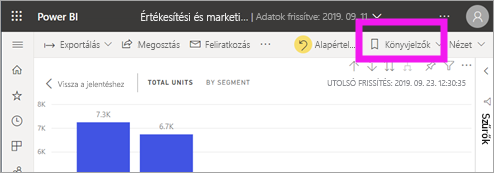
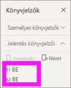
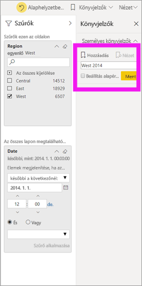
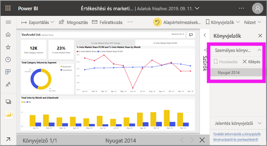
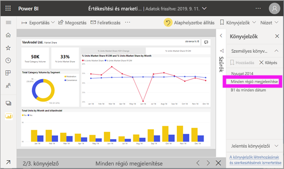

# Mik azok a könyvjelzők?
A könyvjelzők rögzítik a jelentés oldalának aktuálisan konfigurált nézetét, beleértve a szűrőket, a szeletelőket és a vizualizációk állapotát. Amikor kiválaszt egy könyvjelzőt, Power BI visszakerül abba a nézetbe. Kétféle könyvjelző létezik – egyrészt azok, amelyeket Ön hoz létre, másrészt azok, amelyeket a jelentések *tervezői* hoztak létre.

## Elemzések megosztása és történetek felépítése a Power BI könyvjelzőivel 
A könyvjelzők sok különféle módon lehet használni. Tegyük fel, hogy talál egy érdekes információt, és szeretné megőrizni azt – létrehozhat egy könyvjelzőt, hogy később bármikor megnézhesse. Ha abba kell most hagynia a munkát, és csak később tudja folytatni, hozzon létre egy könyvjelzőt. A könyvjelzőt még alapértelmezett nézetként is beállíthatja a jelentéshez, így ha bármikor visszatér, ez a nézet fogadja majd Önt. 

Egy tetszőleges sorrendbe rendezett teljes könyvjelzőgyűjteményt is létrehozhat, majd ezeket sorban megnyitva egy olyan bemutatót állíthat össze, amelyben lényegi összefüggések sorozatát mutathatja be, vagy amelyek egy történetet mondanak el.  

## Könyvjelzők megnyitása
A Könyvjelzők panel megnyitásához válassza a menüsorban a **Könyvjelzők** > **Több könyvjelző megjelenítése** lehetőséget. A közzétett jelentés eredeti alapértelmezett nézetének visszaállításához válassza a **Visszaállítás alapértelmezettre** elemet.

### Jelentés könyvjelzői
Ha a jelentés *tervezője* jelentéskönyvjelzőket is hozzáadott, azokat a **Jelentés könyvjelzői** cím alatt találja meg. A jelentésoldal két könyvjelzővel rendelkezik: B1 és B2. 

Válasszon ki egy könyvjelzőt a jelentésnézetre való váltáshoz. 

### Személyes könyvjelzők

A létrehozott könyvjelzőkhöz a rendszer a következő elemeket menti:

* Az aktuális oldal
* Szűrők
* Szeletelők, szeletelőtípusok (például legördülő menü vagy lista), valamint szeletelőállapot
* A vizualizáció kiválasztásának állapota (például szűrők keresztikemelése)
* A rendezés iránya
* A részletezés helye
* Láthatóság (az egyes objektumoké, a **Kiválasztás** panel használatával)
* A látható objektumok fókusz vagy **Reflektorfény** módja

Állítson be egy jelentésoldalt úgy, amilyen állapotban a könyvjelzővel menteni szeretné. Miután a jelentésoldalt és a vizualizációkat a kívánt módon elrendezte, a könyvjelző hozzáadásához válassza a **Könyvjelzők** panel **Hozzáadás** gombját. Ebben a példában néhány szűrőt adtunk hozzá a régióhoz és a dátumhoz. 

A **Power BI** létrehoz egy személyes könyvjelzőt, amelynek egy általános nevet ad, vagy az Ön által megadott nevet. A könyvjelzőket *átnevezheti*, *törölheti* vagy *frissítheti*, ha a könyvjelző neve melletti három pontra kattint, majd kiválasztja a megfelelő műveletet a megjelenő menüből.

Miután létrehozott egy könyvjelzőt, a megjelenítéséhez egyszerűen válassza ki azt a **Könyvjelzők** panelen. 

<!--
## Arranging bookmarks
As you create bookmarks, you might find that the order in which you create them isn't necessarily the same order you'd like to present them to your audience. No problem, you can easily rearrange the order of bookmarks.

In the **Bookmarks** pane, simply drag-and-drop bookmarks to change their order, as shown in the following image. The yellow bar between bookmarks designates where the dragged bookmark will be placed.

The order of your bookmarks can become important when you use the **View** feature of bookmarks, as described in the next section. 

-->

## Diavetítés a könyvjelzőkkel
Ha a könyvjelzőket sorrendben szeretné megjeleníteni, válassza a **Nézet** lehetőséget a **Könyvjelzők** panelen, hogy elindítsa a diavetítést.

A **Nézet** módban érdemes odafigyelni a következőkre:

- A könyvjelző neve a könyvjelző címsorában látható a vászon alján.
- A könyvjelző címsorában lévő nyilakkal léptethet előre és hátra a könyvjelzők között.
- A **Nézet** módból a **Könyvjelzők** panel **Kilépés** gombjával, vagy a könyvjelzők címsorán található **X** gombbal léphet ki.

A **Nézet** módban bezárhatja a **Könyvjelzők** panelt (a panel X gombjára kattintva), így több hely marad a bemutatónak. A **Nézet** módban az összes vizualizáció interaktívan kezelhető, és keresztkiemelést is lehet alkalmazni, ahogy a normál használat során is. 

<!--
## Visibility - using the Selection pane
With the release of bookmarks, the new **Selection** pane is also introduced. The **Selection** pane provides a list of all objects on the current page and allows you to select the object and specify whether a given object is visible. 

You can select an object using the **Selection** pane. Also, you can toggle whether the object is currently visible by clicking the eye icon to the right of the visual. 

When a bookmark is added, the visible status of each object is also saved based on its setting in the **Selection** pane. 

It's important to note that **slicers** continue to filter a report page, regardless of whether they are visible. As such, you can create many different bookmarks, with different slicer settings, and make a single report page appear very different (and highlight different insights) in various bookmarks.

## Bookmarks for shapes and images
You can also link shapes and images to bookmarks. With this feature, when you click on an object, it will show the bookmark associated with that object. This can be especially useful when working with buttons; you can learn more by reading the article about [using buttons in Power BI](desktop-buttons.md). 

To assign a bookmark to an object, select the object, then expand the **Action** section from the **Format Shape** pane, as shown in the following image.

Once you turn the **Action** slider to **On** you can select whether the object is a back button, a bookmark, or a Q&A command. If you select bookmark, you can then select which of your bookmarks the object is linked to.

There are all sorts of interesting things you can do with object-linked bookmarking. You can create a visual table of contents on your report page, or you can provide different views (such as visual types) of the same information, just by clicking on an object.

When you are in editing mode you can use ctrl+click to follow the link, and when not in edit mode, simply click the object to follow the link. 

## Bookmark groups

Beginning with the August 2018 release of **Power BI Desktop**, you can create and use bookmark groups. A bookmark group is a collection of bookmarks that you specify, which can be shown and organized as a group. 

To create a bookmark group, hold down the CTRL key and select the bookmarks you want to include in the group, then click the ellipses beside any of the selected bookmarks, and select **Group** from the menu that appears.

**Power BI Desktop** automatically names the group *Group 1*. Fortunately, you can just double-click on the name and rename it to whatever you want.

With any bookmark group, clicking on the bookmark group's name only expands or collapses the group of bookmarks, and does not represent a bookmark by itself. 

When using the **View** feature of bookmarks, the following applies:

* If the selected bookmark is in a group when you select **View** from bookmarks, only the bookmarks *in that group* are shown in the viewing session. 

* If the selected bookmark is not in a group, or is on the top level (such as the name of a bookmark group), then all bookmarks for the entire report are played, including bookmarks in any group. 

To ungroup bookmarks, just select any bookmark in a group, click the ellipses, and then select **Ungroup** from the menu that appears. 

Note that selecting **Ungroup** for any bookmark from a group takes all bookmarks out of the group (it deletes the group, but not the bookmarks themselves). So to remove a single bookmark from a group, you need to **Ungroup** any member from that group, which deletes the grouping, then select the members you want in the new group (using CTRL and clicking each bookmark), and select **Group** again. 
-->

## Korlátozások és szempontok
A **könyvjelzők** aktuális kiadásának használatára vonatkozik néhány korlátozás és egyéb szempont.

* A legtöbb egyéni vizualizáció zökkenőmentesen működik a könyvjelzőkkel. Ha hibát tapasztal egy könyvjelző és egy egyéni vizualizáció használatakor, lépjen kapcsolatba az egyéni vizualizáció létrehozójával, és kérje meg, hogy szolgáltasson támogatást a könyvjelzőkhöz. 
* Ha egy vizualizációt a könyvjelző létrehozását követően ad hozzá a jelentésoldalhoz, a vizualizáció az alapértelmezett állapotában jelenik meg. Ez azt is jelenti, hogy ha egy olyan oldalra vesz fel szeletelőt, ahol már hozott létre könyvjelzőket, a szeletelő az alapértelmezett állapotának megfelelően viselkedik majd.
* A könyvjelzőkre általában az nincs hatással, ha a jelentés *tervezője* frissíti vagy újra közzéteszi a jelentést. Ha azonban a tervező jelentős változtatásokat hajt végre a jelentésben, például eltávolítja a könyvjelzők által használt mezőket, akkor hibaüzenet jelenik meg, ha legközelebb megpróbálja megnyitni az adott könyvjelzőt. 

<!--
## Next steps
spotlight?
-->
