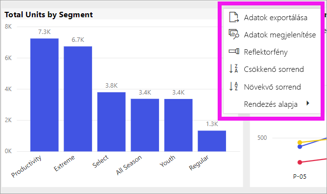
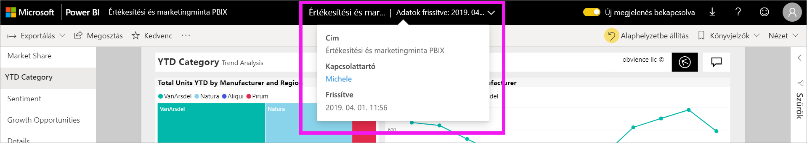

# A diagramok rendezésének módosítása egy Power BI-jelentésben

[!INCLUDE [power-bi-service-new-look-include](../includes/power-bi-service-new-look-include.md)]

> [!IMPORTANT]
> **Ez a cikk azon Power BI-felhasználók számára íródott, akik nem rendelkeznek szerkesztési engedélyekkel a jelentéshez vagy adathalmazhoz. A rendezésről részletesebb utasításokat talál, ha elolvassa az [Oszlop szerinti rendezés a Power BI Desktopban](../desktop-sort-by-column.md)** szakaszt.

A Power BI szolgáltatásban módosíthatja egy vizualizáció kinézetét, ha különböző adatmezők szerint rendezi. A vizualizáció rendezésének módosításával kiemelheti a közvetíteni kívánt információt.

Az irányítópulton a vizualizációk nem rendezhetők, de a Power BI-jelentésekben a legtöbb vizualizáció elrendezhető 

Akár numerikus adatokat használ (például értékesítési adatokat), akár szöveges adatokat (például államneveket), tetszése szerint rendezheti a vizualizációkat. A Power BI nagyon rugalmas rendezhetőséget és egyszerűen használható menüket biztosít. 

## Első lépések

A kezdéshez válasszon ki bármilyen vizualizációt, majd válassza a **További műveletek** (...) lehetőséget.  Itt három rendezési beállítás található: **Csökkenő sorrend**, **Növekvő sorrend** és **Rendezési szempont**. 
    

### Rendezés betűrendben vagy számsorrend szerint

A vizualizációk rendezhetők betűrendben a kategóriáinak neve alapján vagy az egyes kategóriák számértéke szerint is. Ez a diagram például a store  **Name** (üzlet neve) kategória szerint van ábécésorrendbe rendezve.

A rendezés könnyedén módosítható egy kategóriáról (store name – üzlet neve) egy értékre (sales per square feet – értékesítés négyzetlábanként). Válassza a **További műveletek** (...), majd a **Rendezési szempont** lehetőséget. Válassza ki a vizualizációban használt számértéket.  Ebben a példában a **Sales Per Sq Ft** (Értékesítés négyzetláb szerint) lehetőséget választotta.

Ha szükséges, módosítsa a rendezési sorrendet, amely lehet növekvő vagy csökkenő.  Válassza újból a **További műveletek** (...), majd a **Csökkenő rendezés** vagy a **Növekvő rendezés** lehetőséget. A rendezéshez használt mező félkövérrel szedve és egy sárga sávval jelenik meg.

   

> [!NOTE]
> Nem minden vizualizáció rendezhető. A következő vizualizációkat például nem lehet rendezni: fatérkép, térkép, kartogram, pontdiagram, mérőműszer, kártya, vízesés.

## A rendezési sorrend módosításainak mentése
A Power BI-jelentések megőrzik a szűrőket, a szeletelőket, a rendezést és az adatnézetek egyéb módosításait. Így ha kilép egy jelentésből, majd később visszatér, a rendezési módosítások mentve lesznek.  Ha szeretné visszaállítani a módosításokat a jelentés tervezőjének beállításaira, válassza a **Visszaállítás alapértelmezettre** lehetőséget a felső menüsávon. 

Ha azonban a **Visszaállítás alapértelmezettre** gomb szürke színnel jelenik meg, az azt jelenti, hogy a jelentés *tervezője* letiltotta a módosítások mentésének (megőrzésének) lehetőségét.

## Megfontolandó szempontok és hibaelhárítás

### Rendezés más feltételek alapján
Néha más (a vizualizációban nem szereplő) mező vagy más feltételek használatával szükséges rendezni a vizualizációt.  Rendezhet például hónapok alapján egymást követő sorrendben (és nem betűrend) alapján, vagy a teljes számok és nem az egyes számjegyek alapján is (például 0, 1, 9, 20, nem pedig 0, 1, 20, 9).  Ezeket a módosításokat csak a jelentés tervezője végezheti el Önnek. A *tervező* kapcsolattartási adatai a fejléc sávban a jelentés nevét választva találhatók meg.

## Következő lépések
További információk [a Power BI-jelentésekben lévő vizualizációkról](end-user-visualizations.md).

[Power BI – Alapfogalmak](end-user-basic-concepts.md)
