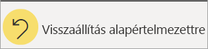

# A diagramok rendezésének módosítása egy Power BI-jelentésben

[!INCLUDE [power-bi-service-new-look-include](../includes/power-bi-service-new-look-include.md)]

A Power BI szolgáltatásban módosíthatja egy vizualizáció kinézetét, ha különböző adatmezők szerint rendezi. A vizualizáció rendezésének módosításával kiemelheti a közvetíteni kívánt információt, és biztosíthatja, hogy a vizualizáció tükrözze ezt a trendet (vagy hangsúlyt).

Akár numerikus adatokat használ (például értékesítési adatokat), akár szöveges adatokat (például államneveket), tetszése szerint rendezheti a vizualizációkat és az adatok megjelenését. A Power BI nagyon rugalmas rendezhetőséget és egyszerűen használható menüket biztosít. Bármely vizualizáción válassza a **További műveletek** (...) lehetőséget, majd válassza ki a mezőt, amely alapján rendezni szeretne.

Az irányítópultokon szereplő vizualizációkat nem lehet rendezni, a Power BI-jelentésekben viszont a legtöbb vizualizációt rendezheti a kategóriáinak neve alapján betűrendben vagy az egyes kategóriák számértéke szerint. Ez a diagram például a **store name** (üzlet neve) kategória szerint van ábécésorrendbe rendezve.

A rendezés könnyedén módosítható egy kategóriáról (store name – üzlet neve) egy értékre (sales per square feet – értékesítés négyzetlábanként).

1. Válassza a **További műveletek** (...), majd a **Rendezési szempont > Sales Per Sq Ft** (Eladások négyzetméterenként) lehetőséget.
2. Ha szükséges, válassza újból a **További műveletek** (...), majd a **Csökkenő rendezés** lehetőséget. A rendezéshez használt mező félkövérrel szedve és egy sárga sávval jelenik meg.

   

> [!NOTE]
> Nem minden vizualizáció rendezhető. A következő vizualizációkat például nem lehet rendezni: fatérkép, térkép, kartogram, pontdiagram, mérőműszer, kártya, vízesés.

## A rendezési sorrend módosításainak mentése
A Power BI-jelentések megőrzik a szűrőket, a szeletelőket, a rendezést és az adatnézetek egyéb módosításait. Így ha kilép egy jelentésből, majd később visszatér, a módosítások mentve lesznek.  Ha szeretné visszaállítani a módosításokat a jelentés tervezőjének beállításaira, válassza a **Visszaállítás alapértelmezettre** lehetőséget a felső menüsávon. 

Ha azonban a **Visszaállítás alapértelmezettre** gomb szürke színnel jelenik meg, az azt jelenti, hogy a jelentés tervezője letiltotta a módosítások mentésének (megőrzésének) lehetőségét.

## Rendezés más feltételek alapján
Néha más (a vizualizációban nem szereplő) mező vagy más feltételek használatával szükséges rendezni a vizualizációt.  Rendezhet például hónapok (és nem betűrend) alapján, vagy a teljes számok és nem az egyes számjegyek alapján is (például, 0, 1, 9, 20, nem pedig 0, 1, 20, 9).  A jelentéstervező frissítheti az adathalmazt az ilyen típusú rendezés engedélyezéséhez. A tervező kapcsolattartási adatai a fejléc sávban a jelentés nevét választva találhatók meg.

## Következő lépések
További információk [a Power BI-jelentésekben lévő vizualizációkról](end-user-visualizations.md).

[Power BI – Alapfogalmak](end-user-basic-concepts.md)
