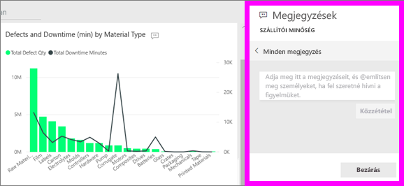
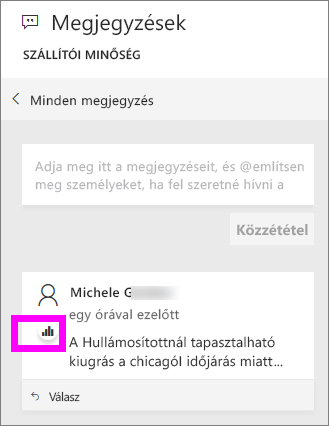
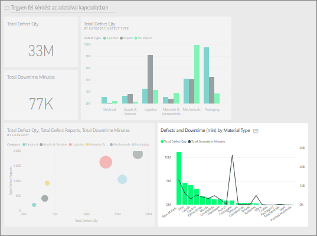

# Megjegyzés hozzáadása irányítópulthoz
Hozzáadhat személyes megjegyzéseket, vagy az irányítópultra vonatkozó beszélgetést kezdeményezhet a munkatársaival. A **megjegyzés** csak az egyik olyan funkció a sok közül, amely lehetővé teszi a *felhasználó* számára a másokkal való együttműködést. 

## A Megjegyzések funkció használata
Megjegyzések fűzhetők egy teljes irányítópulthoz vagy egy irányítópult egyes vizualizációihoz. Felvehet általános, vagy egy bizonyos munkatársaknak szánt megjegyzést is.  

### Általános megjegyzés hozzáadása irányítópulthoz
1. Nyisson meg egy Power BI-irányítópultot, és válassza a **Megjegyzések** ikont. Ekkor megnyílik a Megjegyzések párbeszédpanel.

    

    Itt azt látjuk, hogy az irányítópult készítője már felvett egy általános megjegyzést.  Ezt a megjegyzést mindenki láthatja, aki hozzáfér az irányítópulthoz.

    

2. Válaszadáshoz válassza a **Válasz** lehetőséget, gépelje be válaszát, majd válassza a **Közzététel** lehetőséget.  

    

    A Power BI alapértelmezés szerint ahhoz a kollégához, ez esetben Aaron F.-hez irányítja a választ, aki a megjegyzéssel megnyitotta a beszélgetést. 

    

 3. Ha olyan irányítópult-megjegyzést kíván felvenni, amely nem egy meglévő beszélgetés része, írja be megjegyzését a felső szövegmezőbe.

    

    Az ehhez az irányítópulthoz fűzött megjegyzések most az alábbi módon jelennek meg.

    

### Megjegyzés hozzáadása az irányítópult egy adott vizualizációjához
1. Vigye a kurzort a vizualizáció fölé, és kattintson a három pontra (...).    
2. A legördülő listából válassza a **Megjegyzés hozzáadása** lehetőséget.

      

3.  Ekkor megnyílik a **Megjegyzések** párbeszédpanel. Ehhez a vizualizációhoz még nem tartoznak megjegyzések. 

      

4. Írja be megjegyzését, majd válassza a **Közzététel** lehetőséget.

      

    A diagram ikon  jelzi, hogy ez a megjegyzés egy adott vizualizációhoz kötődik. Az ikon kijelölésével kiemelhető az irányítópulton a hozzá tartozó vizualizáció.

    

5. A **Bezárás** lehetőséggel lehet visszatérni az irányítópultra vagy a jelentésre.

### Munkatársai figyelmének felhívása a @ jel használatával
Ha megjegyzést fűz egy irányítópulthoz vagy egy adott vizualizációhoz, akkor erre a „@” jel használatával hívhatja fel munkatársai figyelmét.  A „@” jel begépelésekor a Power BI legördülő listát nyit meg, amelyben a vállalatához tartozó személyeket kereshet meg és jelölhet ki. Az ellenőrzött nevek a „@” előtaggal, kék betűkkel jelennek meg. 

Ez pedig egy olyan beszélgetés, amit a vizualizáció *tervezőjével* folytatok. A tervező a @ szimbólumot használja, hogy nekem címezze a megjegyzéseit. Innen tudom, hogy a megjegyzés nekem szól. Amikor megnyitom ezt az alkalmazás-irányítópultot a Power BI-ban, kiválasztom a **Megjegyzések** elemet a fejlécen. A **Megjegyzések** panel megjeleníti a beszélgetést.

  

## Következő lépések
Vissza [a felhasználói vizualizációkat ismertető szakaszhoz](end-user-visualizations.md)    
<!--[Select a visualization to open a report](end-user-open-report.md)-->