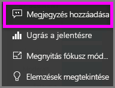
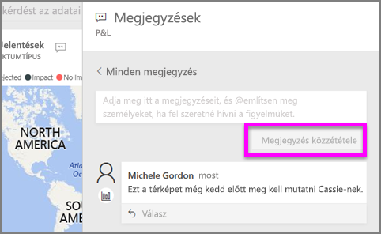
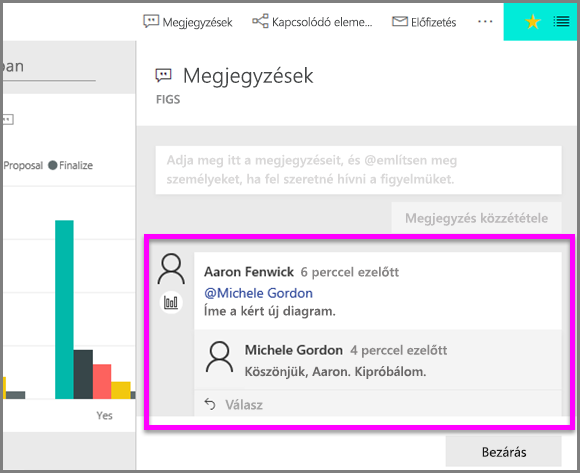

# Megjegyzések hozzáadása vizualizációhoz
Hozzáadhat személyes megjegyzéseket, vagy a vizualizációra vonatkozó beszélgetést kezdeményezhet a munkatársaival. A **megjegyzés** csak az egyik olyan funkció a sok közül, amely lehetővé teszi a *felhasználó* számára a vizualizációkkal való interakciót. 

## A megjegyzés funkció használata

1. Vigye a kurzort a vizualizáció fölé, és kattintson a három pontra (...).    
2. A legördülő listából válassza a **Megjegyzés hozzáadása** lehetőséget.

      

3.  Írja be a megjegyzést, majd válassza a **Megjegyzés közzététele** lehetőséget. Ez egy megjegyzés, amit magamnak írtam (és a helyesírásra sem figyeltem oda).

      

4. Ez pedig egy olyan beszélgetés, amit a vizualizáció *tervezőjével* folytatok. A tervező a @ szimbólumot használja, hogy nekem címezze a megjegyzéseit. Innen tudom, hogy a megjegyzés nekem szól. Amikor megnyitom ezt az alkalmazás-irányítópultot a Power BI-ban, kiválasztom a **Megjegyzések** elemet a fejlécen. A **Megjegyzések** panel megjeleníti a beszélgetést. 

      

5. A **Bezárás** gombra kattintva lehet visszatérni az irányítópultra vagy a jelentésre.

## Következő lépések
Vissza [a felhasználói vizualizációkat ismertető szakaszhoz](end-user-visualizations.md)    
<!--[Select a visualization to open a report](end-user-open-report.md)-->