# Megjegyzés hozzáadása irányítópulthoz vagy jelentéshez
Hozzáadhat személyes megjegyzéseket, vagy az irányítópultra vagy a jelentésre vonatkozó beszélgetést kezdeményezhet a munkatársaival. A **megjegyzés** csak az egyik olyan funkció a sok közül, amely lehetővé teszi a *felhasználó* számára a másokkal való együttműködést. 

## A Megjegyzések funkció használata
Megjegyzések fűzhetők egy teljes irányítópulthoz, annak egyes vizualizációihoz, egy jelentésoldalhoz, valamint annak egyes vizualizációihoz. Felvehet általános, vagy egy bizonyos munkatársaknak szánt megjegyzést is.  

Amikor megjegyzést ad hozzá egy jelentéshez, a Power BI rögzíti az aktuális szűrő- és szeletelőértékeket. Ez azt jelenti, hogy amikor kijelöl egy megjegyzést, vagy válaszol rá, a jelentésoldal vagy a jelentés vizualizációja úgy változhat, hogy megjelenítse a megjegyzés első hozzáadásakor aktív szűrő- és szeletelőkijelöléseket.  

Mi ennek a jelentősége? Tegyük fel, hogy egy munkatársa egy olyan szűrőt alkalmazott, amely érdekes elemzést eredményezett, és ezt meg szeretné osztani a csoporttal. A szűrő kijelölése nélkül a megjegyzés értelmét vesztheti. 

### Általános megjegyzés hozzáadása irányítópulthoz vagy jelentéshez
Az irányítópultok és a jelentések esetén hasonló a megjegyzések hozzáadásának menete. Ebben a példában egy irányítópultot használunk. 

1. Nyisson meg egy Power BI-irányítópultot vagy -jelentést, és válassza a **Megjegyzések** ikont. Ekkor megnyílik a Megjegyzések párbeszédpanel.

    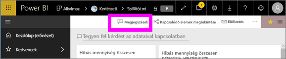

    Itt azt látjuk, hogy az irányítópult készítője már felvett egy általános megjegyzést.  Ezt a megjegyzést mindenki láthatja, aki hozzáfér az irányítópulthoz.

    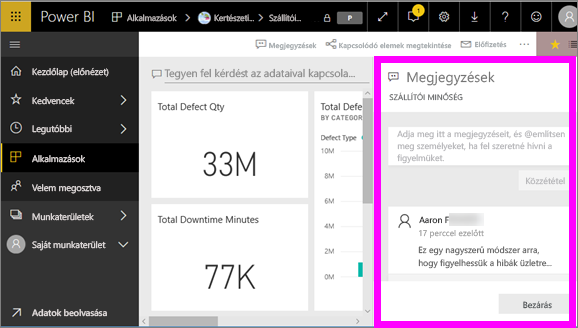

2. Válaszadáshoz válassza a **Válasz** lehetőséget, gépelje be válaszát, majd válassza a **Közzététel** lehetőséget.  

    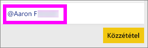

    A Power BI alapértelmezés szerint ahhoz a kollégához, ez esetben Aaron F.-hez irányítja a választ, aki a megjegyzéssel megnyitotta a beszélgetést. 

    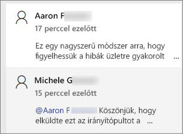

 3. Ha olyan megjegyzést kíván felvenni, amely nem egy meglévő beszélgetés része, írja be megjegyzését a felső szövegmezőbe.

    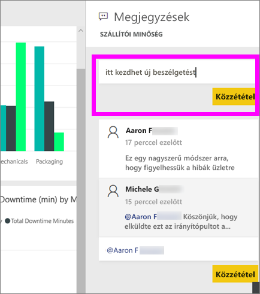

    Az ehhez az irányítópulthoz fűzött megjegyzések most az alábbi módon jelennek meg.

    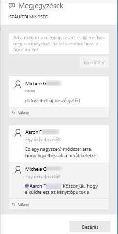

### Megjegyzés hozzáadása az irányítópult vagy jelentés egy adott vizualizációjához
Megjegyzések nemcsak a teljes irányítópulthoz vagy jelentésoldalhoz fűzhetők hozzá, hanem különálló irányítópult-csempékhez és jelentésvizualizációkhoz is. Ennek folyamata hasonló, ebben a példában egy jelentéssel illusztráljuk.

1. Vigye a kurzort a vizualizáció fölé, és kattintson a három pontra (...).    
2. A legördülő listából válassza a **Megjegyzés hozzáadása** lehetőséget.

    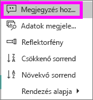  

3.  Megnyílik a **Megjegyzések** párbeszédpanel, az oldalon található többi vizualizáció pedig beszürkül. Ehhez a vizualizációhoz még nem tartoznak megjegyzések. 

    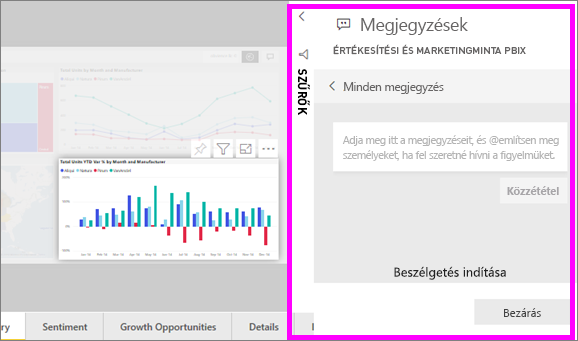  

4. Írja be megjegyzését, majd válassza a **Közzététel** lehetőséget.

    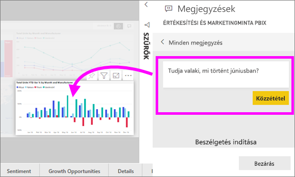  

    - Ha kijelöl egy vizualizációhoz fűzött megjegyzést a jelentésoldalon, az kiemeli a vizualizációt (lásd fent).

    - Irányítópultokon a diagram ikon  jelzi, hogy a megjegyzés egy adott vizualizációhoz kötődik. A teljes irányítópultra vonatkozó megjegyzésekhez nem tartozik különleges ikon. A diagram ikon kijelölésével kiemelhető az irányítópulton a hozzá tartozó vizualizáció.

        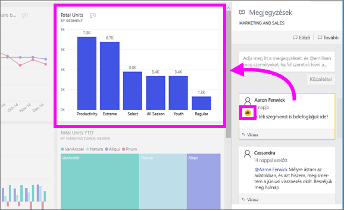

5. A **Bezárás** lehetőséggel lehet visszatérni az irányítópultra vagy a jelentésre.

### Munkatársai figyelmének felhívása a @ jel használatával
Akár egy irányítópulthoz, jelentéshez, csempéhez vagy vizualizációhoz fűz megjegyzést, erre a „\@” jel használatával hívhatja fel munkatársai figyelmét.  A „\@” jel begépelésekor a Power BI legördülő listát nyit meg, amelyben a vállalatához tartozó személyeket kereshet meg és jelölhet ki. Az ellenőrzött nevek a „\@” előtaggal, kék betűkkel jelennek meg. 

Ez pedig egy olyan beszélgetés, amit a vizualizáció *tervezőjével* folytatok. A tervező a @ szimbólumot használja, hogy nekem címezze a megjegyzéseit. Innen tudom, hogy a megjegyzés nekem szól. Amikor megnyitom ezt az alkalmazás-irányítópultot a Power BI-ban, kiválasztom a **Megjegyzések** elemet a fejlécen. A **Megjegyzések** panel megjeleníti a beszélgetést.

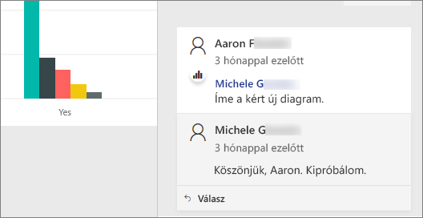  

## Következő lépések
Vissza [a felhasználói vizualizációkat ismertető szakaszhoz](end-user-visualizations.md)    
<!--[Select a visualization to open a report](end-user-open-report.md)-->
