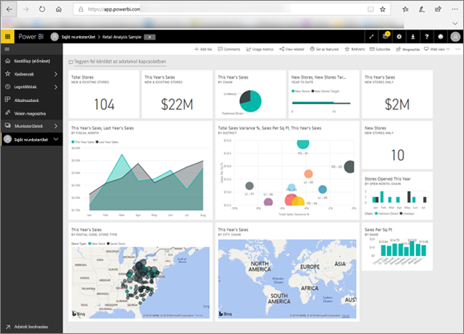

# A Power BI felhasználók számára
A munkakörétől függ, hogy milyen módon használja a Power BI-t. *Végfelhasználóként* vagy *felhasználóként* irányítópultokat, jelentéseket és alkalmazásokat kap munkatársaitól. Ezeket a tartalmakat a ***Power BI szolgáltatásban*** tudja áttekinteni és felhasználni üzleti döntések meghozatalához.

Ha csak most kezdte el használni a Power BI-t, elsőként mindenképp olvassa el a [Power BI áttekintéséről](../power-bi-overview.md) szóló cikket. A cikk bemutatja a Power BI-t alkotó eszközöket.

Felhasználóként nem fog hozzáférni a Power BI összes szolgáltatásához – ami logikus, hiszen nem az Ön feladata irányítópultokat és jelentéseket létrehozni. Az Ön feladata, hogy a Power BI-t az elemzés, monitorozás, felfedezés és döntéshozatal segítésére használja.

A felhasználók számára készült cikkek olvasása során megismeri a terminológiát, a Power BI szolgáltatást, megtudhatja, hogyan navigálhat a tartalmak között, végül pedig azt, hogy miként használhatja ezeket a tartalmakat.  Most pedig lássunk neki!

## Következő lépések

[Szakkifejezések és alapfogalmak a Power BI *felhasználói* számára](end-user-basic-concepts.md)

<!-- [Get started guide for *consumers*] -->
[Ismerkedés a Power BI szolgáltatással](../service-get-started.md)

