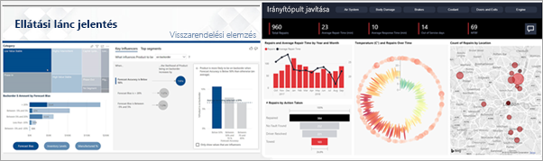
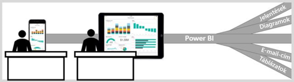

# A Power BI szolgáltatás felhasználók számára

[!INCLUDE[consumer-appliesto-ynny](../includes/consumer-appliesto-ynny.md)]

Egy adatkultúrában élünk, ahol az üzleti döntések a tényeken alapulnak, nem pedig véleményeken. Ezekhez a döntésekhez adatokra van szükség, és a munkatársai segítenek Önnek ebben.     
 
Különféle jelentéseket, számolótáblákat, diagramokat tartalmazó e-maileket, sőt kinyomtatott emlékeztetőket is küldenek Önnek. Az adatmennyiség növekedésével egyre nehezebben tudható, mire van gyorsan szüksége, és attól is tart, hogy esetleg nem is a legújabb információkat használja.  
 

## A Power BI szolgáltatás *felhasználók* számára

A Power BI megkönnyíti a dolgát, és egyúttal hatékonyabbá is teszi az elvégzett munkáját. Minden adatból grafikonok és diagramok lesznek, amelyek vizuálisan mutatják be az adatokat. Számokat és szavakat tartalmazó hosszú listák vagy táblázatok helyett az adatok ***tetszetősen*** jelennek meg: olyan színes és lenyűgöző vizualizációkban, amelyek az adatelemzések alapján történeteket mesélnek el. 

 
Mindössze meg kell nyitnia a Power BI szolgáltatást egy böngészőben vagy a mobileszközön. Ön és munkatársai ugyanazokat a megbízható irányítópultokat és jelentéseket használják, amelyek automatikusan frissülnek, így mindenki mindig a legfrissebb tartalommal dolgozhat.   

Mivel a tartalom nem statikus, azokat mélyebben is megvizsgálhatják, és trendeket, információkat és más üzletiintelligencia-elemzéseket tárhatnak fel. A tartalmat szeletelheti és más módon is rendszerezheti, sőt akár saját szavaival is feltehet kérdéseket. Vagy egyszerűen megvárhatja, hogy az adatokból érdekes információk szülessenek, értesítéseket kérhet az adatváltozásokról, és e-mailben kaphat jelentéseket az Ön által megadott ütemezés szerint. Az összes adata bármikor, a felhőben vagy a helyszínen is bármely eszközről elérhető. És ez még csak egy kis szelete annak, amire a Power BI képes. 

## A Power BI *felhasználójának* számítok?

A munkakörétől függ, hogy milyen módon használja a Power BI-t. Végfelhasználóként vagy *felhasználóként* Ön kap tartalmat (irányítópultokat, jelentéseket vagy alkalmazásokat) a munkatársaitól. A Power BI online vagy mobil változatát használja, amelyet Power BI szolgáltatásnak hívunk, és így tekinti át vagy használja a tartalmat üzleti döntésekhez. 
   
Felhasználóként nem fog hozzáférni a Power BI összes szolgáltatásához – ami nem probléma, hiszen nem az Ön feladata irányítópultokat és jelentéseket létrehozni. Ön a Power BI szolgáltatást elemzéshez, monitorozáshoz, felfedezéshez és döntéshozatal segítésére használja. 

Kétségtelenül találkozni fog a „Power BI Desktop” vagy „Desktop” kifejezéssel. Ezek az irányítópultokat és jelentéseket létrehozó, illetve megosztó *tervezők* által használt különálló eszközre utalnak.  Fontos megjegyezni, hogy más Power BI-eszközök is vannak, felhasználóként azonban csak a Power BI szolgáltatással fog dolgozni. 

Mivel *megosztott* tartalommal dolgozik, Power BI Pro- vagy prémium szintű licencre van szüksége. [Milyen licenccel rendelkezem?](end-user-license.md)

## A tartalom biztonságos kezelése 
Bátran szűrhet, szeletelhet, feliratkozhat és exportálhat – a tevékenysége nem befolyásolja az eredeti megosztott tartalmat (irányítópultokat, jelentéseket és alkalmazásokat) és az azok alapjául szolgáló adatokat.  

Az adatokban nem tud kárt tenni.  A Power BI nagyszerű eszközt jelent a felfedezéshez és kísérletezéshez, és közben nem kell amiatt aggódnia, hogy elront valamit.  
 
Ez nem azt jelenti, hogy a módosításait nem mentheti – ezt megteheti. A módosítások azonban egyedül azt befolyásolják, ahogyan Ön látja a tartalmat. Az eredeti, alapértelmezett nézet egyetlen kattintással helyreállítható.  

## Következő lépések

[A Power BI szolgáltatás felhasználóknak szóló bemutatója](end-user-reading-view.md)    
[Képzés a Power BI szolgáltatás használatához felhasználók számára](https://docs.microsoft.com/learn/paths/consume-data-with-power-bi/)    
[Szakkifejezések és alapfogalmak a Power BI *felhasználói* számára](end-user-basic-concepts.md)    

