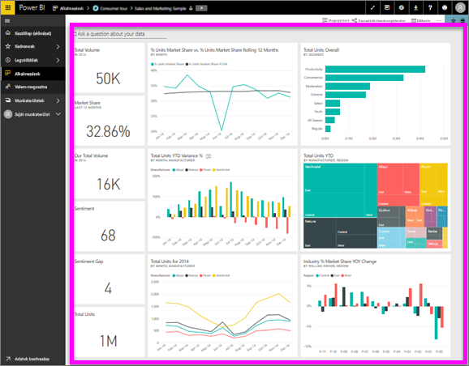

# Irányítópult megtekintése
A Power BI-felhasználók sok időt töltenek irányítópultok tanulmányozásával. Az irányítópultok adott információkat jelenítenek meg alapul szolgáló jelentésekből vagy adathalmazokból. A Power BI-felhasználók pedig ezen információkat használják a nyomkövetéshez, monitorozáshoz, kérdések megválaszolásához, teszteléshez és egyéb műveletekhez az adatokon alapuló üzleti döntések meghozása érdekében.

A Power BI Pro az irányítópultok megosztásához és a megosztott irányítópultok megtekintéséhez is szükséges.

## Irányítópult megnyitása

|              |         |
|------------|--------------------------------|
|      |Az irányítópultok a Power BI szolgáltatásban számos helyről megnyithatók.   Egyszerűen keresse ezt az irányítópult ikont. Ha már megtalálta az adott  irányítópultot, a megnyitás egyszerű – csak válassza ki, és az irányítópult megjelenik  a Power BI vásznán. |
|                    |          |

Irányítópultokat a bal oldali navigációs sáv összes tárolójában találhat. 
- **Kezdőlap** (előnézet)
- **Kedvencek** – ha [kedvencként állított be egy irányítópultot](end-user-favorite.md).
- **Legutóbbi** – ha nemrég látogatott meg egy irányítópultot.
- **Alkalmazások** – a legtöbb alkalmazás irányítópultokat és jelentéseket is tartalmaz.
- **Velem megosztva** – ha munkatársai [irányítópultokat osztanak meg Önnel](end-user-shared-with-me.md).
- **Saját munkaterület** – ha [Power BI-példákat](../sample-datasets.md) töltött le.

## Következő lépések
* [Minta-irányítópultjaink](../sample-tutorial-connect-to-the-samples.md) egyikének megtekintése révén megismerkedhet az irányítópultok használatával.
* Ismerkedjen meg az [irányítópult-csempékkel](end-user-tiles.md), és fedezze fel mi történik, ha kiválaszt egy csempét.