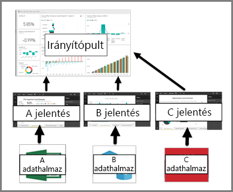

# Irányítópultok a Power BI szolgáltatás felhasználói számára

A Power BI-***irányítópult*** egy gyakran vászonnak is nevezett oldal, amely vizualizációk segítségével mesél el egy történetet. Mivel az irányítópult egyetlen lapon jelenik meg, ezért a jól megtervezett irányítópult csak a történet legfontosabb elemeit tartalmazza.

Az irányítópulton látható vizualizációkat *csempéknek* nevezik, és a jelentés *tervezői* *rögzítik* őket az irányítópultra. A legtöbb esetben a csempe kiválasztásával arra a jelentésoldalra jut, amelyen a vizualizációt létrehozták. Ha csak most kezdte el használni a Power BI-t, a [Power BI alapfogalmait](end-user-basic-concepts.md) elolvasva egyszerűen elsajátíthatja az alapokat.

> [!NOTE]
> Az irányítópultok [megtekinthetők és megoszthatók mobileszközökön](mobile/mobile-apps-view-dashboard.md).
>
> Az Önnel megosztott irányítópultok megtekintéséhez Power BI Próra van szükség.
> 

Az irányítópulton megjelenő vizualizációk a jelentéseken, az egyes jelentések pedig egy-egy adatkészleten alapulnak. Az irányítópultok tulajdonképpen az alapjául szolgáló jelentésekhez és adatkészletekhez való hozzáférési útnak is tekinthetők. Egy vizualizáció kiválasztásával hozzáférhet a létrehozásához használt jelentéshez (és adatkészlethez).

## Az irányítópultok előnyei
Az irányítópultok segítségével nagyszerűen nyomon követheti üzletmenetét, választ találhat kérdéseire, és egyetlen pillantással megtekintheti a legfontosabb mérőszámokat. Az irányítópulton található vizualizációk egy vagy több adatkészletből vagy jelentésből is származhatnak. Az irányítópult a helyi és a felhőben keletkezett adatokat ötvözi, és egyesített nézetet biztosít függetlenül attól, hogy az adatok hol találhatók.

Az irányítópult nem csak egy tetszetős kép, hanem egy interaktív funkció, amelyben az egyes csempék az alapul szolgáló adatok változásának megfelelően frissülnek.

## Irányítópultok és jelentések összehasonlítása a Power BI ***felhasználói*** számára
A jelentéseket könnyű összekeverni az irányítópultokkal, mivel mind a kettő egy vizualizációkkal teli vászon. Azonban van köztük néhány alapvető különbség a Power BI *felhasználói* számára.

| **Képesség** | **Irányítópultok** | **Jelentések** |
| --- | --- | --- |
| Oldalak |Egy oldal |Egy vagy több oldal |
| Adatforrások |Egy vagy több jelentés és egy vagy több adatkészlet irányítópultonként |Egyetlen adatkészlet jelentésenként |
| Szűrés |Nem lehet szűrni és szeletelni |Számos szűrési, kiemelési és szeletelési móddal rendelkezik |
| Riasztások beállítása |Létrehozhat olyan riasztásokat, amelyek e-mailen keresztül értesítik, ha a feltételek teljesülnek |Nem |
| Kiemelt |Kiválaszthat és beállíthat egy „kiemelt” irányítópultot |Nem hozhat létre kiemelt jelentést |
| Láthatja az alapul szolgáló adatkészlet-táblázatokat és -mezőket |Nem. Exportálhatja az adatokat, de magán az irányítópulton nem fogja látni a táblázatokat és a mezőket. |Igen. Láthatja az adatkészlet-táblázatokat, -mezőket és -értékeket. |

## Az irányítópultok létrehozói és felhasználói
A Power BI ***felhasználójaként*** az irányítópultokat *létrehozóktól* kapja meg. Az irányítópultokról további információt olvashat az alábbi témakörökben:

* [Irányítópult megtekintése](end-user-dashboard-open.md)
* Ismerkedjen meg az [irányítópult-csempékkel](end-user-tiles.md), és fedezze fel mi történik, ha kiválaszt egy csempét.
* Szeretne nyomon követni egy adott irányítópult-csempét, és e-mailes értesítést kapni, ha elér egy bizonyos küszöbértéket? [Riasztások létrehozása a csempéken](end-user-alerts.md).
* Tegye fel bátran az irányítópultokkal kapcsolatos kérdéseit. Fedezze fel, hogyan teheti fel az adatokkal kapcsolatos kérdéseit és szerezheti meg a válaszokat vizualizáció formájában a [Power BI Q&A](end-user-q-and-a.md) segítségével.

> [!TIP]
> Ha nem találta meg, amit keres, használja a bal oldalon található tartalomjegyzéket.
> 

## Következő lépések
[Irányítópult megtekintése](end-user-dashboard-open.md) 