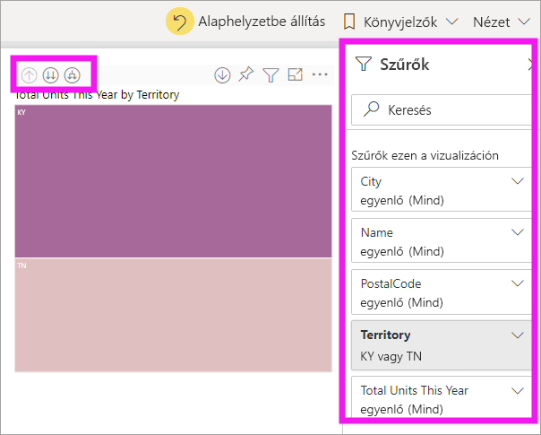
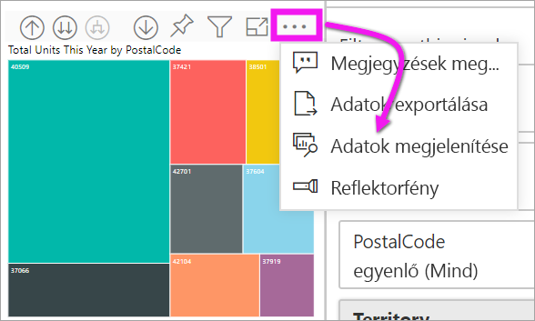

# Részletezés mód vizualizációkban a Power BI-ban

[!INCLUDE[consumer-appliesto-yyny](../includes/consumer-appliesto-yyny.md)]

[!INCLUDE [power-bi-service-new-look-include](../includes/power-bi-service-new-look-include.md)]

Ez a cikk bemutatja, hogyan lehet részletezni a vizualizációk mélyebb szintjeit a Microsoft Power BI szolgáltatásban. Az adatpontok részletezésével és felhatolásával mélyreható betekintést nyerhet az adatokba. 

## A részletezéshez hierarchiára van szükség

Ha a vizualizáció mögött hierarchikus adatstruktúra található, a részletesebb adatszintek kibonthatók. Tegyük fel például, hogy egy vizualizáció az olimpiai érmek számát jeleníti meg, sportonkénti, szakágankénti és versenyszámonkénti adathierarchia alapján. Alapértelmezés szerint a vizualizáció az érmek számát sportok szerinti bontásban (pl. gimnasztika, síelés, vízi sportok stb.) jeleníti meg. Ugyanakkor mivel a vizualizáció hierarchikus, egy-egy vizuális elem (például egy oszlop, egy sáv vagy egy kör) kiválasztásakor egyre részletesebb ábra jeleníthető meg. Ha a **vízi sportok** elemre kattint, megjelennek az úszásra, a műugrásra és a vízilabdára vonatkozó adatok.  Ha a **műugrás** elemre kattint, a műugró, toronyugró és szinkronugró versenyszámra vonatkozó információkat fogja látni.

Sajátos hierarchiatípust képviselnek a dátumok.  A jelentéstervezők gyakran vesznek fel hierarchiákat a vizualizációkba. A dátumhierarchiákban gyakran szerepel az év, a negyedév, a hónap és a nap. 

## A részletezhető vizualizációk azonosítása
Nem tudja, hogy mely Power BI-vizualizációk tartalmaznak hierarchiát? Vigye az egérmutatót egy vizualizáció fölé. Ha a tetején a képen látható részletezési vezérlők kombinációja látható, az azt jelzi, hogy a vizualizáció tartalmaz hierarchiát.

  

## A lehatolás és a felhatolás ismertetése

Ebben a példában egy fatérképet használunk, amelyhez egy területből, településből, irányítószámból és áruháznévből álló hierarchia tartozik. A fatérkép a részletezés előtt megvizsgálja, hogy összesen hány egységet adtak el ebben az évben területeként. 

  

### A részletezési funkciók elérésének két módja

A lehatolási, a felhatolási és a kibontási funkciót kétféleképpen is elérheti a hierarchiával rendelkező vizualizációkhoz. Próbálja ki őket, és használja azt, amelyik Önnek tetszik.

- Első módszer: az ikonok megjelenítéséhez és használatához mutasson egy vizualizációra.  

    

- Második módszer: a menü megjelenítéséhez és használatához kattintson a jobb gombbal egy vizualizációra.

    

## A lehatolás útvonala

### Lehatolás minden mezőre egyszerre

A vizualizációban való lehatoláshoz több módszert is használhat. A lehatolás ikonját választva a hierarchia következő szintjére léphet. A Kentucky és Tennessee államhoz tartozó **Terület** szint esetében egyaránt lehatolhat a település, majd az irányítószám, végül pedig az üzletnév szintjére. Az útvonal minden lépésén új információhoz juthat.

Válassza a felhatolás ikonját  a folyó évi összes egység terület szerinti adataihoz való visszatéréshez.

### Az összes mező kibontása egyszerre

A **Kibontás** a jelenlegi nézethez egy új hierarchiaszintet ad hozzá. Így ha a **Terület** szinten van, kibonthatja, azt és hozzáadhat a fatérképhez várost, irányítószámot és nevet. Az útvonal minden lépése ugyanazt az információt jeleníti meg, és egy új szintet ad hozzá új információkkal.

A mezőkön egyesével is végezhet lehatolást és kibontást.

### Lehatolás mezőnként

1. A lehatolás ikonjának választása a bekapcsoláshoz .

    Most már lehetősége van arra, hogy egy vizuális elemet kijelölve **egyszerre egy mezőnyit** hatoljon le. Példák a vizualizációs elemekre: sáv, buborék és levél.

    

    Ha nem kapcsolja be a lehatolást, egy vizualizációs elem (például egy sáv, buborék vagy levél) kiválasztásakor nem történik lehatolás. Ehelyett a program keresztszűrést végez a jelentésoldal többi diagramján.

1. Válassza ki a **TN**-hez tartozó levélcsomópontot. A fatérkép ekkor megjeleníti az összes olyan várost és területet Tennessee államban, amelyben van üzlet.

    

1. Jelenleg a következőket végezheti el:

    1. További, Tennesseere vonatkozó lehatolás.

    1. Tennessee egy adott városára vonatkozó lehatolás.

    1. Kibontás.

    Most folytassuk azzal, hogy egyszerre egy-egy mezőben végzünk lehatolást.  Válassza ki a **Knoxville, TN** elemet. A fatérkép most a Knoxville-ben található üzlet postai irányítószámát mutatja.

    

    Nézze meg, hogyan változik a csempe, ahogy le- és felhatol a hierarchiában.

### Az összes kibontása és egyszerre egy-egy mező kibontása

Egy olyan fatérkép, amely mindössze egy irányítószámot mutat, nem igazán hasznos.  Most *bontson ki* lefelé egy szintet a hierarchiában.  

1. Az aktív fatérképben válassza a *Kibontás lefelé* ikont . A fatérkép ekkor a hierarchia két szintjét mutatja: irányítószámot és üzletnevet.

    

1. Ha meg szeretné tekinteni a Tennessee-hez tartozó adatok mind a négy hierarchiaszintjét, válassza a felhatolás nyilat addig, amíg el nem éri a faszerkezetes térképen a második szintet, amely a **Total units this year by territory and city** (Összes egység ebben az évben terület és város szerint).

    

1. Győződjön meg róla, hogy továbbra is be van kapcsolva a lehatolás,  majd válassza a *Kibontás lefelé* ikont . A fatérképen most ugyanannyi levél (doboz) látható, de az egyes levelekhez további részletek is megjelennek. A város és az állam mellett most már irányítószámot is mutat.

    

1. Válassza a *kibontás lefelé* ikont még egyszer: ezzel megjeleníti a Tennesee-hez tartozó adatok mind a négy hierarchiaszintjét a fatérképen. Ha még több részletet szeretne, mutasson rá egy levélcsomópontra.

    

## Az adatok megjelenítése lehatoláskor
Az **Adatok megjelenítése** elemet választva megjelenítheti a részleteket. Minden egyes alkalommal, amikor részletezést vagy kibontást végez, az **Adatok megjelenítése** elemmel megjelenítheti a vizualizáció létrehozásához használt adatokat. Ez segíthet annak megértésében, hogy a hierarchiák, a részletezés és a kibontás hogyan működnek együtt a vizualizációk létrehozásában. 

A jobb felső sarokban válassza a **További beállítások** (...) lehetőséget, majd az **Adatok megjelenítése** elemet. 

A következő táblázatban az látható, hogy milyen eredményt kapunk, ha az összes mező területről egyszerre hatolunk le az üzletnévre.  

Figyelje meg, hogy a végösszegek azonosak a **Település**, az **Irányítószám** és a **Név** esetében. Ez nem mindig van így.  Ezeknél az adatoknál azonban minden egyes irányítószámhoz és településhez csak egyetlen üzlet tartozik.  

## Megfontolandó szempontok és korlátozások
- Alapértelmezés szerint a lehatolás nem szűri a jelentés többi vizualizációját. A jelentéstervező azonban megváltoztathatja ezt az alapértelmezett viselkedést. Részletezés közben ellenőrizze, hogy a lapon a többi vizualizációra jellemző-e keresztszűrés vagy keresztkiemelés.

- Az Önnel megosztott jelentések megtekintéséhez Power BI Pro- vagy prémium szintű licenc szükséges. [Milyen licenccel rendelkezem?](end-user-license.md)

## További lépések

[Vizualizációk a Power BI-jelentésekben](../visuals/power-bi-report-visualizations.md)

[A Power BI-jelentések](end-user-reports.md)

[Power BI – Alapfogalmak](end-user-basic-concepts.md)

Több kérdése van? [Kérdezze meg a Power BI közösségét](https://community.powerbi.com/)
