# Rövid útmutató – Navigáció a Power BI szolgáltatásban

[!INCLUDE [power-bi-service-new-look-include](../includes/power-bi-service-new-look-include.md)]

Most, hogy már ismeri a Power BI használatának alapjait, ideje megismerkednie a **Power BI szolgáltatással** is. Ahogy azt korábban említettük, előfordulhat, hogy a csapata egy tagja az összes idejét a **Power BI Desktop** alkalmazásban tölti azzal, hogy adatokat kombinál és jelentéseket hoz létre mások számára. De lehet, hogy ezzel szemben Ön azzal tölti az összes idejét a Power BI szolgáltatásban, hogy mások által készített tartalmakat tekint meg és kezel (**felhasználói** élmény). Ebben a rövid útmutatóban mintaadatok importálásával és használatával felfedezheti, hogy hogyan tud navigálni a Power BI szolgáltatásban. 
 
## Előfeltételek

- Ha még nem regisztrált a Power BI-ra, a kezdés előtt [hozzon létre egy ingyenes próbaverziós fiókot](https://app.powerbi.com/signupredirect?pbi_source=web).

- Olvassa el [A Power BI szolgáltatás alapfogalmai](end-user-basic-concepts.md) című cikket.

## A Power BI szolgáltatás megnyitása és adatok beolvasása
Első lépésként beszerzünk néhány mintaadatot a Power BI szolgáltatás bemutatásához. Sokféle típusú mintaadat a rendelkezésére áll a szolgáltatások kipróbálásához, melyek közül ezúttal a kiskereskedelmi elemzési mintaadatokat fogjuk használni.    
1. Nyissa meg az app.powerbi.com lapot, és válassza a **Minták** hivatkozást. 

    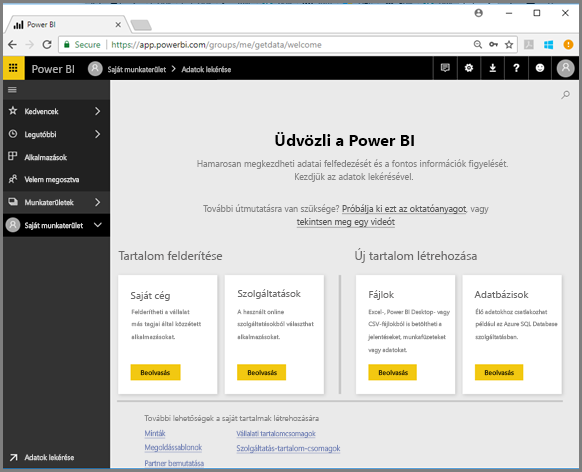

2. Válassza a **Kiskereskedelmi elemzési minta > Csatlakozás** lehetőséget.

    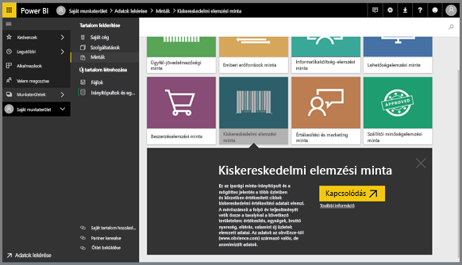

    A Power BI szolgáltatás ekkor importálja a mintát, és megjeleníti az irányítópultot. Az irányítópult megkülönbözteti a Power BI szolgáltatást a Power BI Desktoptól. A minta tartalmaz egy jelentést és egy adatkészletet is, melyre később fogunk kitérni.

    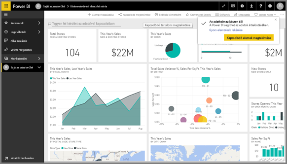

Amanda most bemutatja a Power BI szolgáltatás navigációjának használatát.  Ezután Ön is elkezdheti az ismerkedést a videó alatt látható részletes utasítások alapján.

<iframe width="560" height="315" src="https://www.youtube.com/embed/G26dr2PsEpk" frameborder="0" allowfullscreen></iframe>

## Tartalom megtekintése (irányítópultok, jelentések, munkafüzetek, adatkészletek, munkaterületek, alkalmazások)
Kezdjük az alapvető tartalmak (irányítópultok, jelentések, adatkészletek, munkafüzetek) rendszerének megtekintésével. A tartalom egy munkaterületen belül jelenik meg. Ezen a ponton csak egy munkaterülete van, melynek neve **Saját munkaterület**. Általában a felhasználóknak nincs szükségük másik munkaterület használatára. A Saját munkaterület a tulajdonában lévő összes tartalom tárolására szolgál. Tekintsen rá úgy mint a saját, személyes munkaterületére, ahol nyugodtan kísérletezhet tartalmaival. A Saját munkaterület az a hely, ahova a Kiskereskedelmi elemzési mintát letöltötte és mentette. 

A Saját munkaterületen belül a tartalom 4 lapon van elhelyezve: irányítópultok, jelentések, munkafüzetek, és adatkészletek.

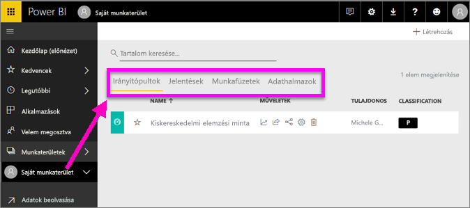

Jelöljön ki egy munkaterületet a navigációs ablaktáblán, és a Power BI vásznát jobb oldalt a vonatkozó tartalmak (irányítópultok, jelentések, munkafüzetek, adathalmazok) lapfülei fogják kitölteni.

Ha új felhasználó, akkor csak egyetlen munkaterületet lát – a **Saját munkaterület** nevű munkaterületet.

Ezeken a lapokon (más néven *tartalomnézeteken*) belül információt találhat a tartalomról, illetve különböző műveleteket érhet el a tartalommal való munkához.  Az Irányítópultok lapról például megnyithat egy irányítópultot, kereshet, rendezhet és még sok mást is tehet.

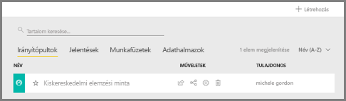

Nyissa meg az irányítópultot az irányítópult nevének választásával.

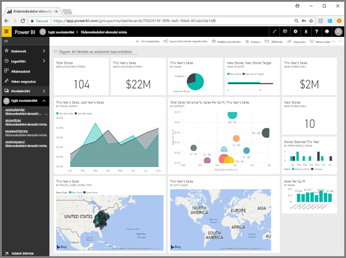

## Irányítópult és jelentés megjelölése kedvencként
A **Kedvencek** segítségével gyorsan elérheti azokat a tartalmakat, amelyek a leginkább fontosak az Ön számára.  

1. A megnyitott irányítópultnál válassza a **Kedvencnek jelölés** lehetőséget a jobb felső sarokban.
   
   
   
   A **Kedvencnek jelölés** átváltozik **Eltávolítás a kedvencek közül** lehetőséggé, és a csillag ikon sárgára színeződik.
   
   

2. Az összes kedvencnek jelölt tartalom megtekintéséhez a navigációs ablaktáblán válassza ki a **Kedvencek** felirat mellett található nyilat. Mivel a navigációs ablaktábla mindig látható, ezért ezt a listát a Power BI szolgáltatásból bárhonnan elérheti.
   
    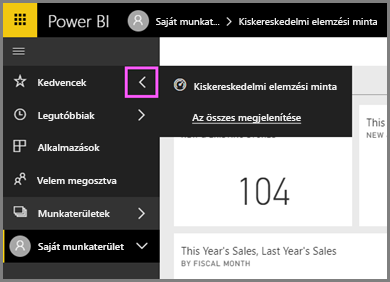
   
    Jelenleg csak egy kedvence van. Irányítópultokat, jelentéseket és alkalmazásokat egyaránt jelölhet meg kedvencként.  

1. Irányítópultot vagy jelentést a munkaterület **Irányítópultok** vagy **Jelentések** megjelenítési lapján is megjelölhet kedvencként.  Nyissa meg a **Jelentések** lapot, és válassza a jelentés nevétől balra lévő csillag ikont.
   
   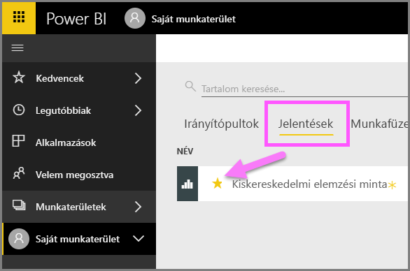

3. Nyissa meg a **Kedvencek** *panelt* a navigációs ablakban lévő **Kedvencek** lehetőség vagy a csillag ikon  kiválasztásával.
   
   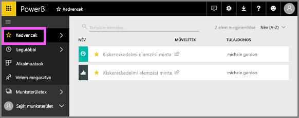
   
   Most már két kedvence van, egy irányítópult és egy jelentés. Itt megnyithatja vagy megkeresheti a kívánt tartalmat, megszüntetheti a kedvencnek jelölést, vagy megoszthatja a tartalmakat a munkatársaival.

4. Válassza a jelentés nevét a jelentésszerkesztő megnyitásához.

    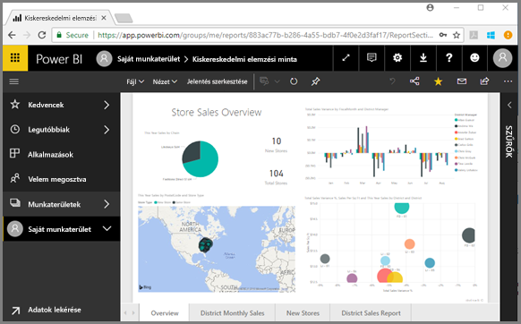

További információ: [Kedvencek](end-user-favorite.md).

## Legutóbbi tartalmak megkeresése

1. A Kedvencekhez hasonlóan a legutóbbi elemeket is bárhonnan láthatja a Power BI szolgáltatásban, ha a navigációs ablaktáblán kiválasztja a **Legutóbbiak** felirat mellett található nyilat.

   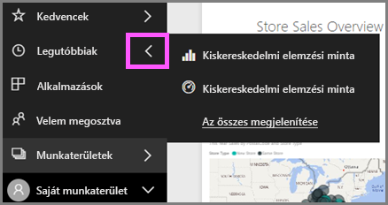

    A megjelenő menüben kiválaszthatja a megnyitandó tartalmat.

2. Időnként előfordulhat, hogy nem megnyitni szeretné a legutóbbi tartalmat, hanem csak adatokra kíváncsi, vagy olyan műveleteket végezne, mint a megállapítások megtekintése vagy az Excelbe exportálás. Ilyen esetben nyissa meg a **Legutóbbiak** panelt a **Legutóbbiak** elem vagy a navigációs ablaktáblán lévő ikonja kiválasztásával. Egynél több munkaterület esetén ez a lista az összes munkaterületről megjeleníti a tartalmakat.

   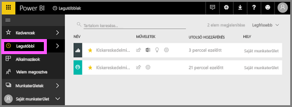

További tudnivalók: [Legutóbbi elemek a Power BI-ban](end-user-recent.md)

### Tartalom keresése és rendezése
A tartalom nézet megkönnyíti a különböző tartalmak keresését, szűrését és rendezését. Egy adott irányítópult, jelentés vagy munkafüzet megkereséséhez használja a keresőmezőt. A Power BI csak azokat a szűrt találatokat jeleníti meg, amelyek neve tartalmazza az adott keresési sztringet.

Mivel csak egy mintája van, a keresés és rendezés nem túl hasznos most.  De ha az irányítópultok, jelentések, munkafüzetek és adatkészletek hosszú listájával dolgozik, akkor a keresést és a rendezést rendkívül hasznosnak fogja találni.

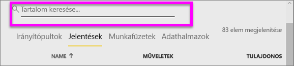

A tartalmakat a nevük vagy a tulajdonosuk alapján is rendezheti. Vegye figyelembe a **Név** elem jobb oldalán a felfelé mutató nyilat. Jelenleg 83 elemet rendezünk név szerinti betűrendes növekvő sorrendben. Ha a rendezési sorrendet csökkenőre kívánja állítani, válassza a **Név** elemet. A felfelé mutató nyíl lefelé mutatóra vált.

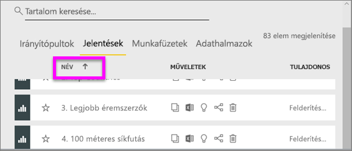

Nem minden oszlop rendezhető. Vigye az egeret az oszlopok fejlécére, hogy lássa, melyeknél érhető el a rendezés.

További információkért olvassa el a [Power BI-ban végzett navigáció keresési és rendezési](end-user-search-sort.md) műveletét ismertető témakört.

## Erőforrások felszabadítása
Miután elkészült ezzel a gyors útmutatóval, igény szerint eltávolíthatja a Kiskereskedelmi elemzési mintát, a jelentést és az adatkészletet.

1. Nyissa meg a Power BI szolgáltatást (app.powerbi.com), és jelentkezzen be.    
2. A navigációs ablaktáblán válassza a **Munkaterületek > Saját munkaterület** lehetőséget.  
    Látja a sárga csillagot, amely a kedvencnek jelölést mutatja?    
3. Az **Irányítópult** lapon kattintson a **Törlés** (kuka) ikonra a Kiskereskedelmi elemzés irányítópultja mellett.    

    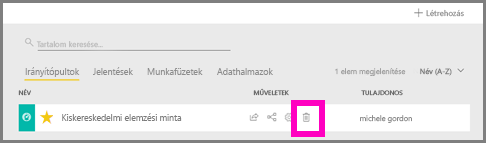

4. Váltson a **Jelentések** lapra, és ismételje meg a műveletet a Kiskereskedelmi elemzés jelentésével.
1. Váltson az **Adatkészletek** lapra, és ismételje meg a műveletet a Kiskereskedelmi elemzés adatkészletével.

## Következő lépések

> [!div class="nextstepaction"]
> [Olvasó nézet a Power BI szolgáltatásban](end-user-reading-view.md)
