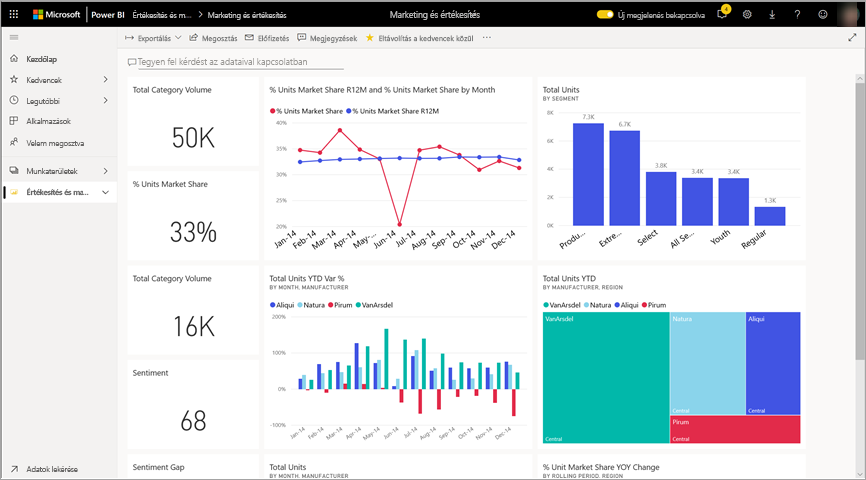
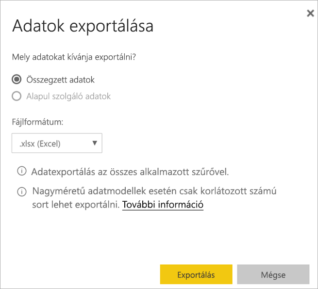
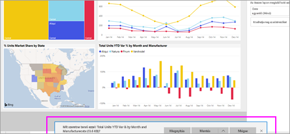

# Adatok exportálása vizualizációból

[!INCLUDE [power-bi-service-new-look-include](../includes/power-bi-service-new-look-include.md)]

Ha szeretné megtekinteni a vizualizáció létrehozásához használt adatokat, [megjelenítheti az adatokat a Power BI-ban](end-user-show-data.md) vagy exportálhatja azokat az Excelbe. Az adatexportálási lehetőség használatához meghatározott típusú licenc szükséges, valamint a tartalomra vonatkozó engedélyek. Ha nem tud exportálni, lépjen kapcsolatba a Power BI rendszergazdájával. 

## Power BI-irányítópulton található vizualizációból

1. Induljon ki egy Power BI-irányítópultból. Itt a ***Értékesítés és marketing minta*** alkalmazásból származó irányítópultot fogjuk használni. Az [alkalmazást letöltheti az AppSource.com](https://appsource.microsoft.com/en-us/product/power-bi/microsoft-retail-analysis-sample.salesandmarketingsample-preview?flightCodes=e2b06c7a-a438-4d99-9eb6-4324ce87f282) webhelyről.

    

2. Vigye a kurzort egy vizualizáció fölé, hogy megjelenjen a három pont (...), majd kattintson rá a műveleti menü megjelenítéséhez.

    

3. Válassza az **Exportálás az Excel programba** lehetőséget.

4. Hogy ez után mi történik, az a böngészőtől függ. A rendszer rákérdezhet a fájl mentésére, vagy a böngésző alján jelenhet meg egy hivatkozás, amely az exportált fájlra mutat. 

    

5. Nyissa meg a fájlt az Excelben.  

    

## Vizualizációból jelentésbe
Egy jelentésben szereplő vizualizációból is exportálhat adatokat .csv vagy .xlsx (Excel-) formátumban. 

1. Egy irányítópulton egy csempe kiválasztásával nyissa meg a mögöttes jelentést.  Ebben a példában ugyanazt az *Idei egységek teljes számának százalékos változása* vizualizációt választjuk, amelyek az előbb. 

    

    Mivel a csempe az *Értékesítés és marketing minta* jelentésből lett létrehozva, ez a jelentés fog megnyílni. Ennek is az az oldala nyílik meg, amely a kiválasztott vizualizációt tartalmazza. 

2. Válassza ki a csempét a jelentésben. Figyelje meg a jobb oldali **Szűrők** panelt. Erre a vizualizációra nincs szűrés alkalmazva. A szűrőkről a [Szűrők használata jelentésekben](end-user-report-filter.md) című cikkben olvashat.

    

3. Válassza a vizualizáció jobb felső sarkában található három pontot. Válassza az **Adatok exportálása** menüpontot.

    

4. Választhat, hogy Összesített vagy Mögöttes adatokat szeretne exportálni. Ha az *Értékesítés és marketing minta* alkalmazást használja, a **Mögöttes adatok** lehetőség le van tiltva. Más jelentéseknél azonban mindkét lehetőség engedélyezett lehet. A különbség magyarázata a következő.

    **Összegzett adatok**: Válassza ezt a lehetőséget, ha a vizualizációban látható adatokat szeretné exportálni.  Az ilyen típusú export csak azokat a vizualizáció létrehozásához felhasznált adatokat tartalmazza. Ha a vizualizáción szűrők vannak alkalmazva, akkor az exportált adatok is szűrve lesznek. Ennél a vizualizációnál például az export csak a 2014. évi adatokat tartalmazza a középső régióból, és gyártók közül is csak négy cég adatait: VanArsdel, Natura, Aliqui és Pirum.
  

    **Mögöttes adatok**: Válassza ezt a lehetőséget, ha a vizualizációban látható adatok **mellett** a mögöttes adathalmaz további adatait is exportálni szeretné.  Ezek között lehetnek olyan adatok, amelyeket az adathalmaz tartalmaz, de nincsenek felhasználva a vizualizációhoz. 

    

5. Hogy ez után mi történik, az a böngészőtől függ. A rendszer rákérdezhet a fájl mentésére, vagy a böngésző alján megjelenhet egy hivatkozás, amely az exportált fájlra mutat. 

    

6. Nyissa meg a fájlt az Excelben. Hasonlítsa össze az exportált adatok mennyiségét az ugyanebből a vizualizációból az irányítópulton exportáltakéval. A különbség oka, hogy ez az export a **mögöttes adatokat** is tartalmazza. 

    

## Következő lépések

[A vizualizáció létrehozásához használt adatok megjelenítése](end-user-show-data.md)