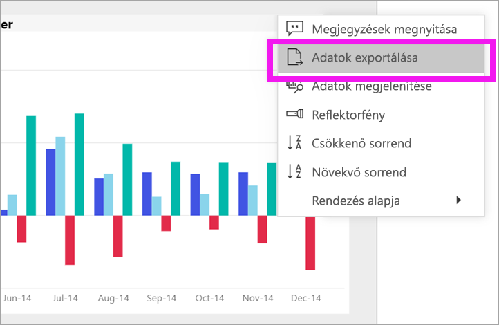

# A vizuális adatok exportálása
Ha egy Vizualizáció létrehozásához használt adatokat szeretne [megjelenítheti az adatokat a Power bi-ban](end-user-show-data.md) vagy exportálhatja ezeket az adatokat az Excelbe. Exportálhatja az adatokat egy bizonyos típusba vagy licencre van szükség, és a szerkesztési engedélye a tartalom. Ha nem tudja exportálni, ellenőrizze a Power BI rendszergazdájához. 

## A Vizualizáció a Power BI-irányítópult

1. Indítsa el a Power BI-irányítópulton. Itt használjuk-e az irányítópult a ***Marketing és értékesítés minta*** alkalmazást. Is [töltse le ezt az alkalmazást az AppSource.com](https://appsource.microsoft.com/en-us/product/power-bi/microsoft-retail-analysis-sample.salesandmarketingsample-preview?flightCodes=e2b06c7a-a438-4d99-9eb6-4324ce87f282).

    

2. Kurzort egy Vizualizáció megjelenítéséhez a három pontra (...), majd kattintson a művelet menü megjelenítéséhez.

    

3. Válassza ki **exportálása Excelbe**.

4. Mi a következő lépés attól függ, hogy milyen böngészőt használ. Kérheti, mentse a fájlt vagy a május tekintse meg az exportált fájl alján, a böngésző mutató hivatkozást. 

    

5. Nyissa meg a fájlt az Excelben.  

    

## Egy Vizualizáció egy jelentésben
Is exportálhat adatokat egy Vizualizáció egy jelentésben vagy .csv-.xlsx-fájlba (Excel) formátumban. 

1. Az irányítópulton válassza ki egy csempét az alapul szolgáló jelentés megnyitásához.  Ebben a példában azt választjuk ugyanaz a Vizualizáció, mint a fenti *teljes egység YTD Var %* . 

    

    Ez a csempe a létrehozása óta a *értékesítési és Marketing minta* jelentés, amely, amely megnyitja a jelentést. És a kiválasztott csempe vizualizációt tartalmazó oldalon nyílik meg. 

2. Kattintson a csempére a jelentésben. Figyelje meg a **szűrők** a jobb oldali ablaktáblán. Ez a Vizualizáció rendelkezik alkalmazott szűrők. A szűrőkkel kapcsolatos további információkért lásd: [szűrők használata a jelentésekben](end-user-report-filter.md).

    

3. Kattintson a vizualizáció jobb felső sarkában található három pontra. Válasszon **adatok exportálása**.

    

4. Beállítások exportálása Summarized és alapul szolgáló adatokat láthatja. Ha használja a *értékesítési és marketing minta* alkalmazás **alapul szolgáló adatok** le lesz tiltva. De felmerülhet a jelentéseket, ha mindkét lehetőség engedélyezve van. Íme a különbség a magyarázatot.

    **Összegzett adatok**: válassza ezt a lehetőséget, ha azt szeretné, amit lát a vizualizációban az adatok exportálása.  Az ilyen típusú exportálás csak a Vizualizáció létrehozásához használt adatokat mutatja. Ha a Vizualizáció alkalmazott szűrők, majd az exportált adatok is szűrve lesznek. Például a Vizualizáció, az Exportálás tartalmazza csak a 2014 és a középső régiójában, és csak adatait négy gyártók: VanArsdel, Natura, Aliqui, and Prirum.
  

    **Mögöttes adatok**: válassza ezt a lehetőséget, ha azt szeretné, amit lát a vizualizációban az adatok exportálására irányuló **plusz** az alapul szolgáló adatkészlet további adatait.  Ebbe beletartozik az adatkészletben található, de nem a vizualizációban használt adatokat. 

    

5. Mi a következő lépés attól függ, hogy milyen böngészőt használ. Kérheti, mentse a fájlt vagy a május tekintse meg az exportált fájl alján, a böngésző mutató hivatkozást. 

    

7. Nyissa meg a fájlt az Excelben. Hasonlítsa össze az adatokat, hogy exportálta a ugyanabban a vizualizációban az irányítópulton az exportált adatok mennyisége. A különbség az, hogy tartalmazza-e az exportálást **alapul szolgáló adatok**. 

    

