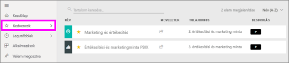
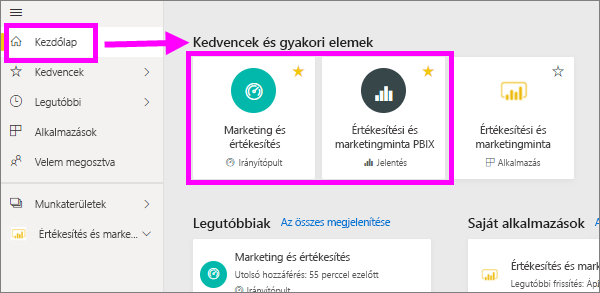
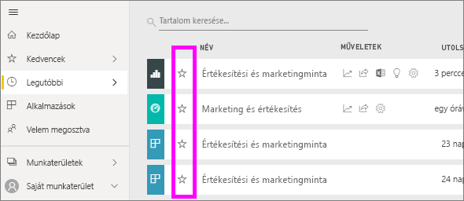
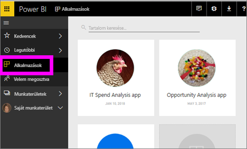
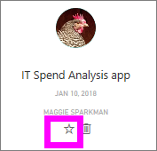
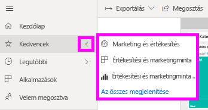
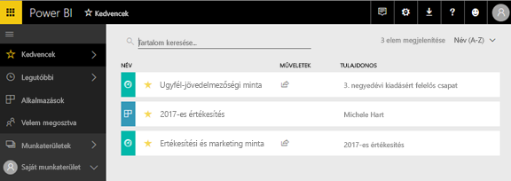
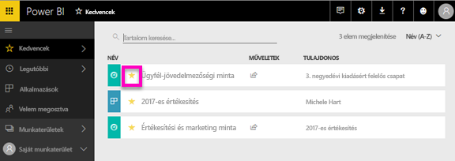

# Kedvenc irányítópultok, jelentések és alkalmazások a Power BI szolgáltatásban
Ha Ön megkönnyíti a tartalom egy *kedvenc*, fogja tudni elérni a gyors a **Kedvencek** tartalmak listája és a **kezdőlap Power BI**  >   **Kedvencek és gyakori elemek**.  A Kedvencek azok általában tartalom a leggyakrabban látogat, és a egy sárga csillag jelöli.

   

   

Egyetlen irányítópultot is választhat egy [kiemelt irányítópultként](end-user-featured.md) a Power BI szolgáltatásban.

## Irányítópult vagy jelentés hozzáadása a *kedvencekhez*

1. Nyisson meg egy gyakran használt irányítópultot vagy jelentést. Olyan tartalmak is lehetnek *kedvencek*, amelyeket mások osztottak meg Önnel.

2. Válassza ki a Power BI szolgáltatás felső menüszalagról **kedvenc** vagy a csillag  ikonra.
   
   
   
   Is hozzáadhatja a Kedvencekhez irányítópult vagy jelentés bárhonnan, tekintse meg a csillag ikont, például a kezdőlap, legutóbbi, alkalmazások és megosztott velem megosztva. 
   
   

## Alkalmazás felvétele a *kedvencek* közé

1. A navigációs panelen válassza ki a **alkalmazások**.

   

2. További információk megjelenítéséhez vigye a kurzort az alkalmazás fölé.  Válassza ki a csillag   ikont kedvencként.
   
   

## A *kedvencek* kezelése
1. A Kedvencek eléréséhez, válassza a jobbra található nyílra úszó menü **Kedvencek**.  Innen kiválaszthatja a megnyitni kívánt kedvenc tartalmat. A listán csak öt kedvenc szerepel (betűrendben). Ha több mint öt rendelkezik, válassza ki a **összes** nyissa meg a tartalom a Kedvencek listában (#2, lásd alább). 
   
   
2. Megtekintéséhez **összes** hozzáadott Kedvencek, a navigációs ablaktáblában jelölje ki a tartalom **Kedvencek** vagy a Kedvencek  ikonra.  
   
    
   
   Innen a következő műveleteket végezheti el: megnyitás, tulajdonos azonosítása, de akár munkatársakkal való megosztás is.

## Eltávolítás a kedvencek közül
Már nem használja olyan gyakran a tartalmat?  Eltávolíthatja a kedvencek közül. Ha egy tartalmat eltávolít a kedvencek közül, az eltűnik a Kedvencek listájából, de a Power BI-ban továbbra is elérhető marad.

1. A **Kedvencek** képernyő megnyitásához kattintson a **Kedvencek** elemre a bal oldali navigációs ablaktáblán.
   
   
2. A kedvencnek jelölés visszavonásához kattintson a tartalom melletti sárga csillagra.

> [!NOTE]
> Irányítópult, jelentés vagy alkalmazás kedvencnek jelölése is visszavonható. Ehhez egyszerűen nyissa meg a tartalmat, és szüntesse meg a sárga ikon bejelölését.   
> 
> 
## Korlátozások és szempontok
Az aktuális időpontban akkor az alkalmazás megjelölése kedvencként, és ez automatikusan Kedvencek összes jelentést és irányítópultokat az adott alkalmazáshoz. Nem alkalmas az egyes alkalmazásokra kedvenc jelentések vagy irányítópultok. 

## Következő lépések
[Power BI – Alapfogalmak](end-user-basic-concepts.md)

További kérdései vannak? [Kérdezze meg a Power BI közösségét](http://community.powerbi.com/)

