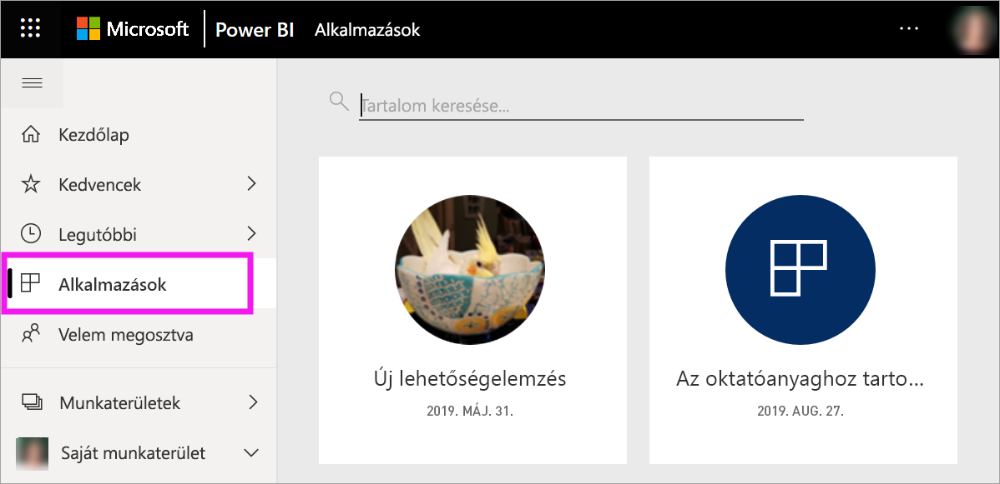

# Kedvenc irányítópultok, jelentések és alkalmazások a Power BI szolgáltatásban
Ha *kedvencként* jelöl meg egy tartalmat, akkor azt gyorsan elérheti a **Kedvencek** tartalomlistából és a **Power BI kezdőlap** > **Kedvencek és gyakoriak** területéről.  A kedvencek azok a helyek, amelyeket általában a leggyakrabban látogat, és ezeket sárga csillag jelöli.

   

   

A Power BI szolgáltatásban arra is lehetősége van, hogy egyetlen irányítópultot [Kiemelt irányítópultként](end-user-featured.md) jelöljön meg.

## Irányítópult vagy jelentés hozzáadása a *kedvencekhez*

1. Nyisson meg egy gyakran használt irányítópultot vagy jelentést. Olyan tartalmak is lehetnek *kedvencek*, amelyeket mások osztottak meg Önnel.

2. A Power BI szolgáltatás felső menüsorában kattintson a **Kedvenc** elemre, vagy a csillag   ikonra.
   
   
   
   Irányítópultot vagy jelentést bármely olyan helyen is megjelölhet kedvencnek, ahol megjelenik a csillag ikon, például a Kezdőlapon, vagy a Legutóbbi elemek, az Alkalmazások és a Velem megosztva területeken. 
   
   

## Alkalmazás felvétele a *kedvencek* közé

1. A navigációs panelen válassza az **Alkalmazások** lehetőséget.

   

2. További információk megjelenítéséhez vigye a kurzort az alkalmazás fölé.  Válassza ki a csillag   ikont kedvencként.
   
   

## A *kedvencek* kezelése
1. A kedvencek eléréséhez kattintson az úszó panel nyilára a **Kedvencek** elem mellett jobbra.  Innen kiválaszthatja a megnyitni kívánt kedvenc tartalmat. A listán legfeljebb öt kedvenc szerepel (betűrendben). Ha ötnél több kedvence van, az **Összes megtekintése** lehetőséget választva megnyithatja a kedvencek listáját (lásd alább a 2. ábrát). 
   
   
2. A kedvencként hozzáadott **összes** tartalom megtekintéséhez kattintson a **Kedvencek** elemre vagy a Kedvencek  ikonra a navigációs panelen.  
   
    
   
   Innen a következő műveleteket végezheti el: megnyitás, tulajdonos azonosítása, de akár munkatársakkal való megosztás is.

## Eltávolítás a kedvencek közül
Már nem használja olyan gyakran a tartalmat?  Eltávolíthatja a kedvencek közül. Ha egy tartalmat eltávolít a kedvencek közül, az eltűnik a Kedvencek listájából, de a Power BI-ban továbbra is elérhető marad.

1. A **Kedvencek** képernyő megnyitásához kattintson a **Kedvencek** elemre a bal oldali navigációs ablaktáblán.
   
   
2. A kedvencnek jelölés visszavonásához kattintson a tartalom melletti sárga csillagra.

> [!NOTE]
> Irányítópult, jelentés vagy alkalmazás kedvencnek jelölése is visszavonható. Ehhez egyszerűen nyissa meg a tartalmat, és szüntesse meg a sárga ikon bejelölését.   
> 
> 
## Korlátozások és szempontok
Jelenleg alkalmazást is megjelölhet kedvencként, és ezzel automatikusan kedvencként jelöli meg az alkalmazáshoz tartozó összes jelentést és irányítópultot is. Az alkalmazások egy-egy jelentését vagy irányítópultját nem lehetséges kedvencnek jelölni. 

## Következő lépések
[Power BI – Alapfogalmak](end-user-basic-concepts.md)

További kérdései vannak? [Kérdezze meg a Power BI közösségét](http://community.powerbi.com/)

