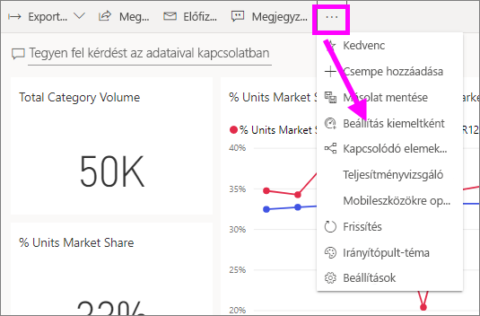
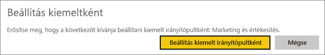
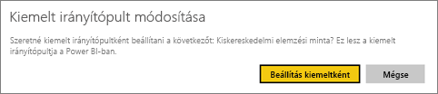
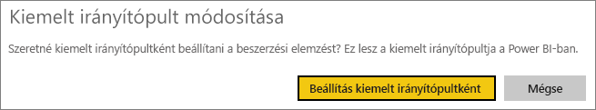
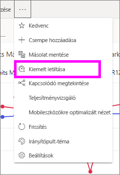

# Kiemelt irányítópultok a Power BI szolgáltatásban
## Kiemelt irányítópult létrehozása
A legtöbb felhasználó rendelkezik egy olyan irányítópulttal, amelyet gyakrabban használ a többinél.  Lehet, hogy ezen az irányítópulton végzi el céges teendőit, vagy egy olyan irányítópult is lehet, mely számos irányítópult és jelentés csempéit gyűjti egy helyre.

Amikor kiválaszt egy irányítópult *kiemelt*, minden alkalommal, amikor a Power BI szolgáltatás megnyitásakor, megnyílik az irányítópult jelenik meg.  

Több irányítópultot is kiválaszthat, és megjelölheti őket *kedvencként*. Lásd a [kedvenc irányítópultokat](end-user-favorite.md) ismertető témakört.

Ha Ön még nem állított be kiemelt irányítópultot, a Power BI megnyitja az utolsó használt irányítópultot vagy a Power BI kezdőlap.  

### **Kiemelt** irányítópult beállítása
Nézze meg, ahogy Amanda létrehoz egy kiemelt irányítópultot, majd a videó alatt látható utasításokat követve próbálja ki mindezt saját maga is.

<iframe width="560" height="315" src="https://www.youtube.com/embed/G26dr2PsEpk" frameborder="0" allowfullscreen></iframe>

1. Nyissa meg azt az irányítópultot, amelyiket *kiemeltté* kíván tenni. 
2. A felső menüsávon válassza a három pontot (...), és válassza **beállítás kiemeltként**.  
   
    
3. Erősítse meg a választását.
   
    

## A kiemelt irányítópult módosítása
Természetesen a későbbiekben kiválaszthat egy másik irányítópultot is kiemelt irányítópultként.

1. Végezze el ismét a fenti 1. és 2. lépést.
   
    
2. Kattintson a **Beállítás kiemeltként** parancsra. Az irányítópult kiemelt állapotának eltávolításával nem távolítja el azt a munkaterületről.  
   
    

## A kiemelt irányítópult eltávolítása
Ha úgy dönt, hogy egyáltalán nincs szüksége kiemelt irányítópultra, az alábbiak szerint szüntetheti meg az irányítópult kiemelt állapotát.

1. Nyissa meg az aktuálisan kiemelt irányítópultot.
2. A felső menüsávon válassza a három pontot (...), és válassza **kiemelt letiltása**.

    
   
## Következő lépések
[Irányítópult megjelölése kedvencként](end-user-favorite.md)

További kérdései vannak? [Kérdezze meg a Power BI közösségét](http://community.powerbi.com/)

