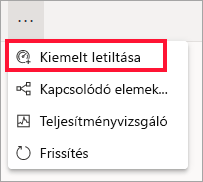

# Kiemelt irányítópultok a Power BI szolgáltatásban

[!INCLUDE [power-bi-service-new-look-include](../includes/power-bi-service-new-look-include.md)]

A legtöbb felhasználó rendelkezik egy olyan irányítópulttal, amelyet gyakrabban használ a többinél. Ez lehet az üzletmenet bonyolításához használt irányítópult is. Olyan irányítópult is lehet, mely számos irányítópult és jelentés csempéit gyűjti egy helyre.

## Kiemelt irányítópult létrehozása
Amikor *kiemeltté* tesz egy irányítópultot, a Power BI szolgáltatás megnyitásakor mindig ez az irányítópult jelenik meg. 

Több irányítópultot is kijelölhet, és megjelölheti őket kedvencként. Lásd a [kedvenc irányítópultokat](end-user-favorite.md) ismertető témakört.

Ha még nem állított be kiemelt irányítópultot, a Power BI az Ön által legutóbb használt irányítópultot nyitja meg, vagy a Power BI **kezdőlapjára** lép. 

### Kiemelt irányítópult beállítása

1. Nyissa meg azt az irányítópultot, amelyet kiemeltté kíván tenni. 
2. A felső menüsorban válassza a **További lehetőségek** (...) elemet, majd a **Megjelölés kiemeltként** lehetőséget. 
   
    
3. Erősítse meg a választását.
   
    

## A kiemelt irányítópult módosítása
A későbbiekben egy másik irányítópultot is kiválaszthat kiemelt irányítópultként.

1. Hajtsa végre korábbi 1. és 2. lépést.
   
2. Válassza a **Beállítás kiemelt irányítópultként** lehetőséget. Az irányítópult kiemelt állapotának eltávolításával nem távolítja el azt a Power BI-ból. 
   
    

## A kiemelt irányítópult eltávolítása
Ha úgy dönt, hogy egyáltalán nincs szüksége kiemelt irányítópultra, az alábbiak szerint szüntetheti meg az irányítópult kiemelt állapotát.

1. Nyissa meg a jelenleg kiemeltként megjelölt irányítópultot.
2. A felső menüsorban válassza a **További lehetőségek** (...) elemet, majd a **Kiemeltként megjelölés megszüntetése** lehetőséget.

    
   
## Következő lépések
- [Irányítópult megjelölése kedvencként](end-user-favorite.md)    
- További kérdései vannak? Kérdezze meg [a Power BI közösségét](https://community.powerbi.com/).

