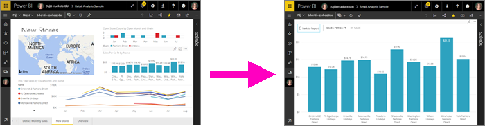
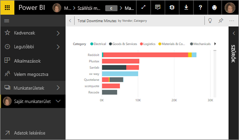
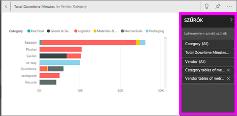
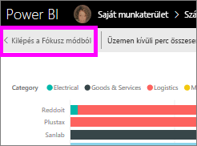
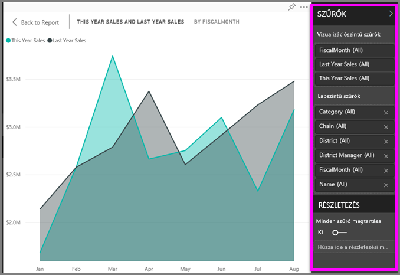
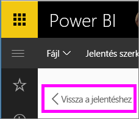

# A tartalom részletesebb megjelenítése: fókusz mód és teljes képernyős mód

<iframe width="560" height="315" src="https://www.youtube.com/embed/dtdLul6otYE" frameborder="0" allowfullscreen></iframe>

A fókusz mód és a teljes képernyős mód két különböző mód a vizualizációk, jelentések és irányítópultok több részletének megtekintésére.  A fő különbség, hogy a teljes képernyőn a tartalmat körülvevő panelek eltűnnek, fókusz módban viszont továbbra is kezelni tudja vizualizációit. A következőkben megvizsgáljuk a hasonlóságokat és a különbségeket.  

|Tartalom    | Fókusz mód  |Teljes képernyős mód  |
|---------|---------|----------------------|
|Irányítópult     |   Nem lehetséges     | igen |
|Jelentés oldala   | Nem lehetséges  | igen|
|Jelentésvizualizáció | igen    | igen |
|Irányítópult-csempe | igen    | igen |
|Windows 10 Mobile | Nem lehetséges | Igen |

## Mi az a teljes képernyős mód?

Jelenítse meg menük és navigációs sávok nélkül a Power BI szolgáltatásbeli tartalmakat (irányítópultokat, jelentésoldalakat, csempéket és vizualizációkat), hogy semmi se terelje el róluk a figyelmet.  Így adatait bármikor megtekintheti egy letisztult, teljes képernyős nézetben, és ehhez elég csak odapillantania. Ezt a megjelenítési módot időnként TV módnak is nevezik.   

A teljes képernyős mód megnyitásához válassza a **teljes képernyő** ikont  a Power BI szolgáltatás menüsávjából az irányítópult, jelentés, fókusz módú csempe vagy fókusz módú vizualizáció felett.  A kiválasztott tartalom kitölti a képernyőt.
Ha a Power BI mobilalkalmazást használja, a [teljes képernyős mód a Windows 10-es mobilalkalmazásoknál érhető el](./mobile/mobile-windows-10-app-presentation-mode.md). 

A teljes képernyős mód néhány felhasználása:

* irányítópult, csempe, vizualizáció vagy jelentés bemutatása egy megbeszélésen vagy konferencián
* irodai megjelenítés egy erre a célra kijelölt nagyméretű kijelzőn vagy projektoron
* megtekintés kis képernyőn
* véleményezés zárolt módban – anélkül érintheti meg a képernyőt, vagy viheti a csempék fölé az egérmutatót, hogy megnyitná az irányítópultot vagy az alapjául szolgáló jelentést

## A Fókusz mód
***Fókusz*** módban kibonthat egy vizualizációt vagy csempét, így azt részletesebben jelenítheti meg.  Lehetséges, hogy irányítópultja vagy jelentése kissé túlzsúfolt, és szeretne ráközelíteni egyetlen vizualizációra.  Éppen erre való a fókusz mód.  

Fókusz módban a Power BI-*fogyasztók* kezelni tudják a vizualizáció létrehozásakor alkalmazott szűrőket.  A Power BI szolgáltatásban a fókusz mód irányítópult-csempén vagy jelentésvizualizáción használható.

## Munka a teljes képernyőn
Irányítópult vagy jelentés teljes képernyős megnyitásához válassza a teljes képernyő ikont.  Ez a felső navigációs sávon található. Teljes képernyős módban az egér vagy a kurzor mozgatásával környezeti menü jeleníthető meg. Mivel a teljes képernyős mód sokféle tartalomhoz elérhető, a környezeti menük mindegyike kissé eltérő lehetőségeket tartalmaz, de ezek viszonylag egyértelműek.  A definíció megtekintéséhez elég a kurzort egy ikon fölé vinni.

Irányítópult menüje    
    

Jelentésoldalak menüje    
    

  *     
  A **Vissza** gombbal a böngészője előző oldalára léphet vissza. Ha az előző oldal is egy Power BI-oldal volt, akkor az is teljes képernyős módban fog megjelenni.  A teljes képernyős mód bekapcsolva marad, amíg ki nem lép belőle.

  *     
  Ezzel a gombban teljes képernyős módban nyomtatható ki egy irányítópult vagy egy jelentésoldal.

  *     
    A **Képernyőhöz igazítás** gombra kattintva az irányítópultját a görgetősávok használata nélkül elérhető lehető legnagyobb méretben jeleníti meg.  

    

  *        
    Bizonyos esetekben nem okoz problémát a görgetősávok használata, és szeretné inkább kitölteni a rendelkezésre álló teljes szélességet. Ehhez válassza a **Szélességhez igazítás** gombot.    

    

  *        
    Teljes képernyős jelentéseknél ezeket a nyilakat használva válthat a jelentésoldalak között.    
  * A teljes képernyős módból való kilépéshez válassza a **Kilépés a teljes képernyős módból** ikont.

      

## Munka fókusz módban
A fókusz mód kétféleképpen nyitható meg. Az egyik irányítópult-csempékhez, a másik jelentésvizualizációkhoz használható.

### Fókusz mód irányítópultokon
1. Nyisson meg egy irányítópultot a Power BI szolgáltatásban.

2. Helyezze a kurzort egy irányítópult-csempe vagy jelentésvizualizáció fölé, válassza a három pontot (...), majd a **Megnyitás fókusz módban** lehetőséget.

    .

2. A rendszer megnyitja a csempét, és kitölti vele a jelentésvásznat.

   

3. A vizualizáció létrehozásához használt szűrők megjelenítéséhez bontsa ki a Szűrők ablaktáblát.

   

4. Ha [szűrők módosításával](end-user-report-filter.md) kísérletezik, érdekes felfedezéseket tehet adatai között.  

5. Hagyja el a Fókusz módot, és térjen vissza az irányítópulthoz a vizualizáció bal felső sarkában látható **Kilépés a fókusz módból** lehetőséget választva.

        

## Fókusz mód jelentésvizualizációkhoz
1. Nyisson meg egy jelentést a Power BI szolgáltatásban.  Ezt a példát a Kiskereskedelmi elemzési minta használatával mutatjuk be.

1. A jelentés megnyitása után válassza a **Körzeti havi értékesítés lapot**.

2. Vigye a kurzort a bal alsó területdiagram fölé, és válassza a **fókusz mód** ikont .  

   
2. A rendszer megnyitja a vizualizációt, és kitölti vele a teljes vásznat.

   
3. A Szűrők panelt is kibonthatja a vizualizáció létrehozásához használt szűrők kezeléséhez. Az adatok részletes vizsgálatával új elemzési eredményeket, kérdéseire pedig válaszokat találhat. *Fogyasztóként* nem vehet fel új szűrőket, nem módosíthatja a vizualizációban használt mezőket, és nem hozhat létre új vizualizációkat.  A meglévő szűrőkön végzett módosításai viszont mentve lesznek, amikor kilép a Power BI-ból. Ha nem szeretné, hogy a Power BI megjegyezze a módosításokat, válassza a **Visszaállítás alapértelmezettre** lehetőséget.   

   

5. Hagyja el a Fókusz módot, és térjen vissza a jelentéshez a vizualizáció bal felső sarkában látható **Vissza a jelentéshez** lehetőségre kattintva.

      

## Megfontolandó szempontok és hibaelhárítás
* Jelentésben lévő vizualizáció fókusz módban történő megtekintésekor az összes szűrőt, azaz a vizualizációszintű, a lapszintű, a részletezésszintű és a jelentésszintű szűrőket is megtekintheti és kezelheti.    
* Irányítópult-vizualizációk fókusz módú megjelenítésekor csak a vizualizációszintű szűrőket tudja kezelni.

## Következő lépések
[Jelentések megtekintési beállításai](end-user-report-view.md)