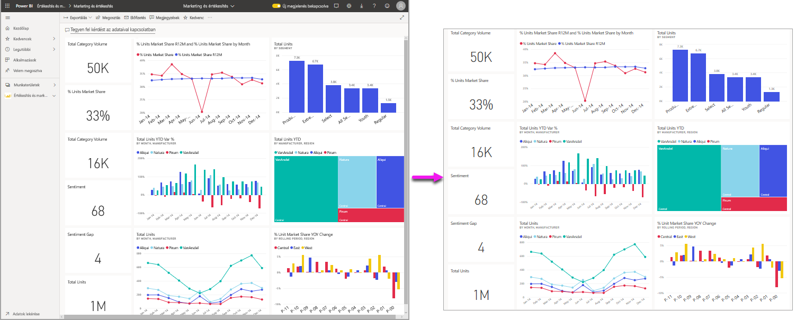
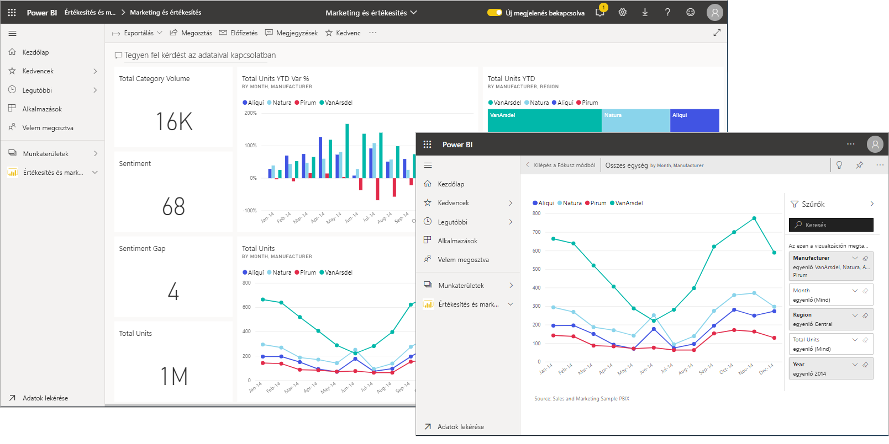
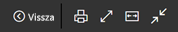
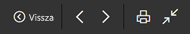
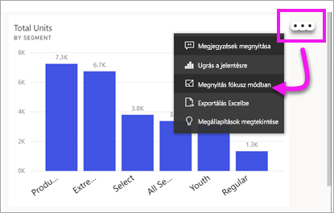
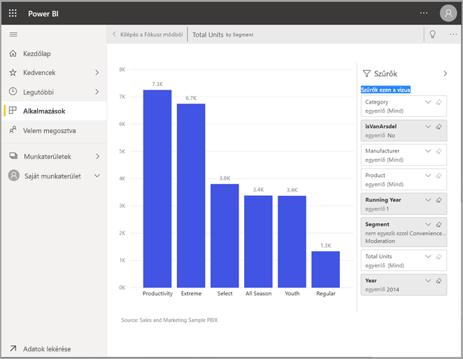
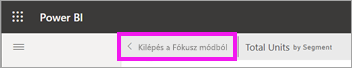
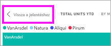

# A tartalom részletesebb megjelenítése: fókusz mód és teljes képernyős mód

[!INCLUDE [consumer-appliesto-yynn](../includes/consumer-appliesto-yynn.md)]

[!INCLUDE [power-bi-service-new-look-include](../includes/power-bi-service-new-look-include.md)]    

<iframe width="560" height="315" src="https://www.youtube.com/embed/dtdLul6otYE" frameborder="0" allowfullscreen></iframe>

A fókusz mód és a teljes képernyős mód két különböző mód a vizualizációk, jelentések és irányítópultok több részletének megtekintésére.  A fő különbség, hogy a teljes képernyőn a tartalmat körülvevő panelek eltűnnek, fókusz módban viszont továbbra is kezelni tudja vizualizációit. A következőkben megvizsgáljuk a hasonlóságokat és a különbségeket.  

|Tartalom    | Fókusz mód  |Teljes képernyős mód  |
|---------|---------|----------------------|
|Irányítópult     |   Nem lehetséges     | igen |
|Jelentésoldal   | Nem lehetséges  | igen|
|Jelentés-vizualizáció | igen    | igen |
|Irányítópult-csempe | igen    | Nem lehetséges |
|Windows 10 Mobile | Nem lehetséges | Igen |

## Mi az a teljes képernyős mód?

A Power BI szolgáltatásbeli tartalmakat (irányítópultokat, jelentésoldalakat és vizualizációkat) megjelenítheti menük és navigációs panelek nélkül, hogy semmi se terelje el róluk a figyelmet.  Így adatait bármikor megtekintheti egy letisztult, teljes képernyős nézetben, és ehhez elég csak odapillantania. Ezt a megjelenítési módot időnként TV módnak is nevezik.   

Ha a Power BI mobilalkalmazást használja, a [teljes képernyős mód a Windows 10-es mobilalkalmazásoknál érhető el](./mobile/mobile-windows-10-app-presentation-mode.md). 

A teljes képernyős mód néhány felhasználása:

* irányítópult, vizualizáció vagy jelentés bemutatása egy megbeszélésen vagy konferencián
* irodai megjelenítés egy erre a célra kijelölt nagyméretű kijelzőn vagy projektoron
* megtekintés kis képernyőn
* véleményezés zárolt módban – anélkül érintheti meg a képernyőt, vagy viheti a csempék fölé az egérmutatót, hogy megnyitná az irányítópultot vagy az alapjául szolgáló jelentést

## A Fókusz mód

***Fókusz*** módban kibonthat egy vizualizációt vagy csempét, így azt részletesebben jelenítheti meg.  Lehetséges, hogy irányítópultja vagy jelentése kissé túlzsúfolt, és szeretne ráközelíteni egyetlen vizualizációra.  Éppen erre való a fókusz mód.  

Fókusz módban a Power BI-*fogyasztók* kezelni tudják a vizualizáció létrehozásakor alkalmazott szűrőket.  A Power BI szolgáltatásban a fókusz mód irányítópult-csempén vagy jelentésvizualizáción használható.

## Munka a teljes képernyőn

A teljes képernyős mód irányítópultokhoz, jelentésoldalakhoz és jelentésvizualizációkhoz érhető el. 

- Irányítópult teljes képernyős megnyitásához válassza a teljes képernyő ikont  a felső menüsávon. 

- Jelentésoldal teljes képernyős megnyitásához válassza a **Nézet** > **Teljes képernyő** lehetőséget.

    

- Vizualizáció teljes képernyős megjelenítéséhez először nyissa meg azt fókusz módban, majd válassza a **Nézet** > **Teljes képernyő** lehetőséget.  

A kiválasztott tartalom kitölti a képernyőt.    Teljes képernyős módban az egér vagy a kurzor mozgatásával környezeti menü jeleníthető meg. Mivel a teljes képernyős mód sokféle tartalomhoz elérhető, a környezeti menük mindegyike kissé eltérő lehetőségeket tartalmaz, de ezek viszonylag egyértelműek.  A definíció megtekintéséhez elég a kurzort egy ikon fölé vinni.

Irányítópult menüje    
    

Jelentésoldalak és jelentésvizualizációk menüje    
    

  *     
  A **Vissza** gombbal a böngészője előző oldalára léphet vissza. Ha az előző oldal is egy Power BI-oldal volt, akkor az is teljes képernyős módban fog megjelenni.  A teljes képernyős mód bekapcsolva marad, amíg ki nem lép belőle.

  *     
  Ezzel a gombban teljes képernyős módban nyomtatható ki egy irányítópult vagy egy jelentésoldal.

  *     
    A **Képernyőhöz igazítás** gombra kattintva az irányítópultját a görgetősávok használata nélkül elérhető lehető legnagyobb méretben jeleníti meg.  

    

  *        
    Bizonyos esetekben nem okoz problémát a görgetősávok használata, és szeretné inkább kitölteni a rendelkezésre álló teljes szélességet. Ehhez válassza a **Szélességhez igazítás** gombot.    

    

  *        
    Teljes képernyős jelentéseknél ezeket a nyilakat használva válthat a jelentésoldalak között.    
  *      
  A teljes képernyős módból való kilépéshez válassza a **Kilépés a teljes képernyős módból** ikont.

      

## Munka fókusz módban

A fókusz mód irányítópultok csempéihez és jelentésvizualizációkhoz érhető el. 

- Irányítópult-csempe fókusz módban való megnyitásához helyezze a kurzort egy irányítópult-csempe vagy jelentésvizualizáció fölé, válassza a **További lehetőségek** (...) elemet, majd a **Megnyitás fókusz módban** lehetőséget.

    . 

- Jelentésvizualizáció fókusz módban való megnyitásához vigye az egeret a vizualizáció fölé, és válassza a **fókusz mód** ikont .  

   

A vizualizáció megnyílik, és kitölti a vásznat. Figyelje meg, hogy a **Szűrők** panel használatával még mindig kezelni tudja a vizualizációt. A **Szűrők** panel és a navigációs panel összecsukható.

   

     

Ha [szűrők módosításával](end-user-report-filter.md) kísérletezik, érdekes felfedezéseket tehet adatai között.  

Az adatok részletes vizsgálatával új elemzési eredményeket, kérdéseire pedig válaszokat találhat. *Fogyasztóként* nem vehet fel új szűrőket, nem módosíthatja a vizualizációban használt mezőket, és nem hozhat létre új vizualizációkat.  A meglévő szűrőket viszont kezelheti. 

Az irányítópult-csempéken végzett módosításokat nem mentheti ki. A jelentésvizualizációk meglévő szűrőin végzett módosításai mentve lesznek, amikor kilép a Power BI-ból. Ha nem szeretné, hogy a Power BI megjegyezze a módosításokat, válassza a **Visszaállítás alapértelmezettre** lehetőséget.   

Hagyja el a Fókusz módot, és térjen vissza az irányítópulthoz. Ehhez válassza a vizualizáció bal felső sarkában látható **Kilépés a fókusz módból** vagy **Vissza a jelentéshez** lehetőséget.

    

  

## Megfontolandó szempontok és hibaelhárítás

* Jelentésben lévő vizualizáció fókusz módban történő megtekintésekor megtekintheti és kezelheti az összes szűrőt: a vizualizációszintű, a lapszintű, a részletezésszintű és a jelentésszintű szűrőket is.    
* Irányítópult-vizualizációk fókusz módú megjelenítésekor csak a vizualizációszintű szűrőket tudja kezelni.

## Következő lépések

[Jelentések megtekintési beállításai](end-user-report-view.md)