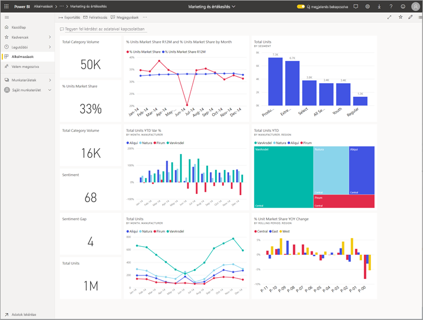
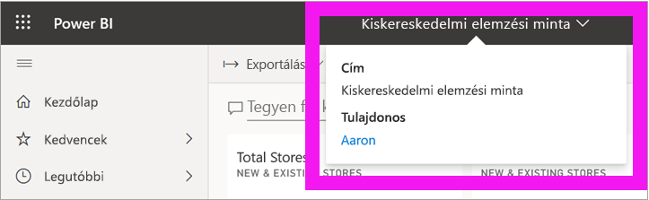
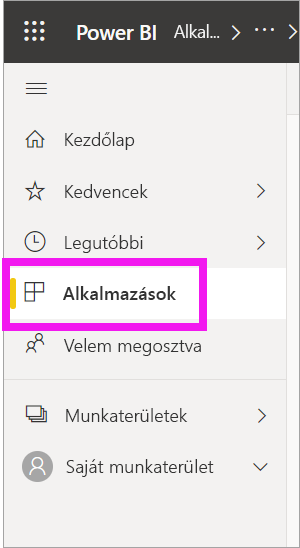
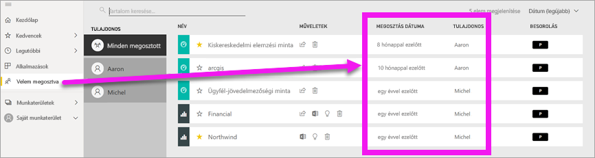
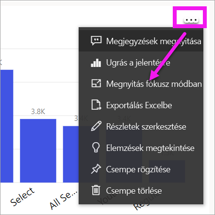
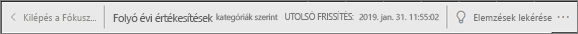
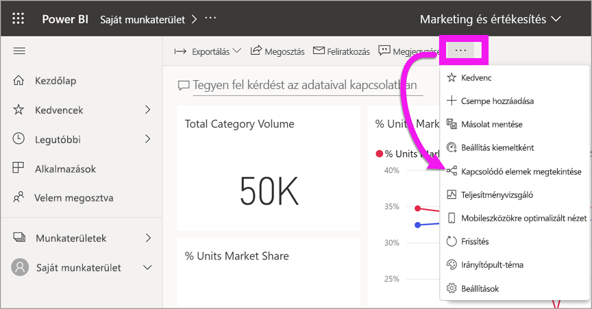
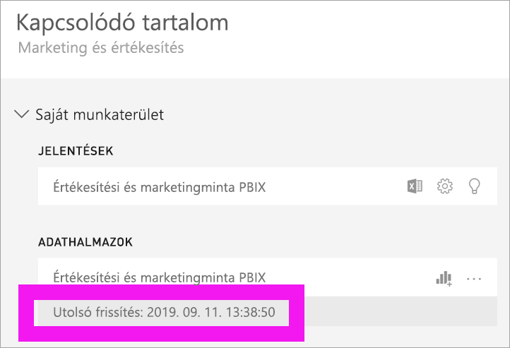

# A tartalma naprakész

[!INCLUDE[consumer-appliesto-ynny](../includes/consumer-appliesto-ynny.md)]

[!INCLUDE [power-bi-service-new-look-include](../includes/power-bi-service-new-look-include.md)]

*Fogyasztóként* a *tervezők* által létrehozott, Önnel megosztott tartalmakkal dolgozik. Előfordulhat, hogy nem tudja, hogy a tartalom naprakész-e, vagy csak tudni szeretné, hogy mikor frissítették utoljára. Ha biztos lehet benne, hogy a legújabb verzióval rendelkezik, magabiztosan dolgozhat.  
 

A jó döntések meghozatalában gyakran kritikus fontosságú a legfrissebb adatok használata. Hogyan győződhet meg róla, hogy a legfrissebb tartalmakat használja? A legtöbb esetben ehhez nem kell tennie semmit. Az Önnel megosztott alkalmazások automatikusan frissülnek a tervező által beállított ütemezés szerint. Ugyanez vonatkozik az Önnel megosztott irányítópultokra és jelentésekre is – a tervező kézzel vagy egy automatizált frissítési ütemezéssel gondoskodik a tartalom naprakészen tartásáról.  

Ha kérdése van az adatok verziójával kapcsolatban, forduljon a tervezőhöz.

## A tervező vagy tulajdonos nevének megkeresése

### Irányítópult vagy jelentés

A tulajdonos neve megtalálható az irányítópultok és jelentések címsorában. További részletek – így a **tulajdonos** nevének – megjelenítéséhez válassza ki a jelentés vagy irányítópult nevét.

### Alkalmazások

Az alkalmazás képernyőjén a tervező neve és az alkalmazás legutóbbi frissítésének dátuma is megjelenik.  

1. Válassza az **Alkalmazások** lehetőséget a navigációs panelen.

    

2. Vigye az egérmutatót az alkalmazásra a cím, a frissességi dátum, valamint a tervező nevének megjelenítéséhez. 

    

### Velem megosztva
A **Velem megosztva** képernyőn megjelenik a tartalom tulajdonosának neve, valamint a tartalom legutóbbi megosztásának dátuma.

 

## A legutóbbi frissítés dátumának megkeresése
Ha érdekli, a legtöbb tartalom esetében megtudhatja a legutóbbi frissítés dátumát is. 

### Irányítópult-csempék
Irányítópult-csempék esetén a Legutóbbi frissítés időbélyegének megjelenítéséhez tekintse meg a csempét fókusz módban.

1. Egy irányítópult csempéjén válassza a **További lehetőségek** (...), majd a **Megnyitás fókusz módban** lehetőséget.

    

2. A legutóbbi frissítés dátuma a jobb felső sarokban jelenik meg. Ha nem látja, bontsa ki a böngészőt. 

    

### Irányítópultok és jelentések
A legutóbbi frissítés dátumát egy másik módszerrel, a **Kapcsolódó megtekintése** lehetőséggel is megkeresheti.  A **Kapcsolódók megtekintése** lehetőség a Power BI felső menüsávjában, a **További lehetőségek** (...) lehetőséget választva érhető el.

A **Kapcsolódó tartalom** panelen láthatók az irányítópult vagy a jelentés mögöttes adathalmazára vonatkozó legújabb frissítési információk.

## Mi történik, ha egy alkalmazást töröl a tervező?

Ha egy tervező töröl egy alkalmazást, az ahhoz tartozó irányítópultok és jelentések automatikusan eltűnnek az Ön Power BI-munkaterületéről is. Többé nem lesznek elérhetők, és nem fogják látni sem az alkalmazások tárolójában, sem a navigációs panelen az alkalmazást.

## Feliratkozás a módosítások megtekintéséhez
Ha naprakész szeretne maradni, feliratkozhat egy jelentésre vagy irányítópultra. Így a bejelentkezés és a jelentés vagy irányítópult megnyitása helyett megbízhatja a Power BI-t, hogy küldjön Önnek egy pillanatképet bizonyos időközönként.  További információ: [Feliratkozás irányítópultokra és jelentésekre](end-user-subscribe.md).

## Adatriasztások beállítása
Szeretne értesítést kapni, ha az adatok egy Ön által megadott korláton túlmenően módosulnak? [Hozzon létre egy adatriasztást](end-user-alerts.md).  Adatriasztásokkal könnyen naprakész maradhat. Ezek segítségével megbízhatja a Power BI-t, hogy küldjön Önnek egy e-mailt, ha egy jelentés értéke meghalad egy adott küszöböt.  Ilyen lehet például, ha a készlet 25 egység alá csökken, vagy az értékesítések meghaladják a kitűzött célt.  

## Következő lépések
[Adatriasztás létrehozása](end-user-alerts.md)    
[Feliratkozás irányítópultokra és jelentésekre](end-user-subscribe.md)    
[Kapcsolódó tartalom megtekintése](end-user-related.md)    
