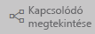

# A tartalma naprakész
*Fogyasztóként* a *tervezők* által létrehozott, Önnel megosztott tartalmakkal dolgozik. Előfordulhat, hogy nem tudja, hogy a tartalom naprakész-e, vagy csak tudni szeretné, hogy mikor frissítették utoljára. Ha biztos lehet benne, hogy a legújabb verzióval rendelkezik, magabiztosan dolgozhat.  
 

A jó döntések meghozatalában gyakran kritikus fontosságú a legfrissebb adatok használata. Hogyan győződhet meg róla, hogy a legfrissebb tartalmakat használja? A legtöbb esetben ehhez nem kell tennie semmit. Az Önnel megosztott alkalmazások automatikusan frissülnek a tervező által beállított ütemezés szerint. Ugyanez vonatkozik az Önnel megosztott irányítópultokra és jelentésekre is – a tervező kézzel vagy egy automatizált frissítési ütemezéssel gondoskodik a tartalom naprakészen tartásáról.  

Ha kérdése van az adatok verziójával kapcsolatban, forduljon a tervezőhöz.

## A tervező nevének megkeresése

### Alkalmazások

Az alkalmazás képernyőjén a tervező neve és az alkalmazás létrehozásának dátuma is megjelenik.  

1. A bal oldali navigációs panelen válassza az **Alkalmazások** lehetőséget.

    

    Minden alkalmazásnál láthatja a címet és a létrehozás dátumát. 

2. Ha a kurzort az alkalmazás fölé helyezi, megjelenik a tervező neve. 

    

### Velem megosztva
A **Velem megosztva** képernyőn megjelenik a tartalom tulajdonosának neve, valamint a tartalom megosztásának dátuma.

 

## A legutóbbi frissítés dátumának megkeresése
Ha érdekli, a legtöbb tartalom esetében megtudhatja a legutóbbi frissítés dátumát is. 

### Irányítópult-csempék
Irányítópult-csempék esetén a Legutóbbi frissítés időbélyegének megjelenítéséhez tekintse meg a csempét fókusz módban.

1. Az irányítópult-csempén válassza a három pont (...) lehetőséget, majd a **Megnyitás fókusz módban** lehetőséget.

    

2. A legutóbbi frissítés dátuma a jobb felső sarokban jelenik meg. Ha nem látja, bontsa ki a böngészőt. 

    

### Irányítópultokban és jelentésekben
A legutóbbi frissítés dátumát egy másik módszerrel, a **Kapcsolódó megtekintése** lehetőséggel is megkeresheti.  A **Kapcsolódó megtekintése** lehetőség a Power BI felső menüsávjában érhető el.

A **Kapcsolódó tartalom** panelen láthatók a legújabb frissíts adatai az irányítópult vagy a jelentés mögöttes adatkészletéhez.

## Mi történik, ha egy alkalmazást töröl a tervező?

Ha egy tervező töröl egy alkalmazást, az ahhoz tartozó irányítópultok és jelentések automatikusan eltűnnek az Ön Power BI-munkaterületéről is. Többé nem lesznek elérhetők, és nem fogják látni a Navigációs panelen sem az alkalmazást.

## Feliratkozás a módosítások megtekintéséhez
Ha naprakész szeretne maradni, feliratkozhat egy jelentésre vagy irányítópultra. Így a bejelentkezés és a jelentés vagy irányítópult megnyitása helyett megbízhatja a Power BI-t, hogy küldjön Önnek egy pillanatképet bizonyos időközönként.  További információ: [Feliratkozás irányítópultokra és jelentésekre](end-user-subscribe.md).

## Adatriasztások beállítása
Szeretne értesítést kapni, ha az adatok egy Ön által megadott korláton túlmenően módosulnak? [Hozzon létre egy adatriasztást](end-user-alerts.md).  Adatriasztásokkal könnyen naprakész maradhat. Ezek segítségével megbízhatja a Power BI-t, hogy küldjön Önnek egy e-mailt, ha egy jelentés értéke meghalad egy adott küszöböt.  Ilyen lehet például, ha a készlet 25 egység alá csökken, vagy az értékesítések meghaladják a kitűzött célt.  

## Következő lépések
[Adatriasztás létrehozása](end-user-alerts.md)    
[Feliratkozás irányítópultokra és jelentésekre](end-user-subscribe.md)    
[Kapcsolódó tartalom megtekintése](end-user-related.md)    
