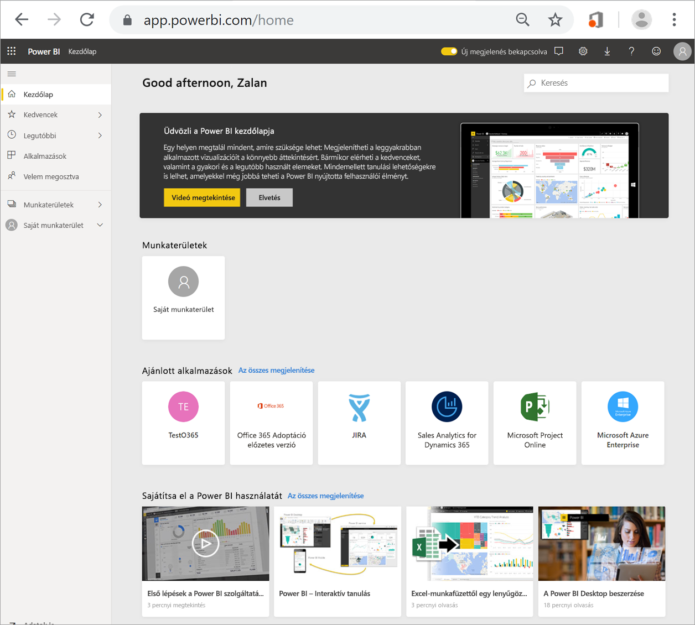
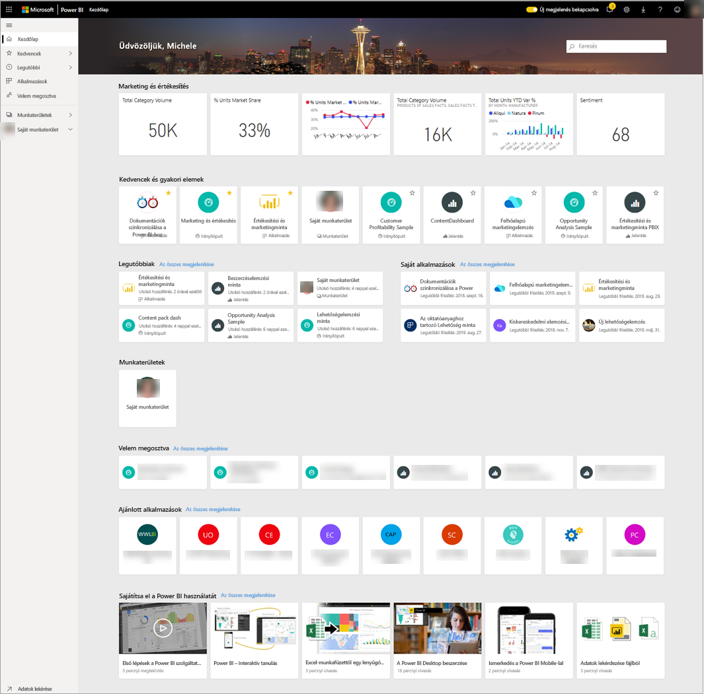
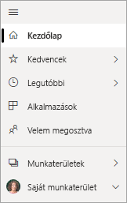
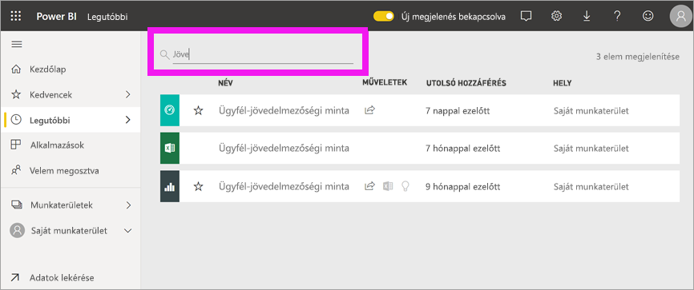

# Irányítópultok, jelentések és alkalmazások megkeresése
A Power BI-ban a *tartalom* kifejezés alkalmazásokra, irányítópultokra és jelentésekre vonatkozik. A tartalmat a Power BI *tervezői* hozzák létre, akik megosztják azokat a munkatársakkal, például Önnel. A tartalom elérhető és megtekinthető a Power BI szolgáltatásban, és a legjobb, ha a Power BI kezdőlapján kezdi a munkát.

## Ismerkedés a Power BI kezdőlapjával
Amikor bejelentkezik, Power BI a Kezdőlap területet nyitja meg és jeleníti meg, ahogy az az alábbi ábrán látható.
 

A Power BI kezdőlapján három különböző módszerrel tekinthet meg és kereshet tartalmakat. Mindhárom ugyanahhoz a tartalomhoz fér hozzá, mindössze más-másféleképpen érik azt el. Néha kereséssel lehet megtalálni tartalmakat a legegyszerűbb és leggyorsabb módon, míg más esetben hatékonyabb módszer, ha kiválaszt egy *kártyát* a kezdőlapon.

- A kezdőlapon rendszerezve megtalálja a kedvenc és a legújabb tartalmakat, de vannak még itt ajánlott tartalmak és tanuláshoz használható források is. Minden tartalomhoz tartozik egy *kártya*, amelyen egy cím és egy ikon is látható. Ha kiválasztja a kártyát, megnyílik az adott tartalom.
- A bal oldalon egy navigációs panelt talál, amelyet navigációs sávnak hívunk. Ezen a panelen ugyanaz a tartalom látható, de más elrendezésben: Kedvencek, Legutóbbi, Alkalmazások és Velem megosztva kategóriákban. Innen megtekintheti a tartalomlistát, és kiválaszthatja a megnyitni kívánt elemet.
- A jobb felső sarokban található a globális keresőmező, amellyel megkeresheti a tartalmakat cím, név vagy kulcsszó alapján.

Az alábbi témakörökben részletesebben is megvizsgáljuk mindegyik lehetőséget, amelyekkel tartalmat kereshet és tekinthet meg.

## Kezdőlap vászon
A Kezdőlapon megtekinthet minden olyan tartalmat, amelynek használatára jogosult. A Kezdőlap (lásd a fenti képet) először még nem tartalmaz sok mindent, de ez megváltozik majd, ha munkatársaival használatba veszi a Power BI-t.

A Kezdőlap emellett az ajánlott tartalmakkal és a tanulási forrásokkal is frissül majd. 
 
Amint használni kezdi a Power BI szolgáltatást, és a munkatársaktól irányítópultokat, jelentéseket és alkalmazásokat kap majd, a Kezdőlap fokozatosan megtelik ezekkel. A Kezdőlap idővel az alábbi képen láthatóhoz fog hasonlítani.

 
A következő néhány témakörben alaposabban szemügyre vesszük a Kezdőlapot felülről lefelé haladva.

## A legfontosabb tartalom mindig kéznél van

### Kedvencek és gyakori elemek
Ez a felső szakasz a leggyakrabban felkeresett tartalomra mutató hivatkozásokat tartalmaz, illetve azokat, amelyeket Ön [Kiemeltként vagy kedvencként](end-user-favorite.md) megjelölt. Figyelje meg, hogy több kártyán sárga csillag látható; az a két alkalmazás és az az irányítópult kedvencekként lettek megjelölve.
 
### Legutóbbi és Saját alkalmazások
A következő szakaszban a legutóbb meglátogatott tartalmak jelennek meg. Figyelje meg, hogy mindegyik kártyán időbélyeg is van. A **Saját alkalmazások** szakaszban azok az alkalmazások találhatók, melyeket Önnel megosztottak, vagy amelyeket Ön [az AppSource-ból töltött le](end-user-apps.md). Itt a legutóbbi alkalmazások jelennek meg. Ha kiválasztja az **Összes megjelenítése** lehetőséget, akkor megtekintheti az összes olyan alkalmazást, melyet megosztottak Önnel.

### Munkaterületek
A Power BI *felhasználójaként* általában csak egy munkaterülettel rendelkezik: a **Saját munkaterülettel**. 

### Velem megosztva
A munkatársak megoszthatnak Önnel alkalmazásokat, egyéni irányítópultokat és jelentéseket is. Figyelje meg, hogy a **Velem megosztva** szakaszban három irányítópult és három jelentés van, amelyeket a munkatársai megosztottak Önnel.

### Ajánlott alkalmazások
A tevékenységei és a fiókbeállításai alapján Power BI ajánlott alkalmazásokat is megjelenít. Ha kiválaszt egy alkalmazáskártyát, azzal megnyitja az alkalmazást.
 
### Tanulási források
A Kezdőlap alján tanulási források láthatóak. Az, hogy pontosan milyen források jelennek meg, attól függ, hogy Ön milyen tevékenységeket végez, és hogy a Power BI-adminisztrátor milyen beállításokat alkalmazott. 
 
## A navigációs panel (navigációs sáv) bemutatása

A bal oldali navigációs panel (navigációs sáv) használatával irányítópultokat, jelentéseket és alkalmazásokat kereshet, és navigálhat közöttük. Esetenként a tartalmat a leggyorsabban a navigációs sávval lehet megkeresni.
A navigációs sáv megjelenik, amint megnyitja kezdőlapot, és ott is marad, amikor a Power BI szolgáltatás többi területét megnyitja.
  
A navigációs sáv a tartalmat tárolókba rendezi, hasonlóan ahhoz, amit már korábban láttunk a Kezdőlapon: Kedvenc, Legutóbbiak, Alkalmazások és Velem megosztva kategóriákba. Az úszó menük használatával megtekintheti minden tárolóban csak a legutóbbi tartalmat, de tartalomlistákra is léphet, ha az egyes tárolókategóriákban az összes tartalmat meg szeretné tekinteni.
 
- Ha meg szeretné nyitni valamely tartalomszakaszt, és meg szeretné jeleníti az összes elemet, válassza ki a fejlécét.
- Ha az egyes tárolókban a legutóbbi elemeket szeretné megtekinteni, válassza az úszó menüt ( **>** ).

    

 
A navigációs sávval ugyancsak gyorsan megtalálhatja a keresett tartalmat. A tartalom a Kezdőlapon láthatóhoz hasonlóan van elrendezve, de kártyák helyett itt listákban jelennek meg. 

## Keresés az összes tartalomban
A tartalmat néha a leggyorsabban kereséssel találhatja meg. Tegyük fel, hogy azt veszi észre, hogy a Kezdőlapon már nem jelenik meg egy irányítópult, amelyet egy ideje nem használt. Lehet, hogy emlékszik rá, hogy Aaron nevű kollégája osztotta meg Önnel, de arra már nem emlékszik, hogy Aaron milyen nevet adott neki, vagy hogy milyen típusú tartalmat osztott meg: irányítópultot vagy jelentést.
 
Megadhatja az irányítópult teljes vagy részleges nevét, és rákereshet. Sőt, a kollégája nevét is megadhatja, és olyan tartalmakat is kereshet, amelyeket ő osztott meg Önnel. A keresés hatóköre úgy van kiválasztva, hogy minden olyan tartalomban keressen, amelyet Ön birtokol, illetve amelyekhez rendelkezik hozzáféréssel.

## Következő lépések
[A Power BI alapfogalmainak](end-user-basic-concepts.md) áttekintése
