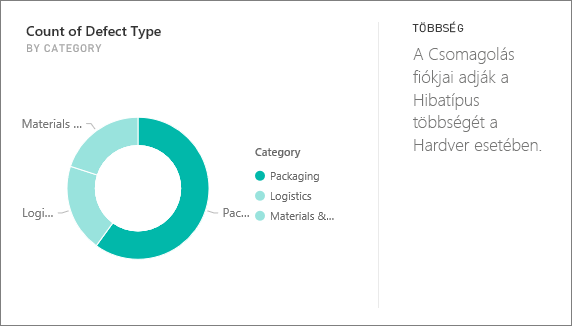
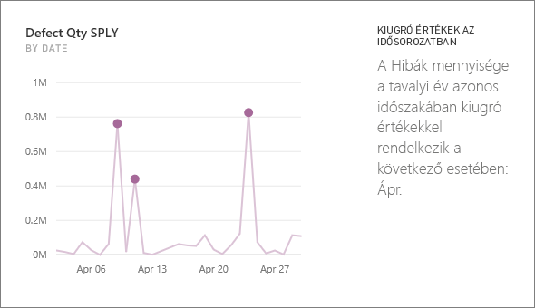

# A Power BI által támogatott elemzések típusai

[!INCLUDE[consumer-appliesto-yyny](../includes/consumer-appliesto-yyny.md)]

Kérheti a Power BI-tól, hogy nézze át az adatokat érdekes trendeket és mintázatokat keresve. Ezek a trendek és mintázatok *Elemzés* nevű vizualizációk formában jelennek meg. 

Az Elemzések használatát a [Power BI-elemzések](end-user-insights.md) című cikkből ismerheti meg

## Az elemzések működése
A Power BI gyorsan megkeresi az adatkészlet különböző részhalmazait. A Power BI a keresésnél kifinomult algoritmusok alkalmazásával keres az adatkészletben érdekes összefüggések feltárása érdekében. A Power BI-*fogyasztók* elemzéseket futtathatna az irányítópult-csempéken.

## Néhány alapfogalom
A Power BI statisztikai algoritmusokkal fedi fel az elemzési eredményeket. Ezeket az algoritmusokat a cikk következő szakasza sorolja fel és ismerteti. Az algoritmusok megismerése előtt megadunk néhány nem feltétlenül ismert definíciót. 

* **Mérték** – a mértékek kvantitatív (numerikus) mezők, amelyek számítások elvégzésére használhatók. Gyakori számítás az összegzés, az átlagszámítás és a minimum meghatározása. Ha egy vállalat például gördeszkákat gyárt és árusít, akkor mérték lehet az egy év alatt eladott gördeszkák száma és a haszon évenkénti átlaga.  
* **Dimenzió** – a dimenziók kategorikus (szöveges) adatok. Egy dimenzió egy személyt, objektumot, elemet, terméket, helyet vagy időt ír le. Egy adathalmazban a *mértékek* dimenziók segítségével csoportosíthatók hasznos kategóriákba. A gördeszkagyárban ilyen dimenzió lehet az értékesítés (mint mérték) modellek, színek, országok vagy marketingkampányok szerint.   
* **Korreláció** – a korreláció az értékek viselkedésének összefüggését mutatja meg.  Ha a növekedésük és csökkenésük mintázata hasonló, akkor pozitív korrelációban állnak. Ha a mintázatok ellentétesek, akkor a korrelációjuk negatív. Ha például a piros gördeszkák értékesítése mindig emelkedik, amikor televíziós marketing-kampányt indítunk, akkor a piros gördeszkák értékesítése és a televíziós kampány pozitívan korrelál.
* **Idősor** – idősorral az idő ábrázolható egymást követő adatpontok formájában. Ezek az adatpontok követhetik egymást például másodpercenként, óránként, hónaponként vagy évenként.  
* **Folytonos változó** – egy változó folytonos, ha bármilyen értéket felvehet a minimuma és a maximuma között, ellenkező esetben diszkrétnek nevezzük. Ilyen például a hőmérséklet, a tömeg, az életkor és az idő. A folytonos változók egy érték törtrészeit is tartalmazhatják. Az eladott kék gördeszkák teljes száma diszkrét változó, hiszen fél gördeszkát nem lehet eladni.  

## Milyen összefüggések tárhatók fel az elemzésekkel?
A Power BI a következő algoritmusokat használja. 

### Kiugró (alsó vagy felső) értékek a kategóriában
Kiemeli azokat az eseteket, amikor egy vagy két kategóriában a többinél sokkal magasabbak az értékek.  

### Időbeli adatsorok változási pontjai
Időbeli adatsoroknál kiemeli, hogy mikor következett be szignifikáns változás a trendekben.

### Korreláció
Azokat az eseteket észleli, ahol több mérték hasonló mintázatot vagy trendet mutat egy adathalmazbeli kategória vagy érték szerint ábrázolva.

### Alacsony variancia
Azokat az eseteket észleli, amikor valamely dimenzió adatpontjai nem esnek messze a középértéktől, vagyis amikor kicsi a variancia. Tegyük fel, hogy rendelkezik egy „értékesítés” nevű mértékkel és egy „régió” nevű dimenzióval. A régiót megvizsgálva azt tapasztalja, hogy nagyon kicsi a különbség az adatpontok és a középérték (vagyis az adatpontok középértéke) között. A megállapítás akkor aktiválódik, amikor az összes régióban mért értékesítések varianciája egy adott küszöbérték alá esik. Más szóval akkor, amikor minden régióban meglehetősen azonos képet mutatnak az értékesítések.

### Többség (fő tényezők)
Megkeresi azokat az eseteket, amelyekben az összérték többségi aránya egy másik dimenzió mentén vizsgálva egyetlen tényezőnek tudható be.  

### Időbeli adatsorok általános trendjei
Észleli az időrendben elérhető adatok növekvő és csökkenő trendjeit.

### Időbeli adatsorok szezonális változásai
Azt vizsgálja, hogy felfedezhetőek-e heti, havi vagy éves gyakorisággal ismétlődő minták az időbeli adatsorokban.

### Állandó részesedés
Kiemeli azokat az eseteket, amelyekben szülő-gyermek típusú korreláció fedezhető fel egy gyermek érték részesedése és egy folyamatos változó mentén vizsgált teljes szülő érték között. Az állandó részesedést jelző megállapítás egy mérték, egy dimenzió és egy másik dátum/idő dimenzió környezetére vonatkozik. Ez a megállapítás akkor aktiválódik, amikor egy konkrét dimenzióérték (például: „az északkeleti régió”) százalékos értéke állandó összesített értékesítést jelez a szóban forgó dátum/idő dimenzió egészében.

Az állandó részesedést jelző megállapítás hasonló az alacsony varianciát jelzőhöz, mert mindkettő arra utal, hogy időben nem változik az adott érték. Az állandó részesedést jelző megállapítás azonban az **összesített érték százalékos arányának** időbeli állandóságát méri, az alacsony varianciát jelző megállapítás pedig az abszolút mérték értékeinek valamely dimenzióban észlelt állandóságát.

### Kiugró értékek egy időbeli adatsorban
Időrendben elérhető adatok esetén észleli, hogy vannak-e olyan dátumok vagy időpontok, melyeknél az érték szignifikánsan eltér a többi dátumhoz/időponthoz tartozó értéktől.

## További lépések
[Power BI-elemzések](end-user-insights.md)

Több kérdése van? [Kérdezze meg a Power BI közösségét](https://community.powerbi.com/)

