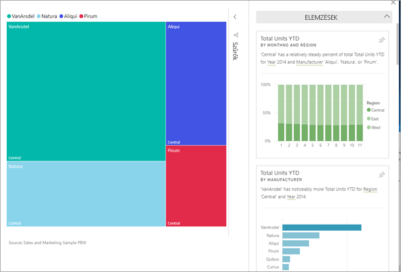
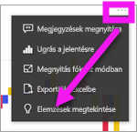
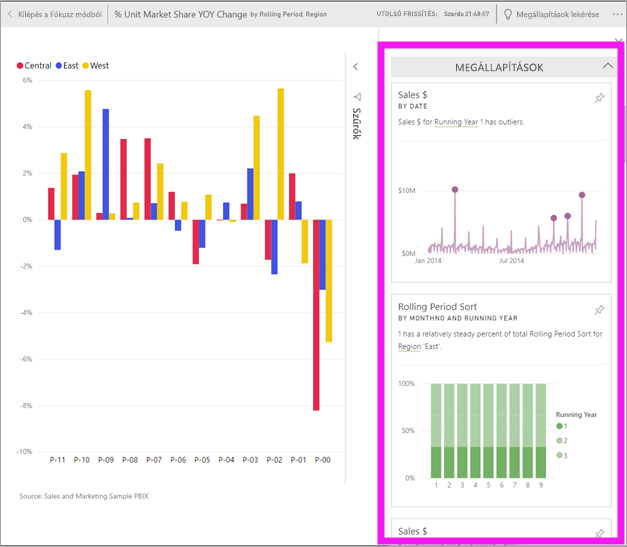
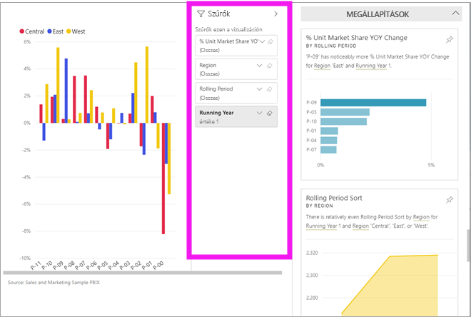
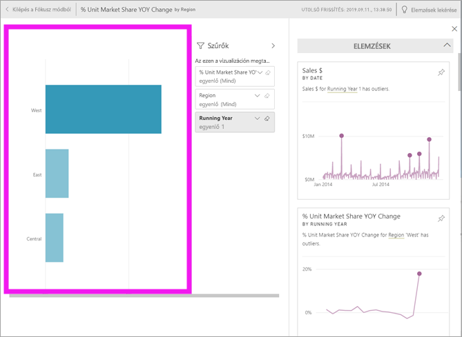
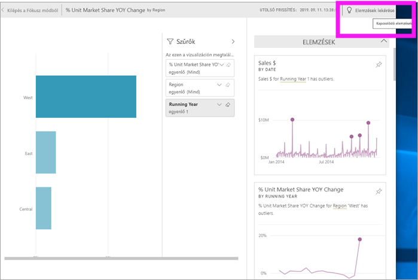

# Adatelemzési eredmények megtekintése irányítópult-csempéken a Power BI-jal
Az irányítópulton található vizualizációs [csempék](end-user-tiles.md) mindegyike nagyszerű lehetőséget kínál az adatfeltárással való ismerkedéshez. Ha rákattint egy csempére, megnyílik egy jelentés vagy a [Q&A](end-user-q-and-a.md), amelyben szűrheti és rendezheti a jelentés alapjául szolgáló adathalmazt, és részletes elemzést végezhet rajta. Elemzések futtatásakor pedig a Power BI elvégzi Ön helyett az adatok felderítését.

Elemzéseket futtatva érdekes interaktív vizualizációkat hozhat létre adataiból. Elemzéseket futtathat az irányítópult adott csempéin, és még az elemzéseken is futtathat elemzést!

Az elemzés szolgáltatás a Microsoft Research-csel együttműködésben fejlesztett, egyre növekvő számú [haladó szintű elemzési algoritmusra épül](end-user-insight-types.md). A Microsoft Research egyre több ember számára teszi lehetővé adatai újszerű és intuitív módszerekkel történő elemzését.

## Irányítópult csempére vonatkozó elemzések futtatása
Ha az irányítópult egyik csempéjén futtat elemzéseket, a Power BI megkeresi az adott csempe létrehozásához használt adatokat. 

1. [Nyisson meg egy irányítópultot](end-user-dashboards.md).
2. Vigye az egérmutatót egy csempe fölé. Válassza a három pontot (…), majd az **Elemzések megtekintése** lehetőséget. 

    

3. A csempe [Fókusz módban](end-user-focus.md) nyílik meg, és a jobb oldalán jelennek meg az elemzéskártyák.    
   
        
4. Felkeltette valamelyik elemzés az érdeklődését? Az adott elemzéskártyát kiválasztva az adatok mélyebb szintjére is leáshat. A kiválasztott elemzés a bal oldalon fog megjelenni, az új, kizárólag az adott elemzés adatain alapuló új elemzéskártyák pedig a jobb oldalon.    

 ## Az elemzéseket megjelenítő kártyák interaktív használata
Egy elemzés megnyitása után folytathatja a felderítést.

   * A vizualizációt a vásznon szűrheti.  A szűrők megjelenítéshez a jobb felső sarokban látható nyilat választva nyithatja meg a Szűrők panelt.

      
   
   * Elemzést magára az elemzés kártyájára vonatkozóan is futtathat. Ezt gyakran **kapcsolódód elemzésnek** is nevezik. Kijelöléssel tegyen aktívvá egy elemzéskártyát. Az megjelenik a jelentésvásznon.
   
      
   
   * Válassza a jobb felső sarokban látható villanykörte ikont  vagy az **Elemzések lekérése** lehetőséget. A bal oldalon megjelennek az elemzések, a jobb oldalon pedig új kártyák láthatók, melyeket kizárólag az adott elemzésben szereplő adatok alapján készített a rendszer.
     
     
     
A jelentéshez a bal felső sarokban látható **Kilépés a fókusz módból** lehetőséget választva léphet vissza.

## Megfontolandó szempontok és hibaelhárítás
- Az **Elemzések megtekintése** az irányítópult nem minden csempetípusával használható. Például egyéni vizualizációkhoz nem érhető el.<!--[custom visuals](end-user-custom-visuals.md)-->

## Következő lépések
További tudnivalók a [Gyors elemzések típusaival kapcsolatban](end-user-insight-types.md)

