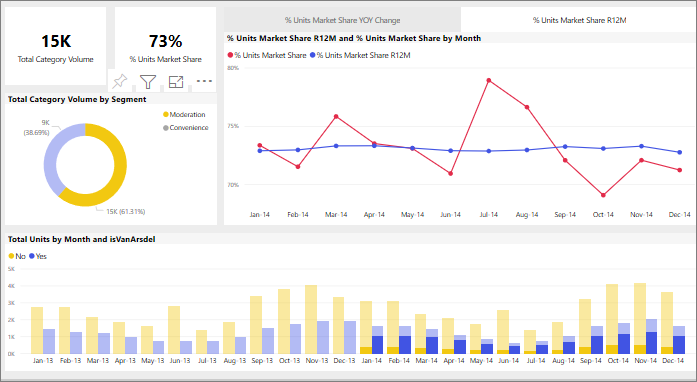

# Vizualizációk közötti keresztszűrés Power BI-jelentésben
A Power BI egyik legnagyszerűbb funkciója, hogy a jelentésoldalon szereplő vizualizációk mind kapcsolódnak egymáshoz. Ha kiválasztja a vizualizáció egyik adatpontját, az oldalon szereplő összes többi, az adott adatot tartalmazó vizualizáció módosul a kijelölés alapján. 

Alapértelmezés szerint a jelentésoldalakon található egyik vizualizáció adatpontjának kiválasztásával lehet a többi vizualizációra keresztszűrést, keresztkiemelést és részletezést végezni. 

Ez hasznos lehet annak azonosítására, hogy az adatértékek hogyan járulnak hozzá egy másikhoz. Ha például ha a perecdiagramon kijelöli a Moderálási szegmenst, akkor a rendszer kiemeli az adott szegmens hozzájárulását az Egységek teljes száma hónap szerint diagram minden egyes oszlopához, és a jobb oldalon található vonaldiagram is szűrve lesz.

Lásd: [Szűrés és kiemelés](../power-bi-reports-filters-and-highlighting.md). 

A jelentés *tervezője* állítja be, hogy pontosan milyen módon lépnek interakcióba egymással az oldalon szereplő vizualizációk. A tervezők ki- és bekapcsolhatják a vizualizációk interakcióit, és módosíthatják az alapértelmezett keresztszűrés, a keresztkiemelés és a részletezés működését. 
  
> [!NOTE]
> A *keresztszűrés* és *keresztkijelölés* kifejezésekkel az itt ismertetett viselkedéseket a **Szűrők** ablaktábla szűrés és kiemelés funkciójától különböztetjük meg.  

## Megfontolandó szempontok és hibaelhárítás
- Ha a jelentés olyan vizualizációkkal is rendelkezik, amelyek támogatják a [részletes vizsgálatot](../power-bi-visualization-drill-down.md), akkor alapbeállítás szerint egy adott vizualizáció részletező elemzése nem lesz hatással a jelentésoldal többi vizualizációjára.     
- Ha az „A” vizualizációt használja a „B” vizualizációval való interakcióra, az „A” vizualizáció vizualizációs szintű szűrőit a rendszer a „B” vizualizációra alkalmazza.

## Következő lépések
[A jelentésszűrők használata](../power-bi-how-to-report-filter.md)
