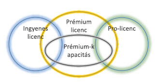
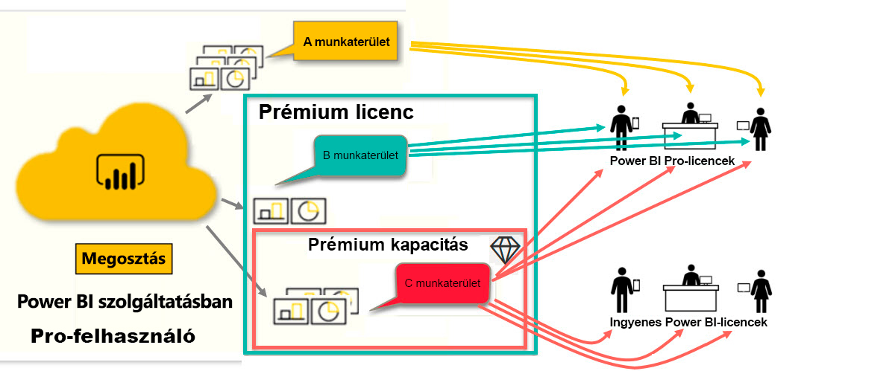

# Power BI-licencek típusai
*Ügyfélként* a Power BI szolgáltatást használhatja a jelentések és irányítópultok megismeréséhez és ezek alapján az üzleti döntések meghozatalához. Ha már egy ideje használja a Power BI-t, vagy beszélgetett *tervező* munkatársaival, valószínűleg észrevette, hogy van néhány funkció, amely csak akkor működik, ha rendelkezik bizonyos licenctípusokkal. 

Ez a cikk a licencek típusai és kombinációi közötti különbségeket ismerteti: ingyenes, Pro, Premium és Premium-kapacitás. Azt is megtudja, hogyan derítheti ki, Ön melyik kombinációt használja.  

Először nézzük meg a két licenckategóriát: a felhasználónkénti licenceket és szervezeti licenceket. A kiindulási pontunk a licencekhez elérhető alapértelmezett képességek lesznek. Ezután megvizsgáljuk, hogy a Power BI rendszergazdája és a tartalomtulajdonosok hogyan használhatják a szerepköröket és engedélyeket az alapértelmezett licencelési lehetőségek módosításához. 

Még ha a licence lehetővé is teszi, a rendszergazda korlátozhatja például az adatexportálást, a Q&A természetes nyelvi lekérdezések használatát, illetve a webes közzétételt is. Ha pedig egy *jelentéstervező* tartalmat rendel egy munkaterülethez, akkor hozzárendelheti Önt egy munkaterület-szerepkörhöz. A szerepkörök határozzák meg, hogy az adott munkaterületen belül mit tehet és mit nem. A *jelentéstervező* tovább módosíthatja a licenc korlátait az engedélyek beállításaival. Más szóval... bonyolult. Remélhetőleg ez a cikk segít nagyrészt – vagy akár teljes egészében – átlátni a zűrzavart.

## Felhasználónkénti licencek
Az első licenctípus a **felhasználónkénti** licenc. A Power BI-felhasználók ingyenes licenccel vagy Pro-licenccel rendelkeznek. Bizonyos szolgáltatások a Pro-licenccel rendelkező felhasználók számára vannak fenntartva.  

- **A Power BI Pro-licenc** lehetővé teszi a felhasználóknak, hogy együttműködjenek más Pro-felhasználókkal a tartalom létrehozásában vagy megosztásában. Csak a Pro-licenccel rendelkező felhasználók tehetnek közzé jelentéseket, fizethetnek elő irányítópultokra és jelentésekre, és működhetnek együtt a munkatársakkal a munkaterületeken. 

    

    A Power BI Pro egy egyéni felhasználói licenc, amellyel a felhasználók beolvashatják és kezelhetik azokat a jelentéseket és irányítópultokat, amelyeket mások közzétettek a Power BI szolgáltatásban. Az ezzel a licenctípussal rendelkező felhasználók megoszthatnak tartalmakat, és együttműködhetnek más Power BI Pro-felhasználókkal. Csak Power BI Pro felhasználók tehetnek közzé és oszthatnak meg tartalmakat más felhasználókkal, vagy használhatják fel a mások által létrehozott tartalmakat. Ez alól kivétel a [Power BI Premium-kapacitásban](#understanding-premium-and-premium-capacity) tárolt tartalom. A Pro-licenceket jellemzően a jelentések *tervezői* és a fejlesztők használják. További információ: [A Power BI Premium-kapacitás](#understanding-premium-and-premium-capacity).

- **Az önálló ingyenes Power BI-licenc** – bár sok mindenre használható – azon felhasználóknak való, akik most ismerkednek a Power BI-jal, vagy akik saját maguk számára készítenek tartalmat. [Egyéni regisztráció a Power BI szolgáltatásra](../service-self-service-signup-for-power-bi.md). Az ingyenes önálló licenc nincs szervezeti licenchez rendelve. 

    Az ingyenes önálló felhasználói licenc tökéletes megoldás azoknak, akik a Microsoft-mintákat használják a Power BI megismerésére. Az ingyenes önálló licenccel rendelkező felhasználók nem tekinthetik meg a mások által megosztott tartalmakat, és nem oszthatják meg a sajátjaikat más Power BI-felhasználókkal. 

    

Eddig világos?  Oké. Vegyünk fel egy további réteget, a **prémium szint** rétegét.

## A Premium és a Premium-kapacitás megismerése
A Premium egy **szervezeti** licenc. Gondoljon rá úgy, mintha a szervezet funkciók egy további rétegét venné fel a Power BI **felhasználónkénti** licencei mellé. 

Ha egy szervezet Premium-licencet vásárol, a rendszergazda általában azokhoz az alkalmazottakhoz rendel Pro-licenceket, akik tartalmakat fognak létrehozni és megosztani. A rendszergazda pedig ingyenes licenceket rendel hozzá mindenkihez, aki ezt a tartalmat használja. A Pro-felhasználók [munkaterületeket](end-user-workspaces.md) hozhatnak létre, és tartalmat (irányítópultokat, jelentéseket, alkalmazásokat) adhatnak hozzájuk. Ha engedélyezni szeretnék másoknak a munkaterületeken való együttműködést, a Pro-felhasználók a *kapacitás*, az engedélyek és a szerepkörök kombinációját használják. 

Ha egy szervezet Premium-licenceket vásárol, kifejezetten a számára fenntartott kapacitást kap a Power BI szolgáltatásban. Ez sincs megosztva. Ezeket teljes egészében a Microsoft által felügyelt, dedikált hardverek szolgálják ki. A szervezetek dönthetnek úgy, hogy a dedikált kapacitást széles körben szétterítik, vagy egyes munkaállomásokra koncentrálják. A Premium-kapacitású munkaterületek olyan területek, ahol a Pro-felhasználók megoszthatnak tartalmakat és együttműködhetnek az ingyenes felhasználókkal anélkül, hogy az ingyenes felhasználóknak Pro-fiókra lenne szükségük.  

A Premium-kapacitásban továbbra is Pro-licencre van szükség a tartalomtervezők számára. A tervezők adatforrásokhoz csatlakozhatnak, adatokat modellezhetnek, és munkaterület-alkalmazásokként csomagolt jelentéseket és irányítópultokat készíthetnek. A Pro-licenccel nem rendelkező felhasználók továbbra is hozzáférhetnek a Power BI Premiumban található munkaterülethez, feltéve, hogy a tartalom a Premium-*kapacitásban* van, és a munkaterület tulajdonosa engedélyt ad nekik.

Az alábbi ábrán a bal oldalon azok a Pro-felhasználók jelennek meg, akik tartalmat hoznak létre és osztanak meg a munkaterületeken.  
- Az **A munkaterületet** olyan szervezetben hozták létre, amely nem rendelkezik Premium szolgáltatással. 

- A **B munkaterületet** olyan szervezetben hozták létre, amely Premium-licenccel rendelkezik, bár ezt az adott munkaterületet nem a Premium-kapacitásba mentették. A munkaterület nem rendelkezik gyémánt ikonnal.

- A **C munkaterületet** egy Premium-licenccel rendelkező szervezetben hozták létre, és a Premium-kapacitásba mentették. A munkaterület rendelkezik gyémánt ikonnal.  

A Power BI Pro-*tervező* bármelyik három munkaterületet használhatja a más Pro-felhasználókkal való együttműködésre és a tartalmak megosztására, mindaddig, amíg a tervező megosztja a munkaterületet a teljes szervezettel, vagy munkaterületi szerepköröket rendel a Pro-felhasználókhoz. 

A Power BI Pro-*tervező* csak a C munkaterület használatával oszthat meg tartalmakat és dolgozhat együtt ingyenes felhasználókkal. A munkaterületet a Premium-kapacitáshoz kell rendelni ahhoz, hogy az ingyenes felhasználók hozzáférhessenek. A munkaterületen belül a tervező adhat szerepköröket az együttműködésben részt vevő felhasználóknak: *Rendszergazda*, *Tag*, *Közreműködő* vagy *Megtekintő*. A munkaterületen elvégezhető műveleteket a szerepköre határozza meg. A Power BI-*felhasználók* általában *Megtekintő* szerepkört kapnak. További információ: [Munkaterületek Power BI-felhasználóknak](end-user-workspaces.md).

## Az Ön tulajdonában lévő licenc megkeresése
A Power BI-licencekre vonatkozó információkat többféleképpen is meg lehet keresni. 

Először határozza meg, hogy milyen **felhasználói** licenccel rendelkezik.

- A Microsoft Office bizonyos verziói Power BI Pro-licencet foglalnak magukban.  Ha szeretné megtudni, hogy az Office Ön által használt verziója tartalmazza-e a Power BI-t, látogasson el [a hivatalos Office-portálra](https://portal.office.com/account), és válassza az **Előfizetések** lehetőséget.

    Az első felhasználó, Pradtanna Office 365 E5 előfizetéssel rendelkezik, amely tartalmazza a Power BI Pro-licencet.

    

    A második felhasználónak, Zalánnak ingyenes Power BI-licence van. 

    

Következőként ellenőrizze, hogy fiókja rendelkezik-e Premium-licenccel. A fenti felhasználók bármelyike – függetlenül attól, hogy Pro- vagy ingyenes licence van – tartozhat olyan szervezethez, amely Premium-licenccel rendelkezik.  Nézzük meg a második felhasználónkat, Zalánt.  

- A Power BI szolgáltatásban válassza a **Saját munkaterület** lehetőséget, majd a jobb felső sarokban a fogaskerék ikont. Válassza a **Személyes tárhely kezelése** lehetőséget.

    

    A Pro vagy az ingyenes **felhasználónkénti** licencek 10 GB-os tárhelyet biztosítanak a felhőben, amely Power BI-jelentések vagy Excel-munkafüzetek tárolására használható. Ha többet lát, mint 10 GB, akkor Ön egy Premium-licenccel rendelkező szervezeti fiók tagja.

    

    Ne feledje, hogy az Office-portál lapon Zalán felhasználói előfizetése Power BI (ingyenes) előfizetés volt. Mivel azonban a szervezete Premium-licencet vásárolt, Zalán nem korlátozódik 10 GB tárterületre a Power BI szolgáltatásban; 100 GB-ot ér el. A Premium-licenccel rendelkező szervezetekben – amíg a *tervező* a munkaterületet a Premium-kapacitásban helyezi el – Zalán *felhasználóként* képes megtekinteni a megosztott tartalmakat, együttműködni a munkatársakkal, használni az alkalmazásokat, stb. Az engedélyeinek hatályát a Power BI-rendszergazda és a tartalomtervező állítja be. Figyelje meg, hogy egy Pro-felhasználó már megosztott egy munkaterületet Zalánnal. A gyémánt ikon azt jelzi, hogy a munkaterület a Premium-kapacitásban van tárolva. 

   
## A munkaterület szerepköreinek megismerése
Eddig áttekintettük a felhasználónkénti licenceket, a Premium-licenceket és a Premium-kapacitást. Most vessünk egy pillantást a munkaterület *szerepköreire*.

Mivel ez a cikk a Power BI-*felhasználóknak* szól, vegyük a következő forgatókönyvet:

-  Ön egy *ingyenes* felhasználó egy Power BI Premium-licenccel rendelkező szervezetben. 
- Egy Power BI Pro-felhasználó irányítópultok és jelentések csoportját hozta létre, és *alkalmazásként* közzétette a gyűjteményt a teljes szervezet számára.  
- A *munkaterületeken* belül alkalmazások vannak, a munkaterületet pedig a Premium-kapacitásban tárolják.    
- Az alkalmazás-munkaterületnek egy irányítópultja és két jelentése van.
- A Pro-felhasználó **Megtekintő** szerepkört rendelt a felhasználónkhoz.

### A Megtekintő szerepkör
A Power BI-*tervezők* a szerepkörökkel kezelhetik, hogy mely felhasználók milyen műveleteket végezhetnek a munkaterületeken, így elősegíthetik a csapatok együttműködését. Az egyik ilyen szerepkör a **Megtekintő**. 

Ha a munkaterület Power BI Premium-kapacitásban van, a Megtekintő szerepkörrel rendelkező felhasználók akkor is hozzáférnek a munkaterülethez, ha nem rendelkeznek Power BI Pro-licenccel. Mivel azonban a Megtekintő szerepkör nem fér hozzá a mögöttes adatokhoz, és nem is exportálhatja őket, ez az irányítópultokkal, jelentésekkel és alkalmazásokkal való kommunikáció biztonságos módja.

> [!TIP]
> A további szerepkörök (Rendszergazda, Tag, Közreműködő) megismeréséhez tekintse meg az [új munkaterület létrehozásával](../service-new-workspaces.md) foglalkozó részt.

