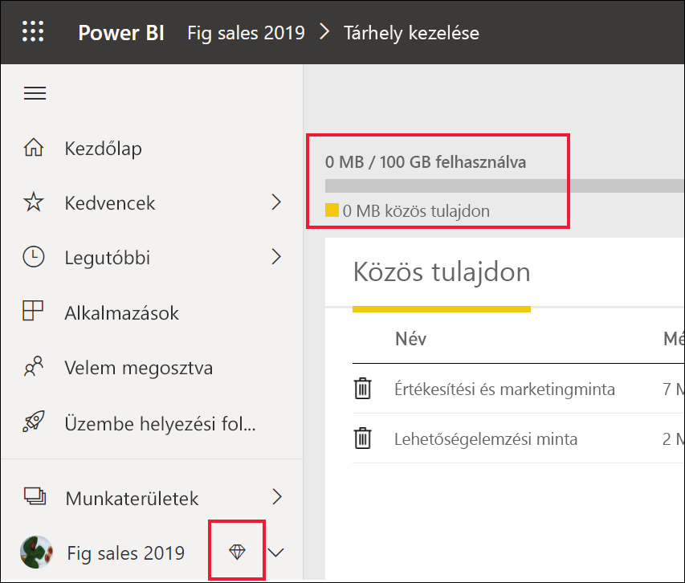

# A Power BI szolgáltatás használata *fogyasztóként*

[!INCLUDE[consumer-appliesto-ynnn](../includes/consumer-appliesto-ynnn.md)]

[*Ügyfélként*](end-user-consumer.md) a Power BI szolgáltatást használhatja a jelentések és irányítópultok megismeréséhez és ezek alapján adatokon alapuló üzleti döntések meghozatalához. Ha már egy ideje használja a Power BI-t, vagy beszélgetett *tervező* munkatársaival, valószínűleg észrevette, hogy van néhány funkció, amely csak akkor működik, ha rendelkezik bizonyos típusú licenccel, előfizetéssel vagy engedélyekkel. 

Az, hogy milyen tevékenységeket végezhet a Power BI szolgáltatásban, a következő három dologtól függ:
-    a használt licenc és előfizetés típusa
-    a tartalom tárolási helye
-    az Önhöz rendelt szerepkörök és engedélyek

Ebben a cikkben ismertetjük az egyes licenctípusok képességeit, és hogy a *tartalom tárolási helye* befolyásolhatja-e, hogy *mit végezhet el vele*. Azt is megtudhatja, hogyan keresheti meg a licencét és az előfizetését, és kiderítheti, hogy hol van tárolva a tartalom. A szerepkörökről és az engedélyekről a [munkaterület szerepköreit](end-user-workspaces.md) ismertető cikkben talál további információt.

## Licencek

A Power BI szolgáltatás minden felhasználója vagy *ingyenes* licencet, vagy egy *Pro*-licencet használ. Ha Ön Power BI-*fogyasztó*, akkor valószínűleg egy olyan ingyenes licencet használ, amelyet a rendszergazda kezel. 

Egyszerre több licenccel is lehet rendelkezni.  A szolgáltatás mindig az aktuálisan elérhető legmagasabb szintű licenc alapján nyújtja a felhasználói élményt. 

## Power BI Prémium-kapacitás

A Premium egy olyan szervezeti előfizetés, amely másféle módon tárolja a tartalmakat: dedikált kapacitásban. A Premium használata esetén munkahelyén belül és kívül is bárki saját Power BI Pro-licenc vásárlása nélkül megtekintheti az összes Power BI-tartalmat. 

A Premium lehetővé teszi, hogy a Pro-felhasználók széles körben megoszthassák a tartalmakat anélkül, hogy a tartalmak címzettjei Pro-licencekkel rendelkeznének. A tartalomtervezőknek Pro-licencekkel kell rendelkezniük. A tervezők adatforrásokhoz csatlakozhatnak, adatokat modellezhetnek, és munkaterület-alkalmazásokként csomagolt jelentéseket és irányítópultokat készíthetnek. A Pro-licenccel nem rendelkező felhasználók is hozzáférhetnek a Power BI Premium kapacitású munkaterületéhez, amennyiben rendelkeznek Megtekintői szerepkörrel.

Ezeken a munkaterületeken a tervezők olyan szerepköröket osztanak ki, például **Megtekintő**, **Közreműködő**, **Tag** vagy **Rendszergazda**, amely meghatározza, hogy a munkatársak milyen mértékben kezelhetik a tartalmat. További információt a [munkaterület engedélyei és szerepkörei](end-user-workspaces.md) című cikkben talál. 

A prémium szintű kapacitásról a [Mi az a Microsoft Power BI Premium?](../admin/service-premium-what-is.md) című témakörben talál további információt.

## Az Ön tulajdonában lévő licenc azonosítása

A [Microsoft **Saját fiók** oldalán](https://portal.office.com/account) láthatja, hogy milyen licencek vannak Önhöz rendelve.  Válassza az **Előfizetések** lapját.

Az első felhasználó, Pradtanna Office 365 E5 előfizetéssel rendelkezik, amely tartalmazza a Power BI Pro-licencet.

A második felhasználónak, Zalánnak ingyenes Power BI-licence van. 

## Annak megállapítása, hogy van-e hozzáférése a prémium szintű kapacitáshoz

A következő lépésben megállapíthatja, hogy egy olyan szervezet tagja-e, amely rendelkezik egy prémium szintű kapacitással. A fenti felhasználók bármelyike, függetlenül attól, hogy Pro- vagy ingyenes licence van, tartozhat olyan szervezethez, amely prémium szintű kapacitással rendelkezik.  Nézzük meg a második felhasználónkat, Zalánt.  

Azt, hogy Zalan szervezete rendelkezik-e prémium szintű kapacitással, úgy állapíthatja meg, ha megnézi a rendelkezésre álló tárterület mennyiségét. 

- A Power BI szolgáltatásban válassza a **Saját munkaterület** lehetőséget, majd a jobb felső sarokban a fogaskerék ikont. Válassza a **Személyes tárhely kezelése** lehetőséget.

    

    Ha ez több mint 10 GB, akkor Ön olyan szervezet tagja, amely prémium szintű előfizetéssel rendelkezik. Az alábbi képen az látható, hogy Zalan szervezete legfeljebb 100 GB tárhellyel rendelkezik.  

    

Figyelje meg, hogy egy Pro-felhasználó már megosztott egy munkaterületet Zalánnal. A gyémánt ikon azt jelzi, hogy a munkaterület a prémium szintű kapacitásban van tárolva. 

## A prémium szintű kapacitásban üzemeltetett tartalom azonosítása

Azt, hogy a szervezete prémium szintű kapacitással rendelkezik-e, úgy is megtudhatja, ha olyan alkalmazásokat és alkalmazás-munkaterületeket keres, amelyek gyémánt ikonnal vannak megjelölve. A gyémánt ikon azt jelzi, hogy a munkaterület a prémium szintű kapacitásban van tárolva. 

Az alábbi képen az alkalmazások közül három a prémium szintű kapacitásban van tárolva.

    
Amíg a *tervező* a munkaterületet a prémium dedikált kapacitásban helyezi el, *felhasználóként* **azon a munkaterületen belül** Ön képes lesz megtekinteni a megosztott tartalmakat, együttműködni a munkatársakkal, használni az alkalmazások irányítópultjait és jelentéseit stb. Az engedélyeinek hatókörét a Power BI-rendszergazda és a tartalomtervező állítja be. 

   

## Végső összeállítás

Ha egy szervezet prémium előfizetést vásárol, a rendszergazda általában Pro-licenceket rendel azokhoz az alkalmazottakhoz, akik tartalmat fognak létrehozni és megosztani a prémium szintű kapacitásban. A rendszergazda pedig ingyenes licenceket rendel hozzá mindenkihez, aki ezt a tartalmat használja. A Pro-felhasználók [alkalmazás-munkaterületeket](end-user-workspaces.md) hozhatnak létre, és tartalmat (irányítópultokat, jelentéseket, alkalmazásokat) adhatnak hozzájuk. Annak érdekében, hogy ezeken a munkaterületeken az ingyenes felhasználók is közreműködhessenek, a rendszergazda vagy Pro-felhasználó egy *Prémium szintű kapacitást* rendel hozzá.    
 

|Licenctípus  |megosztott kapacitás  |dedikált kapacitás  |
|---------|---------|---------|
|**Ingyenes**     |  Személyes tesztkörnyezetként való használathoz, ahol tartalmat hozhat létre saját maga számára, és használhatja azt a tartalmat. Ez nagyszerű módszer a Power BI szolgáltatás kipróbálására. Nem használhatja senki másnak a tartalmát, és Ön sem oszthatja meg a saját tartalmát másokkal  1     |   A dedikált kapacitáshoz rendelt és Önnel megosztott tartalommal dolgozhat. Az ingyenes és a Pro-felhasználók közösen dolgozhatnak anélkül, hogy az ingyenes felhasználóknak Pro-fiókokra lenne szükségük.      |
|**Pro**     |  Együttműködhet más Pro-felhasználókkal a tartalom létrehozásában vagy megosztásában.        |  Együttműködhet ingyenes és Pro-felhasználókkal a tartalom létrehozásában vagy megosztásában.       |

1 Lásd: [Megfontolandó szempontok és hibaelhárítás](#considerations-and-troubleshooting). 

Az alábbi ábrán a bal oldalon azok a Pro-felhasználók jelennek meg, akik tartalmat hoznak létre és osztanak meg alkalmazás-munkaterületeken. 

- Az **A munkaterületet** olyan szervezetben hozták létre, amely nem rendelkezik Premium kapacitással. 

- A **B munkaterületet** egy Prémium előfizetéssel rendelkező szervezetnél hozták létre, és a munkaterületet dedikált kapacitásba mentették. A munkaterület rendelkezik gyémánt ikonnal.  

    

A Power BI Pro *tervezője* a három munkaterületet bármelyikén együttműködhet és tartalmakat oszthat meg más Pro-felhasználókkal. A Power BI Pro felhasználója azonban csak úgy oszthat meg tartalmat és működhet együtt az ingyenes felhasználókkal, ha a B munkaterületet használja, amely prémium szintű dedikált kapacitásban található.  A munkaterületen belül a tervező adhat szerepköröket az együttműködésben részt vevő felhasználóknak. A munkaterületen elvégezhető műveleteket a szerepköre határozza meg. A Power BI-*felhasználók* általában *Megtekintő* szerepkört kapnak. A szerepkörökről további információt a [Munkaterületek Power BI-felhasználóknak](end-user-workspaces.md) című cikkben talál.

## Megfontolandó szempontok és hibaelhárítás
- Egyszerre több Power BI-licenccel is lehet rendelkezni. A Power BI szolgáltatás mindig az aktuálisan elérhető legmagasabb szintű licenc alapján nyújtja a felhasználói élményt. Ha például egy Pro és egy ingyenes licenccel is rendelkezik, a Power BI szolgáltatás a Pro-licencet fogja használni.

- Ha tartalmat szeretne megosztani és létrehozni (irányítópultokat, jelentéseket és alkalmazásokat), akkor Ön a Power BI-nak nem *fogyasztója*, hanem *tervezője*. Ebben az esetben érdemes a Pro-licencre váltani. Regisztrálhat a Power BI Pro 60 napos ingyenes egyéni próbaverziójára, ha kiválasztja a frissítési párbeszédpanelt, amely akkor jelenik meg a Power BI szolgáltatásban, amikor egy Pro-funkciót próbál meg használni.

    

  Ha a 60 napos próbaidőszak lejár, a licenc ingyenes Power BI-licencre vált vissza. Innentől kezdve nem férhet hozzá a Power BI Pro-licencet igénylő funkciókhoz. Ha továbbra is Pro-licencet szeretne használni, a Power BI Pro-licenc megvásárlása érdekében forduljon a rendszergazdához. Ha Önnek nincs rendszergazdája, látogasson el a [Power BI díjszabási oldalára](https://powerbi.microsoft.com/pricing/).     

- Ha ingyenes licencre regisztrált, az soha nem jár le. Így ha Pro-próbaverzióra frissít, vagy a szervezete egy Pro-licencet biztosít Önnek, és a próbaverzió lejár vagy a szervezete eltávolítja a Pro-licencét, akkor továbbra is használhatja majd az ingyenes licencet, kivéve, ha Ön vagy a rendszergazda megszünteti a licencet. 

- 1 A Power BI szolgáltatás ingyenes felhasználói licence tökéletes választás ahhoz, hogy azt kipróbálja vagy felhasználja személyes adatelemzéshez és vizualizációkhoz a **Saját munkaterület** használatával. Egy ingyenes felhasználó a Power BI-t nem a munkatársakkal való együttműködéshez használja. Az ingyenes licenccel rendelkező felhasználók nem tekinthetik meg a mások által megosztott tartalmat, és nem oszthatják meg a saját tartalmukat más Power BI-felhasználókkal. 

    

## Következő lépések
- [A Power BI *felhasználójának* számítok?](end-user-consumer.md)    
- [További tudnivalók a munkaterületekről](end-user-workspaces.md)    
- [Power BI-szolgáltatások fogyasztói funkciói licenctípus szerint](end-user-features.md)
