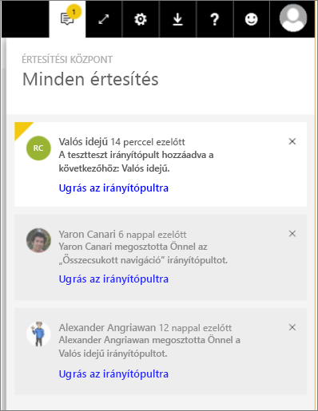

# Power BI-értesítések megtekintése
Az értesítési központ a Power BI használatával kapcsolatos információkból álló szekvenciális hírcsatorna. A megnyitásakor az Önnel megosztott új irányítópultokkal, a csoport munkaterületének változásaival, a Power BI-eseményekre és -értekezletekre vonatkozó értesítésekkel és egyebekkel kapcsolatos üzenetek láthatók. [Riasztásokat beállíthat a Power BI szolgáltatásban](../service-set-data-alerts.md) és a Power BI-mobilalkalmazásokban is.

Nézze meg, hogy tekinti át és kezeli Amanda az értesítéseket, és hogyan válaszol rájuk. Ez után próbálja ki Ön is a videó alatt látható részletes utasítások szerint.

<iframe width="560" height="315" src="https://www.youtube.com/embed/bZMSv5KAlcE" frameborder="0" allowfullscreen></iframe>

1. Amikor bejelentkezik a Power BI-ba, a távolléte alatt érkezett értesítések hozzáadódnak a hírcsatornájához. Ha új értesítései vannak, akkor a Power BI egy sárga körben jeleníti meg az új elemek számát.
   
   
2. A Power BI menüsávján válassza az Értesítések ikont.
   
   
3. A legújabb értesítés látható legfelül, az olvasatlan üzenetek pedig kiemelten jelennek meg. A rendszer 90 napig őrzi meg az értesítéseket, ha nem törli őket korábban, vagy a számuk el nem éri a 100-as felső korlátot.
   
   
4. Egy értesítés elvetéséhez válassza az × ikont.

### Következő lépések
* [Adatokkal kapcsolatos riasztások a Power BI szolgáltatásban](../service-set-data-alerts.md)
* [Power BI-adatriasztás által aktivált Microsoft Flow-folyamat létrehozása](../service-flow-integration.md)
* [Adatriasztások beállítása az iPhone-alkalmazásban (a Power BI for iOS-ben)](mobile/mobile-set-data-alerts-in-the-mobile-apps.md)
* [Adatriasztások beállítása a Windows 10-hez készült Power BI-mobilalkalmazásban](mobile/mobile-set-data-alerts-in-the-mobile-apps.md)
* További kérdései vannak? [Kérdezze meg a Power BI közösségét](http://community.powerbi.com/)

