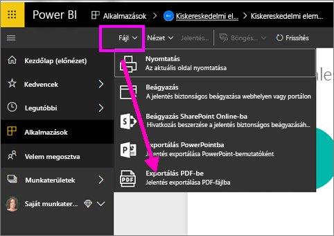
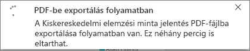
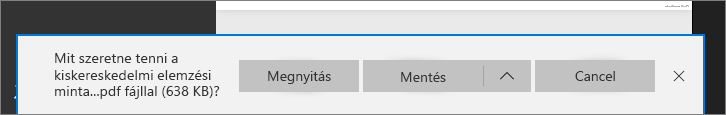

# Jelentések exportálása a Power BI-ból PDF-be
A Power BI segítségével közzéteheti jelentését PDF formátumban, és könnyedén létrehozhat egy dokumentumot a Power BI-jelentés alapján. **PDF-fájlba történő exportáláskor** a Power BI-jelentés minden egyes oldalából a PDF dokumentum egy-egy oldala lesz.

## A Power BI-jelentés exportálása PDF-fájlba
A Power BI szolgáltatásban jelöljön ki egy jelentést a vásznon való megjelenítéshez. Jelentést saját Kezdőlapján, az Alkalmazások között, vagy a bal oldali navigációs panel bármely más szakaszában kijelölhet.

1. Válassza a **Fájl** > **Exportálás PDF-fájlba** lehetőséget a menüsávon.

    

    Megjelenik egy előugró ablak, ahol kiválaszthatja az **Aktuális nézet** vagy az **Alapértelmezett nézet** lehetőséget.  Az **Aktuális nézet** az aktuális állapotban exportálja a jelentést, amely tartalmazza a szeletelő és a szűrő értékein végzett aktív módosításokat.  A legtöbb felhasználó ezt a beállítást választja.  Azt is megteheti, hogy az **Alapértelmezett nézet** lehetőség választásával az eredeti állapotában (az azt megosztó szerzőként) exportálja a jelentést, így az eredeti állapoton végzett semmilyen változtatás sem fog tükröződni.
    
    Emellett egy jelölőnégyzetet is bejelölhet, amellyel kiválaszthatja, hogy exportálja-e vagy sem a jelentés rejtett lapjait.  Egyszerűen bejelölje be ezt a négyzetet, ha csak a böngészőben az Ön számára látható jelentéslapokat szeretné exportálni.  Ha inkább szeretné belefoglalni az exportba az összes rejtett lapot is, akkor hagyja bejelöletlenül.  Ha a jelölőnégyzet ki van szürkítve, akkor nincsnek rejtett lapok a jelentésben.  Miután elvégezte a kijelöléseket, kattintson az Exportálás gombra a folytatáshoz.
    
    Megjelenik egy előrehaladást jelző sáv a jobb felső sarokban. Az exportálás igénybe vehet néhány percet, de a jelentés exportálása közben Ön tovább dolgozhat a Power BI-ban.

    

    A folyamat végén az értesítési fejlécen üzenet jelenik meg, hogy a Power BI szolgáltatás befejezte az exportálási folyamatot.

2. A fájl mostantól elérhető azon a helyen, ahol a böngésző megjeleníti a letöltött fájlokat. Az alábbi képen ez egy letöltési szalag formájában látható a böngészőablak alján.

    

Ennyi az egész! Letöltheti a fájlt, és megnyithatja bármely PDF-megtekintő alkalmazással, mint például a Microsoft Edge-ben rendelkezésre állóval.

## Korlátozások és szempontok
Az **Exportálás PDF-be** funkció használatakor figyelembe kell vennie néhány megfontolást és korlátozást.

* Az **R vizualizációk** jelenleg nem támogatottak. A PDF-fájlban ezek a vizualizációk lehetnek üresek, és megjeleníthetnek egy hibaüzenetet.  

* A **hitelesített** **egyéni vizualizációk** támogatottak. A hitelesített egyéni vizualizációkról, beleértve az egyéni vizualizáció hitelesítési folyamatát, az [Egyéni vizualizáció hitelesítése](../power-bi-custom-visuals-certified.md) oldalon talál további információt. A nem hitelesített egyéni vizualizációk nem támogatottak. A PDF-fájlban hibaüzenettel jelennek meg.   

* A 30-nál több jelentésoldalt tartalmazó jelentések jelenleg nem exportálhatók.

* A jelentés PDF-fájlba történő exportálása néhány percet igénybe vehet, ezért legyen türelemmel. Az exportálás időtartamát többek között a jelentés szerkezete és a Power BI szolgáltatás aktuális terhelése befolyásolhatja.

* Ha az **Exportálás PDF-be** menüpont nem érhető el a Power BI szolgáltatásban, valószínűleg a bérlői rendszergazda letiltotta a funkciót. Részletekért lépjen kapcsolatba a bérlői rendszergazdával.

* A háttérképek szélét a program a diagram határoló területével együtt levágja. Erősen ajánlott, hogy a PDF-fájlba való exportálás előtt távolítsa el a háttérképeket.

* A Power BI bérlői tartományán kívüli felhasználók jelentéseit (például olyan felhasználókét, akik nem a cég munkatársai, de megosztották Önnel a jelentést), nem lehet közzétenni PDF-fájlban.

* Ha egy irányítópultot cégen kívüli felhasználóval oszt meg (tehát olyasvalakivel, aki nincs jelen a Power BI-bérlőben), akkor az a felhasználó nem tudja PDF-fájlba exportálni a megosztott irányítópulthoz kapcsolódó jelentéseket. Például ha Ön aaron@contoso.com, megoszthatja a munkáját a következővel: cassie@cohowinery.com. De cassie@cohowinery.com nem exportálhatja a kapcsolódó jelentéseket PDF-fájlba.

* A Power BI szolgáltatás a PDF-exportálásnál a Power BI nyelvi beállításait alkalmazza. A nyelvi beállításokat megtekintheti vagy módosíthatja a fogaskerék ikon, majd a **Beállítások** > **Általános** > **Nyelv** lehetőség választásával.

## Következő lépések
[Jelentés nyomtatása](end-user-print.md)
