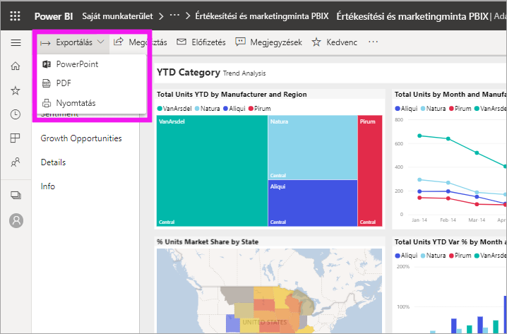
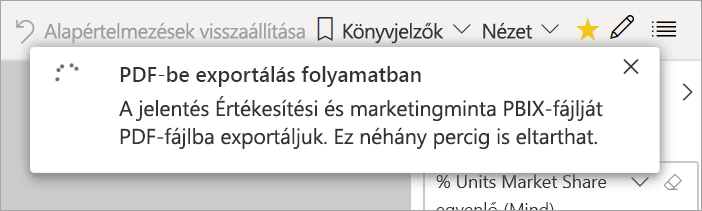

# Jelentések exportálása a Power BI-ból PDF-be

[!INCLUDE [power-bi-service-new-look-include](../includes/power-bi-service-new-look-include.md)]

A Power BI segítségével közzéteheti jelentését PDF formátumban, és könnyedén létrehozhat egy dokumentumot a Power BI-jelentés alapján. PDF-fájlba történő exportáláskor a Power BI-jelentés minden egyes oldalából a PDF dokumentum egy-egy oldala lesz.

## A Power BI-jelentés exportálása PDF-fájlba
A Power BI szolgáltatásban jelöljön ki egy jelentést a vásznon való megjelenítéshez. Egy jelentést a **kezdőlapon**, az **Alkalmazások** között, vagy a navigációs panel bármely más tárolójában is kijelölhet.

1. Válassza a menüsor **Exportálás** > **PDF** lehetőségét.

    

    Megjelenik egy előugró ablak, ahol kiválaszthatja az **Aktuális értékek** vagy az **Alapértelmezett értékek** lehetőséget. Az **Aktuális értékek** az aktuális állapotban exportálja a jelentést, amely tartalmazza a szeletelő és a szűrő értékein végzett aktív módosításokat. A legtöbb felhasználó ezt a beállítást választja. Azt is megteheti, hogy az **Alapértelmezett értékek** lehetőség választásával az eredeti állapotában exportálja a jelentést, ahogyan azt a *tervezője* megosztotta, így az eredeti állapoton végzett semmilyen változtatás sem fog tükröződni.
    
    Emellett egy jelölőnégyzetet is bejelölhet, amellyel kiválaszthatja, hogy exportálja-e vagy sem a jelentés rejtett lapjait. Jelölje be ezt a négyzetet, ha csak a böngészőben az Ön számára látható jelentésoldalakat szeretné exportálni. Ha inkább szeretné belefoglalni az exportba az összes rejtett oldalt is, akkor bejelöletlenül hagyhatja ezt a négyzetet. Ha a jelölőnégyzet ki van szürkítve, akkor nincsnek rejtett lapok a jelentésben. Miután elvégezte a kijelöléseket, válassza az **Exportálás** gombot a folytatáshoz.
    
    Megjelenik egy előrehaladást jelző sáv a jobb felső sarokban. Az exportálás néhány percig is eltarthat. A jelentés exportálása közben Ön tovább dolgozhat a Power BI-ban.

    

    Amikor a Power BI szolgáltatás befejezi az exportálási folyamatot, erről az értesítési fejléc megváltozása tájékoztatja Önt.

2. A fájl mostantól elérhető azon a helyen, ahol a böngésző megjeleníti a letöltött fájlokat. Az alábbi képen ez egy letöltési szalag formájában látható a böngészőablak alján.

    

Ennyi az egész! Letöltheti a fájlt, és megnyithatja bármely PDF-megtekintő alkalmazással, mint például a Microsoft Edge-ben rendelkezésre állóval.

## Korlátozások és szempontok
Az **Exportálás PDF-be** funkció használatakor figyelembe kell vennie néhány megfontolást és korlátozást.

* Az R vizualizációk jelenleg nem támogatottak. A PDF-fájlban ezek a vizualizációk üresek, és egy hibaüzenetet jelenítenek meg. 
* A minősített egyéni vizualizációk támogatottak. A minősített egyéni vizualizációkról, beleértve az egyéni vizualizáció minősítési folyamatát, az [Egyéni vizualizáció minősítése](../developer/power-bi-custom-visuals-certified.md) oldalon talál további információt. A nem minősített egyéni vizualizációk nem támogatottak. A PDF-fájlban hibaüzenettel jelennek meg. 
* 30-nál több jelentésoldalt tartalmazó jelentések jelenleg nem exportálhatók.
* A jelentés PDF-fájlba történő exportálása néhány percet igénybe vehet, ezért legyen türelemmel. Az exportálás időtartamát többek között a jelentés szerkezete és a Power BI szolgáltatás aktuális terhelése befolyásolhatja.
* Ha az **Exportálás PDF-be** menüpont nem érhető el a Power BI szolgáltatásban, valószínűleg a bérlői rendszergazda letiltotta a funkciót. Részletekért lépjen kapcsolatba a bérlői rendszergazdával.
* A háttérképek szélét a program a diagram határoló területével együtt levágja. A PDF-be való exportálás előtt ajánlott eltávolítani a háttérképeket.
* A Power BI bérlői tartományán kívüli felhasználók jelentéseit (például olyan felhasználókét, akik nem a cég munkatársai, de megosztották Önnel a jelentést), nem lehet közzétenni PDF-fájlban.
* Ha egy irányítópultot cégen kívüli felhasználóval oszt meg (tehát olyasvalakivel, aki nincs jelen a Power BI-bérlőn), akkor az a felhasználó nem tudja a PDF-be exportálni a megosztott irányítópulthoz kapcsolódó jelentéseket. Például ha Ön aaron@contoso.com, megoszthatja a munkáját a következővel: cassie@cohowinery.com. cassie@cohowinery.com viszont nem exportálhatja a kapcsolódó jelentéseket a PDF-be.
* Előfordulhat, hogy amikor háttérképet tartalmazó jelentéseket exportál PDF-be, az **Oldal háttere** beállítás **Normál** vagy **Kitöltés** értéke esetén a kép torzítva jelenik meg. A legjobb eredmény érdekében ajánlott az **Illeszkedés** beállítás használatával elkerülni az exportált dokumentummal kapcsolatos problémákat.
* A Power BI szolgáltatás a PDF-exportálásnál a Power BI nyelvi beállításait alkalmazza. A nyelvi beállításokat megtekintheti vagy módosíthatja a fogaskerék ikon  > **Beállítások** > **Általános** > **Nyelv** lehetőség választásával.
* Az URL-szűrők jelenleg nem érvényesek az exportálás **Aktuális értékek** beállításánál.

## Következő lépések
[Jelentés nyomtatása](end-user-print.md)
