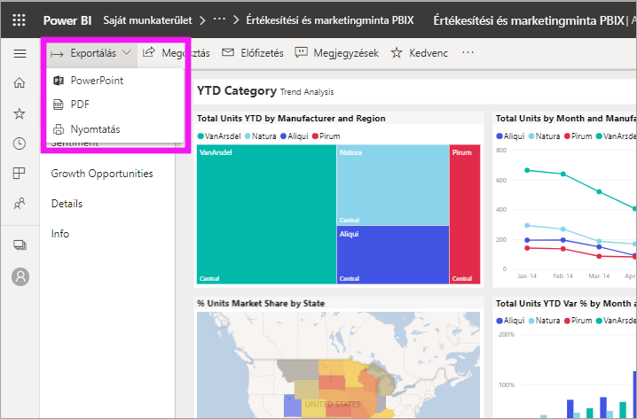
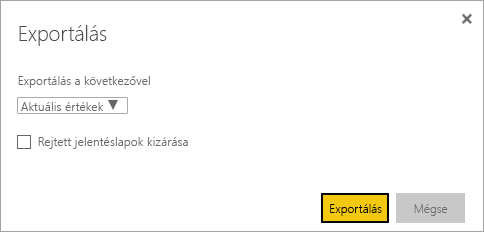
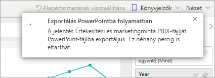
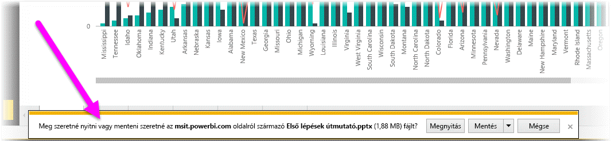
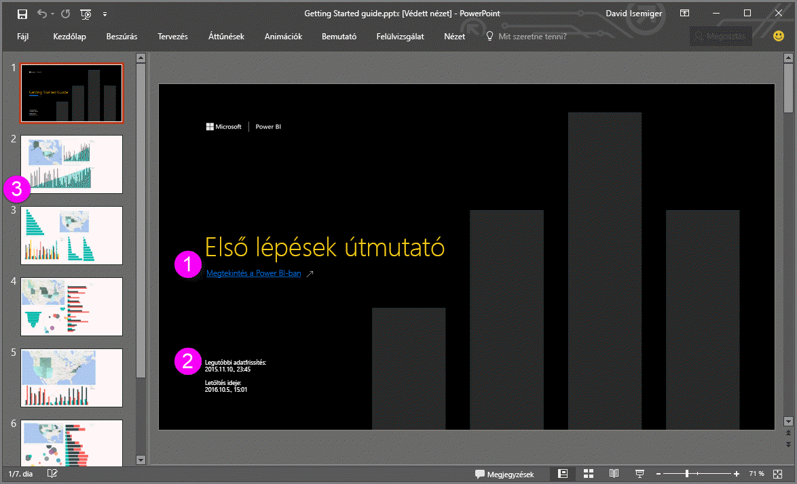
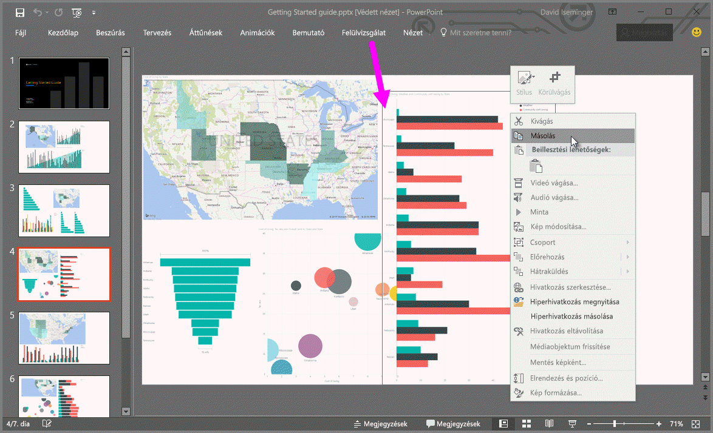

# Jelentések exportálása Power BI-ból PowerPointba

[!INCLUDE [power-bi-service-new-look-include](../includes/power-bi-service-new-look-include.md)]

A Power BI segítségével közzéteheti jelentését a Microsoft PowerPointban, és könnyedén létrehozhat bemutatót a Power BI-jelentés alapján. A PowerPointba történő exportáláskor a következő történik:

* A PowerPointban a Power BI-jelentés minden lapjából külön dia lesz.
* A rendszer a Power BI-jelentés minden oldalát egyetlen nagyfelbontású képként exportálja a PowerPointba.
* A jelentéshez adott szűrők és szeletelők beállításai megmaradnak.
* A PowerPointban létrejön egy hivatkozás, amely a Power BI-jelentésre mutat.

A **Power BI-jelentést** gyorsan exportálhatja a **PowerPointba**. Kövesse az alábbi szakaszban leírt lépéseket.

## Power BI-jelentés exportálása a PowerPointba
A Power BI szolgáltatásban jelöljön ki egy jelentést a vásznon való megjelenítéshez. Egy jelentést a **kezdőlapon**, az **Alkalmazások** között, vagy a navigációs panel bármely más tárolójában is kijelölhet.

Amikor a PowerPointba exportálandó jelentés megjelenik a vásznon, válassza az **Exportálás** > **PowerPoint** elemet a menüsávon.

Megjelenik egy előugró ablak, ahol kiválaszthatja az **Aktuális értékek** vagy az **Alapértelmezett értékek** lehetőséget. Az **Aktuális értékek** az aktuális állapotban exportálja a jelentést, amely tartalmazza a szeletelő és a szűrő értékein végzett aktív módosításokat. A legtöbb felhasználó ezt a beállítást választja. Azt is megteheti, hogy az **Alapértelmezett értékek** lehetőség választásával az eredeti állapotában exportálja a jelentést, ahogyan azt a *készítője* megosztotta, így az eredeti állapoton végzett semmilyen változtatás sem fog tükröződni.

 
Emellett egy jelölőnégyzetet is bejelölhet, amellyel kiválaszthatja, hogy exportálja-e vagy sem a jelentés rejtett lapjait. Jelölje be ezt a négyzetet, ha csak a böngészőben az Ön számára látható jelentésoldalakat szeretné exportálni. Ha inkább szeretné belefoglalni az exportba az összes rejtett oldalt is, akkor hagyja bejelöletlenül ezt a négyzetet. Ha a jelölőnégyzet ki van szürkítve, akkor nincsnek rejtett lapok a jelentésben. Miután elvégezte a kijelöléseket, válassza az **Exportálás** gombot a folytatáshoz.

Ekkor a Power BI szolgáltatás böngészőablakának jobb felső sarkában megjelenik egy értesítés, hogy folyamatban van a jelentés exportálása a PowerPointba. Az exportálás néhány percig is eltarthat. A jelentés exportálása közben Ön tovább dolgozhat a Power BI-ban.

Miután a Power BI szolgáltatás befejezte az exportálási folyamatot, erről az értesítési fejléc megváltozása tájékoztatja Önt. A fájl mostantól elérhető azon a helyen, ahol a böngésző megjeleníti a letöltött fájlokat. Az alábbi képen ez egy letöltési szalag formájában látható a böngészőablak alján.

Ennyi az egész! A fájlt letöltheti, megnyithatja a PowerPointban, módosíthatja és kibővítheti, mint minden más PowerPoint-bemutatót.

## Az exportált PowerPoint-fájl megtekintése
Amikor megnyitja a Power BI-ból exportált PowerPoint-fájlt, számos remek és praktikus elemet talál. Tekintse meg az alábbi képet, és nézze végig a számozott elemek által szemléltetett nagyszerű funkciókat.

1. A bemutató első oldalán a jelentés neve és egy hivatkozás látható, amelynek segítségével a bemutató alapjául szolgáló jelentést **megtekintheti a Power BI-ban**.
2. A jelentésről is hasznos információkhoz juthat. Az **Utolsó adatfrissítés** azt a dátumot és időt mutatja meg, amelyen az exportált jelentés alapul. A **Letöltés** azt a dátumot és időt mutatja, amikor a Power BI-jelentés PowerPoint-fájlba lett exportálva.
3. A jelentés minden oldala külön dián jelenik meg, ahogy azt a navigációs panel is mutatja. 
4. A közzétett jelentést a Power BI a saját nyelvi beállításainak megfelelően, vagy a böngésző nyelve szerint rendereli. A nyelvi beállításokat megtekintheti vagy módosíthatja a fogaskerék ikon  > **Beállítások** > **Általános** > **Nyelv** lehetőség választásával. Nyelvi információk: [A Power BI által támogatott nyelvek és országok vagy régiók](../supported-languages-countries-regions.md).
5. A PowerPoint-bemutató tartalmaz egy címoldalt, amelyen megjelenik az exportált idő a megfelelő időzónában.

Bármelyik önálló diára kattintva láthatja, hogy minden egyes jelentésoldal külön kép.

>[!NOTE]
> Az, hogy minden egyes jelentésoldalhoz egy vizualizáció tartozik, új funkció. Ez előző viselkedés, amelynél minden vizualizációhoz egy-egy különálló kép tatozott, már nem funkcionál. 
 

Most már csak Önön múlik, hogy miképpen használja fel a PowerPoint-bemutatót vagy a nagyfelbontású képeket.

## Korlátozások
Az **Exportálás a PowerPointba** funkció használatakor figyelembe kell vennie néhány megfontolást és korlátozást.

* Az R vizualizációk jelenleg nem támogatottak. Az ilyen vizualizációkat a rendszer üres képként exportálja a PowerPointba, és hibaüzenetet küld, hogy a vizualizáció nem támogatott.
* A minősített egyéni vizualizációk támogatottak. A minősített egyéni vizualizációkról, beleértve az egyéni vizualizáció minősítési folyamatát, az [Egyéni vizualizáció minősítése](../developer/power-bi-custom-visuals-certified.md) oldalon talál további információt. A nem minősített egyéni vizualizációk nem támogatottak. Ezeket a rendszer üres képként exportálja a PowerPointba, és hibaüzenetet küld, hogy a vizualizáció nem támogatott.
* A 30-nál több jelentésoldalt tartalmazó jelentések jelenleg nem exportálhatók.
* A jelentés PowerPointba történő exportálása néhány percet igénybe vehet, várjon türelmesen. Az exportálás időtartamát többek között a jelentés szerkezete és a Power BI szolgáltatás aktuális terhelése befolyásolhatja.
* Ha az **Exportálás a PowerPointba** menüpont nem érhető el a Power BI szolgáltatásban, valószínűleg a bérlői rendszergazda tiltotta le a funkciót. Részletekért lépjen kapcsolatba a bérlői rendszergazdával.
* A háttérképek szélét a program a diagram határoló területével együtt levágja. A PowerPointba való exportálás előtt ajánlott eltávolítani a háttérképeket.
* A PowerPoint lapjai, függetlenül a Power BI-jelentés eredeti oldalméreteitől és dimenzióitól, mindig a szabványos 9:16 méretben jönnek létre.
* A Power BI bérlői tartományán kívüli felhasználók jelentéseit (például olyan felhasználókét, akik nem a cég munkatársai, de megosztották Önnel a jelentést), nem lehet közzétenni a PowerPointban.
* Ha egy irányítópultot cégen kívüli felhasználóval oszt meg (tehát olyasvalakivel, aki nincs jelen a Power BI-bérlőn), akkor az a felhasználó nem tudja a PowerPointba exportálni a megosztott irányítópulthoz kapcsolódó jelentéseket. Például ha Ön aaron@contoso.com, megoszthatja a munkáját a következővel: david@cohowinery.com. david@cohowinery.com viszont nem exportálhatja a kapcsolódó jelentéseket a PowerPointba.
* Előfordulhat, hogy az exportálás nem működik a PowerPoint régebbi verzióival.
* Ahogy korábban említettük, a rendszer minden jelentésoldalt külön képként exportál a PowerPoint-fájlba.
* A Power BI szolgáltatás a PowerPoint-exportálásnál a Power BI nyelvi beállításait alkalmazza. A nyelvi beállításokat megtekintheti vagy módosíthatja a fogaskerék ikon  > **Beállítások** > **Általános** > **Nyelv** lehetőség választásával.
* Az exportált PowerPoint-fájl címoldalán található **Letöltés ideje** a számítógép időzónáját követi a letöltés idején.
* Az URL-szűrők jelenleg nem érvényesek az exportálás **Aktuális értékek** beállításánál.

## Következő lépések
[Jelentés nyomtatása](end-user-print.md)
