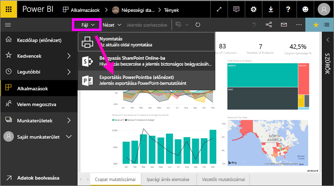
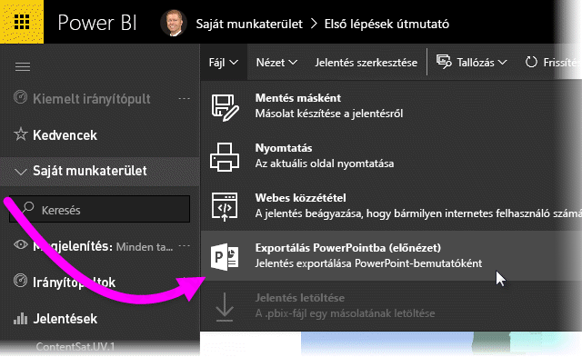
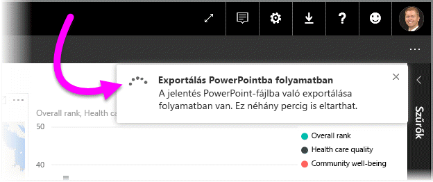
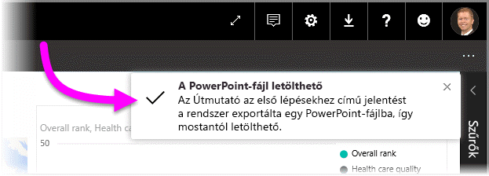

# Jelentések exportálása Power BI-ból PowerPointba
A Power BI segítségével közzéteheti jelentését a **Microsoft PowerPointban**, és könnyedén létrehozhat bemutatót a Power BI-jelentés alapján. A **PowerPointba történő exportáláskor** a következő történik:

* A PowerPointban a Power BI-jelentés minden lapjából külön dia lesz
* A rendszer a Power BI-jelentés minden oldalát egyetlen, magas felbontású képként exportálja a PowerPointba <!-- * The filters and slicers settings that you added to the report are preserved. -->
* A PowerPointban létrejön egy hivatkozás, amely a Power BI-jelentésre mutat 

A **Power BI-jelentést** gyorsan exportálhatja a **PowerPointba**. Csak kövesse az alábbi szakaszban leírt lépéseket.

## Hogyan exportálhatja a Power BI-jelentést a PowerPointba
A Power BI szolgáltatásban jelöljön ki egy jelentést a vásznon való megjelenítéshez. Jelentést saját **Kezdőlapján**, az **Alkalmazások** között, vagy a bal oldali navigációs panel bármely más szakaszában kijelölhet.

Amikor a PowerPointba exportálandó jelentés megjelenik a vásznon, kattintson a **Fájl > Exportálás a PowerPointba** elemre a Power BI szolgáltatás menüsávján.

   
Megjelenik egy előugró ablak, ahol kiválaszthatja az **Aktuális nézet** vagy az **Alapértelmezett nézet** lehetőséget.  Az **Aktuális nézet** az aktuális állapotban exportálja a jelentést, amely tartalmazza a szeletelő és a szűrő értékein végzett aktív módosításokat.  A legtöbb felhasználó ezt a beállítást választja.  Azt is megteheti, hogy az **Alapértelmezett nézet** lehetőség választásával az eredeti állapotában (az azt megosztó szerzőként) exportálja a jelentést, így az eredeti állapoton végzett semmilyen változtatás sem fog tükröződni.
    
Emellett egy jelölőnégyzetet is bejelölhet, amellyel kiválaszthatja, hogy exportálja-e vagy sem a jelentés rejtett lapjait.  Egyszerűen bejelölje be ezt a négyzetet, ha csak a böngészőben az Ön számára látható jelentéslapokat szeretné exportálni.  Ha inkább szeretné belefoglalni az exportba az összes rejtett lapot is, akkor hagyja bejelöletlenül.  Ha a jelölőnégyzet ki van szürkítve, akkor nincsnek rejtett lapok a jelentésben.  Miután elvégezte a kijelöléseket, kattintson az **Exportálás** gombra a folytatáshoz.

Ekkor a Power BI szolgáltatás böngészőablakának jobb felső sarkában megjelenik egy értesítés, hogy folyamatban van a jelentés exportálása a PowerPointba. Ez igénybe vehet néhány percet, de a jelentés exportálása közben Ön tovább dolgozhat a Power BI-ban.

A folyamat végén az értesítési fejlécen üzenet jelenik meg, hogy a Power BI szolgáltatás befejezte az exportálási folyamatot.

A fájl mostantól elérhető azon a helyen, ahol a böngésző megjeleníti a letöltött fájlokat. Az alábbi képen ez egy letöltési szalag formájában látható a böngészőablak alján.

Ennyi az egész! A fájlt letöltheti, megnyithatja a PowerPointban, módosíthatja és kibővítheti, mint minden más PowerPoint-bemutatót.

## Az exportált PowerPoint-fájl megtekintése
Amikor megnyitja a Power BI-ból exportált PowerPoint-fájlt, számos remek és praktikus elemet talál. Tekintse meg az alábbi képet, és nézze végig a számozott elemek által szemléltetett nagyszerű funkciókat.

1. A bemutató első oldalán a jelentés neve és egy hivatkozás látható, amelynek segítségével a bemutató alapjául szolgáló jelentést **megtekintheti a Power BI-ban**.
2. Továbbá olyan hasznos információkat kap a jelentésről, mint például az exportált jelentés alapjául szolgáló *legutóbbi adatfrissítés* és a *letöltés ideje*, amely a Power BI-jelentés PowerPoint-fájlba történt exportálásának dátumát adja meg.
3. A jelentés minden oldala külön dián jelenik meg, ahogy a bal oldali navigációs ablaktábla mutatja. 
4. A közzétett jelentést a Power BI a saját nyelvi beállításainak megfelelően, vagy a böngésző nyelve szerint rendereli. A nyelvi beállításokat megtekintheti vagy módosíthatja a fogaskerék ikon , majd a **> Beállítások > Általános > Nyelv** lehetőség választásával. Nyelvi információk: [A Power BI által támogatott nyelvek és országok/régiók](../supported-languages-countries-regions.md).
5. A PowerPoint-bemutató tartalmaz egy címoldalt, amelyen megjelenik az exportált idő a megfelelő időzónában.

Bármelyik önálló diára kattintva megfigyelheti, hogy minden egyes jelentésoldal külön kép.

>[!NOTE]
> Az, hogy minden egyes jelentésoldalhoz egy vizualizáció tartozik, új funkció. Ez előző viselkedés, amelynél minden vizualizációhoz egy-egy különálló kép tatozott, már nem funkcionál. 
 

Most már csak Önön múlik, hogy miképpen használja fel a PowerPoint-bemutatót vagy a magas felbontású képeket.

## Korlátozások
Az **Exportálás a PowerPointba** funkció használatakor figyelembe kell vennie néhány megfontolást és korlátozást.

* Az **R vizualizációk** jelenleg nem támogatottak. Az ilyen vizualizációkat a rendszer üres képként exportálja a PowerPointba, és hibaüzenetet küld, hogy a vizualizáció nem támogatott.
* A **hitelesített** **egyéni vizualizációk** támogatottak. A hitelesített egyéni vizualizációkról, beleértve az egyéni vizualizáció hitelesítési folyamatát, az [Egyéni vizualizáció hitelesítése](../power-bi-custom-visuals-certified.md) oldalon talál további információt. A nem hitelesített egyéni vizualizációkat a rendszer üres képként exportálja a PowerPointba, és hibaüzenetet küld, hogy a vizualizáció nem támogatott.
* A 30-nál több jelentésoldalt tartalmazó jelentések jelenleg nem exportálhatók.
* A jelentés PowerPointba történő exportálása néhány percet igénybe vehet, ezért türelmét kérjük. Az exportálás időtartamát többek között a jelentés szerkezete és a Power BI szolgáltatás aktuális terhelése befolyásolhatja.
* Ha az **Exportálás a PowerPointba** menüpont nem érhető el a Power BI szolgáltatásban, valószínűleg a bérlői rendszergazda letiltotta a funkciót. Lépjen kapcsolatba a bérlői rendszergazdával.
* A háttérképek szélét a program a diagram határoló területével együtt levágja. Erősen ajánljuk, hogy a PowerPointba való exportálás előtt távolítsa el a háttérképeket.
* A PowerPoint lapjai, függetlenül a Power BI-jelentés eredeti oldalméreteitől és dimenzióitól, mindig a szabványos 9:16 méretben jönnek létre.
* A Power BI bérlői tartományán kívüli felhasználók jelentéseit (például olyan felhasználókét, akik nem a cég munkatársai, de megosztották Önnel a jelentést), nem lehet közzétenni a PowerPointban.
* Ha egy irányítópultot cégen kívüli felhasználóval oszt meg (tehát olyasvalakivel, aki nincs jelen a Power BI-bérlőn), akkor az a felhasználó nem tudja a PowerPointba exportálni a megosztott irányítópulthoz kapcsolódó jelentéseket. Például ha Ön aaron@contoso.com, megoszthatja a munkáját a következővel: david@cohowinery.com. De david@cohowinery.com nem exportálhatja a kapcsolódó jelentéseket a PowerPointba.
* Ahogy korábban említettük, a rendszer minden jelentésoldalt külön képként exportál a PowerPoint-fájlba.
* A Power BI szolgáltatás a PowerPoint-exportálásnál a Power BI nyelvi beállításait alkalmazza. A nyelvi beállításokat megtekintheti vagy módosíthatja a fogaskerék ikon , majd a **> Beállítások > Általános > Nyelv** lehetőség választásával.
* Az exportált PowerPoint-fájl címoldalán található **Letöltés ideje** a számítógép időzónáját követi a letöltés idején.

## Következő lépések
[Jelentés nyomtatása](end-user-print.md)
