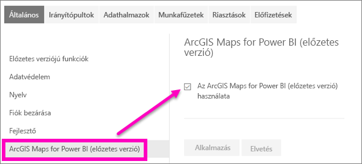

# Feliratkozás a Power BI szolgáltatás előzetes verziójú funkcióira
## Mik azok az *előzetes verziójú funkciók*?
Ahogy folyamatosan fejlesztjük a Power BI szolgáltatást, egyes új funkciókat *előzetes verziójú funkciókként* adunk ki. Az előzetes verziójú funkciók be- és kikapcsolhatók, így kipróbálhatja őket.

> [!TIP]
> Az előzetes verziójú funkciók a Power BI Desktophoz is elérhetőek. További információt a [Power BI Desktop közösségi fórumán](https://community.powerbi.com/t5/Desktop/bd-p/power-bi-designer) talál.
> 
> 

## Az előzetes verziójú funkciók megkeresése és be- (vagy ki-) kapcsolása
1. Kattintson a Power BI-képernyő jobb felső sarkában lévő fogaskerék ikonra, majd válassza a **Beállítások** elemet a Beállítások menü megnyitásához.
   
   .
2. Válassza az **Általános** lapot. Ha vannak előzetes verziójú funkciók, akkor vagy megjelenik az **Előzetes verziójú funkciók** lehetőség, vagy pedig szerepelni fog egy előzetes verziójú funkció a bal oldalon.  Ebben a példában az ArcGIS Maps előzetes verziója jelenik meg. 
   
   
3. Az új funkció teszteléséhez válassza a **Be** választógombot, vagy jelölje be a jelölőnégyzetet. Ezután válassza az **Alkalmaz** lehetőséget.
4. Az előzetes verziójú funkciók kikapcsolásához, kövesse a fenti 1., 2. és 3. lépést, és a 3. lépésben válassza a **Ki** lehetőséget vagy törölje a jelet, majd válassza az **Alkalmaz** lehetőséget.

Kérdése van, vagy visszajelzést küldene? [Látogasson el a Power BI közösségi fórumára](http://community.powerbi.com/t5/Navigation-Preview-Forum/bd-p/NavigationPreview).

