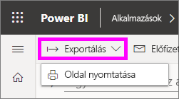
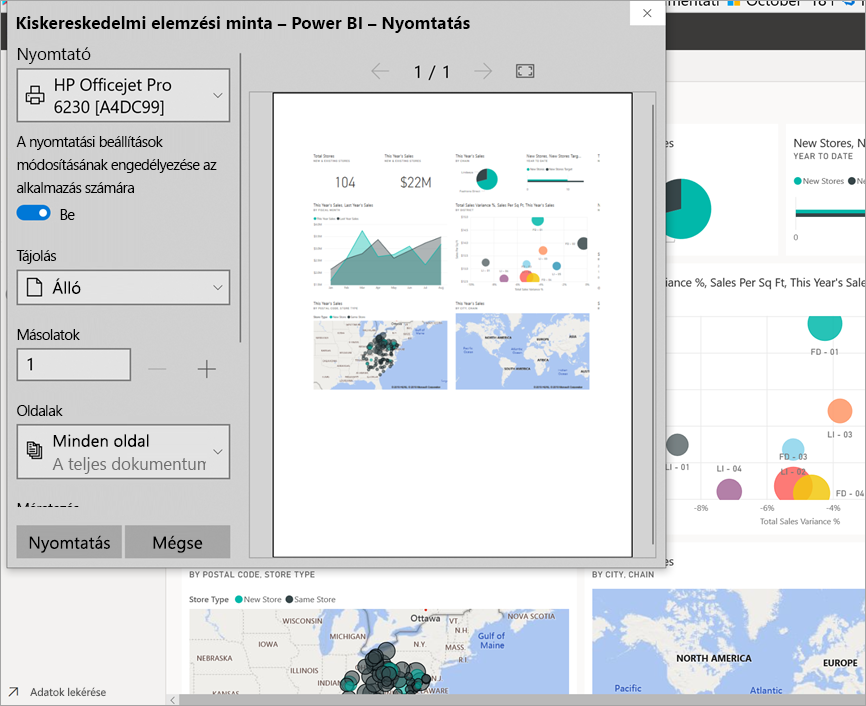
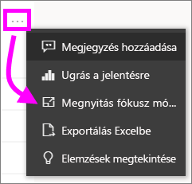
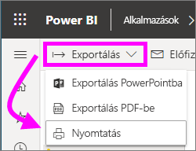

# Nyomtatás a Power BI szolgáltatásból

[!INCLUDE[consumer-appliesto-yynn](../includes/consumer-appliesto-yynn.md)]
## Mit lehet nyomtatni
[!INCLUDE [power-bi-service-new-look-include](../includes/power-bi-service-new-look-include.md)]

Útmutató teljes irányítópultok, irányítópult-csempék, jelentésoldalak, jelentés-vizualizációk Power BI-ból történő nyomtatásához. Ha a jelentésnek több oldala is van, minden oldalt külön-külön kell kinyomtatnia. 

## Nyomtatási megfontolások

A Power BI-ban az irányítópultok és a jelentések többségét a jelentések *tervezői* hozzák létre, amelyeket online lehet használni, és számos eszközön kiváló minőségben jelennek meg. Amikor kinyomtat egy jelentést, a böngészőtől függ, hogy a tartalom hogyan jelenik majd meg a papíron. 

A böngésző beállításai segítségével módosíthatja a nyomtatási megjelenést, de még akkor is előfordulhat, hogy nem tudja elérni a kívánt eredményt. Érdemes lehet a tartalmat először [PDF-be](end-user-pdf.md) exportálni, és a PDF-fájlt kinyomtatni inkább. 

## A böngésző nyomtatási beállításainak módosítása
Amikor Power BI-ból nyomtat, a böngésző megnyit egy nyomtatási ablakot. Minden böngésző nyomtatási ablaka különbözik a többitől. Mindegyikben megtalálhatóak azonban bizonyos beállítások, amelyek segítségével szabályozhatja a nyomtatás megjelenését. 

Íme néhány gyors tipp, amellyel formázhatja a nyomtatást.

   > 
1. Ha az irányítópult, a jelentés vagy a vizualizáció szélesebb, mint amilyen a magassága, érdemes lehet a **Fekvő** elrendezést használni. 

   

2. Ha több tartalmat szeretne egy oldalon, módosítsa például a margókat és a méretezést. 

    

Kísérletezzen a böngésző beállításaival addig, amíg meg nem találja a kívánt megjelenítést. Egyes böngészőkben arra is lehetőség van, hogy a háttérbeli grafikákat is kinyomtassa. 

## Irányítópult nyomtatása
1. Nyissa meg azt az irányítópultot, amelyet ki szeretne nyomtatni.
2. A bal felső sarokban válassza az Exportálás elemet, majd az **Oldal nyomtatása** lehetőséget.
   
    

3. Ekkor megjelenik a böngésző Nyomtatás ablaka. Válassza ki a beállításokat. Ha például az irányítópult szélesebb, mint amilyen hosszú, érdemes lehet az elrendezést **Fekvő tájolásra** állítani. Válassza a **Nyomtatás** lehetőséget.
   
    

## Irányítópult-csempe nyomtatása
1. A felső menüsáv teljes képernyő ikonjára  kattintva nyissa meg az irányítópultot [teljes képernyős módban](end-user-focus.md).

3. [Nyissa meg a csempét fókusz módban](end-user-focus.md). Ehhez vigye fölé az egérmutatót, hogy megjelenjen a **További lehetőségek** (...) elem, majd válassza a **Megnyitás fókusz módban** lehetőséget vagy a fókusz ikont .
   
    

4. A kurzort a csempe fölé húzva jelenítheti meg a válaszható lehetőségek menüjét.
   
    

4. A nyomtatás ikon kiválasztása .     

5. Ekkor megjelenik a böngésző Nyomtatás ablaka. Válassza ki a beállításokat. Ha például a csempe nem fér el az oldalon, akkor érdemes lehet a méretezést 75%-ra módosítani. Válassza a **Nyomtatás** lehetőséget.

     

> [!TIP]
> Ha követte ezeket a lépéseket, és a csempe továbbra sem a kívánt módon jelenik meg, próbálja meg a következőket.
> 1. Nyissa meg a nyomtatási ablakot, és végezze el a módosításokat úgy, hogy a nyomtatási beállítások a legjobb nyomtatási megjelenést eredményezzék. Módosíthatja például az elrendezést, a margókat és a méretezést. 
> 2. A nyomtatás helyett azonban válassza a **Mégse** lehetőséget. 
> 3. Végezze el újra az 1–5 lépéseket. A csempe a nyomtatási ablak új beállításaira lesz módosítva, és készen áll a nyomtatásra.

## Jelentésoldal nyomtatása
A jelentésekből egyszerre egy oldal nyomtatható ki.

1. Az aktuális oldal nyomtatásához nyissa meg a jelentést, és válassza az **Exportálás** > **Nyomtatás** lehetőséget.
   
    
2. Ekkor megjelenik a böngésző Nyomtatás ablaka.

3. Kövesse a fenti **Irányítópult nyomtatása** szakasz nyomtatási lépéseit.
   

## Jelentés-vizualizáció nyomtatása
1. A kurzort a csempe fölé húzva, majd jobb felső sarokban látható Fókusz ikonra  kattintva [nyissa meg a vizualizációt fókusz módban](end-user-focus.md).

2. A vizualizáció nyomtatásához a bal felső sarokban válassza az **Exportálás** > **Nyomtatás** lehetőséget.

    

3. Kövesse a fenti **Irányítópult nyomtatása** szakasz nyomtatási lépéseit.

## Megfontolandó szempontok és hibaelhárítás

* KÉRDÉS: Nem nyomtatható ki a jelentés minden lapja egyszerre.    
* VÁLASZ: Ez nem hiba. A jelentésekből egyszerre csak egy oldal nyomtatható ki.
* KÉRDÉS: Nem lehet PDF-fájlba nyomtatni.    
* VÁLASZ: Ez a lehetőség csak akkor jelenik meg, ha böngészőjéhez már beállított egy PDF-illesztőprogramot.    
* KÉRDÉS: A **Nyomtatásra** kattintás után nem az itt bemutatott képernyő jelenik meg.    
* VÁLASZ: A Nyomtatási képernyők böngészőnként és szoftververziónként változnak.
* KÉRDÉS: A nyomtatásra kerülő anyag nincs megfelelően méretezve.  Az irányítópult nem fér el az oldalon. Méretezéssel és tájolással kapcsolatos egyéb problémák.    
* VÁLASZ: Nem tudjuk garantálni, hogy a nyomtatott példány pontosan meg fog egyezni azzal, ami a Power BI szolgáltatásban látható. A kicsinyítést és nagyítást, a margókat, a megjelenítési részleteket, a tájolást és a méretet nem a Power BI szolgáltatás vezérli. Próbálja meg módosítani a böngésző nyomtatási beállításait. A fentiekben szereplő néhány javaslat az oldal tájolása (álló vagy fekvő), a margó mérete és a méretezés. Ha ezekkel nem jár sikerrel, a böngésző súgójában találhat további információt.      
* KÉRDÉS: A teljes képernyős módból való nyomtatáskor nem jelenik meg a Nyomtatás lehetőség, amikor a vizualizáció fölé viszem a kurzort.   
* VÁLASZ: Térjen vissza az irányítópultra vagy jelentésre az alapértelmezett nézetben, majd nyissa meg újra a vizualizációt fókusz módban, majd a teljes képernyős módban. 

## Következő lépések
[Irányítópultok és jelentések megosztása munkatársakkal és más személyekkel](../collaborate-share/service-share-dashboards.md)

További kérdései vannak? [Kérdezze meg a Power BI közösségét](https://community.powerbi.com/)
