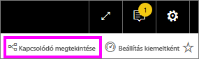

# Q&A a Power BI-**ügyfelek** számára
## Mi a Q&A?
Ha válaszokat keres az adatokban, néha az a leggyorsabb megoldás, ha természetes nyelven kérdez. Például: „what were total sales last year (mennyi volt az összes értékesítés tavaly).”

A Q&A szolgáltatás könnyen használható, természetes nyelvi funkciókat kínál az adatok elemzéséhez, és kérdéseire grafikonok vagy diagramok formájában ad választ. A Q&A nem keresőmotor – csak a Power BI-ban lévő adatokról szolgáltat eredményeket.

A **Power BI Q&A** Pro- vagy Premium-licenccel érhető el.  A [Q&A a Power BI-mobilalkalmazásokban](mobile/mobile-apps-ios-qna.md) és a [Q&A a Power BI Embedded használatával](../developer/qanda.md) külön cikkekben szerepelnek. A **Power BI Q&A** jelenleg csak angol nyelven feltett természetes nyelvű kérdéseket támogat, de előzetes verzióban elérhető a spanyol is, amelyet a Power BI-rendszergazda engedélyezhet.

A kérdés megfogalmazása csak az első lépés.  Pontosíthatja vagy kibővítheti a kérdést, megbízható új információkat fedezhet fel, összpontosíthat a részletekre, vagy feltárhatja a szélesebb összefüggéseket, így az adatok feltérképezése valódi élménnyé válik. Örömét lelheti az új eredményekben és felfedezésekben.

Valóban interaktív élmény... és gyors! A memóriabeli tárolás segítségével szinte egy pillanat alatt megkapja a választ.

## Hol találom a Q&A-t?
A Q&A a Power BI szolgáltatás irányítópultjain és a Power BI mobilalkalmazás irányítópultjának alján érhető el. Ha a tervező nem adott Önnek szerkesztési jogosultságot, a Q&A-vel feltárhatja az adatokat, azonban nem mentheti a Q&A használatával létrehozott vizualizációkat.

## A Q&A használata irányítópulton a Power BI szolgáltatásban
A Power BI szolgáltatásban (app.powerbi.com) az irányítópultokon egy vagy több adatkészletből származó csempék vannak rögzítve, így bármely adatkészlet bármely adatával kapcsolatban feltehető kérdés. Ha meg szeretné nézni, hogy mely jelentéseket és adatkészleteket használták fel az irányítópult létrehozásához, válassza a menüsávon a **Kapcsolódó megtekintése** elemet.

## Hogyan kezdjem meg a használatát?
Először ismerkedjen meg a tartalommal. Tekintse meg az irányítópulton és a jelentésben található vizualizációkat. Mérje fel az elérhető adatok típusát és terjedelmét. 

Például:

* Ha a vizualizáció tengelyfeliratai és értékei között szerepelnek a „sales”, „account”, „month” és „opportunity” szavak, akkor feltehet olyan angol nyelvű kérdéseket, mint: "Which *account* has the highest *opportunity*", vagy "show *sales* by month as a bar chart".

* Ha rendelkezik egy webhely Google Analytics-beli teljesítményadataival, akkor kérdezheti a Q&A-t a weboldalakon töltött időről, az egyedi oldallátogatások számáról és a felhasználói érdeklődés mérőszámairól. Demográfiai adatok lekérdezésekor például az életkor és a háztartások bevétele földrajzi hely szerinti eloszlásáról tehet fel kérdéseket.

Ha már megismerte az adatokat, lépjen vissza az irányítópultra, és helyezze a kurzort a kérdésmezőbe. Ekkor megnyílik a Q&A képernyő.

 

Még mielőtt gépelni kezdene, a Q&A egy új képernyőt nyit meg, amelyen javaslatokkal segít a kérdés megfogalmazásában. Olyan kifejezéseket és kérdéseket fog látni, amelyekben szerepelnek az alapul szolgáló adatkészletek tábláinak nevei, sőt *kiemelt** kérdések is megjelenhetnek, amelyeket az adatkészlet tulajdonosa hozott létre.

Ezek bármelyikét kiválaszthatja és hozzáadhatja a kérdés mezőhöz, és módosíthatja őket meghatározott kérdésekhez. 

A Q&A emellett kérdésekkel, automatikus kiegészítéssel és vizuális jelekkel is segíti a kérdések feltételét. 

 

### Mely vizualizációkat használja a Q&A?
A Q&A az éppen megjelenített adatok alapján választja ki a legalkalmasabb vizualizációt. Az alapul szolgáló adatkészlet(ek) adatai egy bizonyos típusba vagy kategóriába vannak besorolva, ami segít a Q&A-nak eldönteni, hogy hogyan jelenítse meg. Ha az adat például dátum típusúként van megadva, akkor nagyobb valószínűséggel jelenik meg vonaldiagramként. Városként kategorizált adatok nagyobb valószínűséggel lesznek térképen megjelenítve.

Utasíthatja is a Q&A-t, hogy melyik vizualizációt használja, ha hozzáfűzi azt a kérdéséhez. Azt azonban mindig vegye figyelembe, hogy a Q&A nem mindig tudja a kért vizualizációtípusban megjeleníteni az adatokat. A Q&A felajánlja a használható vizualizációtípusok listáját.

## Megfontolandó szempontok és hibaelhárítás
**Kérdés**: Nem látom a Q&A-t ezen az irányítópulton.    
**1. válasz**: Ha nem látja a kérdésmezőt, először ellenőrizze a beállításokat. Ehhez kattintson a Power BI-eszköztár jobb felső sarkában lévő fogaskerék ikonra.   

Ezután válassza a **Beállítások** > **Irányítópultok** elemet. Ellenőrizze, hogy látható-e pipa a **Q&A-keresőmező megjelenítése ezen az irányítópulton** beállítás mellett.    
  

**2. válasz**: Néha az irányítópult *tervezője* vagy a rendszergazda kikapcsolja a Q&A-t. Kérdezze meg őket, hogy engedélyezni lehetne-e a használatát.   

**Kérdés**: Nem a várt eredményeket látom, amikor beírok egy kérdést.    
**Válasz**: Beszéljen az irányítópult *tervezőjével*. A tervező sok mindent tehet a Q&A-eredmények javítása érdekében. A tervező például átnevezheti az adatkészlet oszlopait, hogy azok könnyebben érhető kifejezéseket használjanak (`CustomerFirstName` `CustFN` helyett). Mivel a tervező ismeri igazán jól az adatkészletet, hasznos kérdéseket is javasolhat, és hozzáadhatja azokat a Q&A-vászonhoz.

## Következő lépések
[Q&A-tippek Power BI-felhasználóknak](end-user-q-and-a.md)
