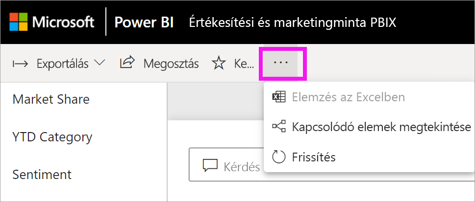

# Q&A a Power BI-**ügyfelek** számára

[!INCLUDE [power-bi-service-new-look-include](../includes/power-bi-service-new-look-include.md)]

## Mi a Q&A?
Ha válaszokat keres az adatokban, néha az a leggyorsabb megoldás, ha természetes nyelven kérdez. Például: „what were total sales last year (mennyi volt az összes értékesítés tavaly).”

A Q&A szolgáltatás könnyen használható, természetes nyelvi funkciókat kínál az adatok elemzéséhez, és kérdéseire grafikonok vagy diagramok formájában ad választ. A Q&A nem keresőmotor – csak a Power BI-ban lévő adatokról szolgáltat eredményeket.

## Mely vizualizációkat használja a Q&A?
A Q&A az éppen megjelenített adatok alapján választja ki a legalkalmasabb vizualizációt. Az alapul szolgáló adathalmaz adatai egy bizonyos típusba vagy kategóriába vannak besorolva, ami segít a Q&A-nak eldönteni, hogy hogyan jelenítse meg azokat. Ha az adat például dátum típusúként van megadva, akkor nagyobb valószínűséggel jelenik meg vonaldiagramként. Városként kategorizált adatok nagyobb valószínűséggel lesznek térképen megjelenítve.

Utasíthatja is a Q&A-t, hogy melyik vizualizációt használja, ha hozzáfűzi azt a kérdéséhez. Azt azonban mindig vegye figyelembe, hogy a Q&A nem mindig tudja a kért vizualizációtípusban megjeleníteni az adatokat. A Q&A felajánlja a használható vizualizációtípusok listáját.

## Hol találom a Q&A-t?
A Q&A a Power BI szolgáltatás irányítópultjain és a Power BI mobilalkalmazás irányítópultjának alján érhető el. Ha a tervező nem adott Önnek szerkesztési jogosultságot, a Q&A-vel feltárhatja az adatokat, azonban nem mentheti a Q&A használatával létrehozott vizualizációkat.

A Q&A-t jelentésekben is megtalálhatja, ha a jelentés *készítője* felvett abba egy [Q&A vizualizációt](../visuals/power-bi-visualization-q-and-a.md).   

## Q&A az irányítópultokon

A **Power BI Q&A** Pro- vagy Premium-licenccel érhető el.  A [Q&A a Power BI-mobilalkalmazásokban](mobile/mobile-apps-ios-qna.md) és a [Q&A a Power BI Embedded használatával](../developer/qanda.md) külön cikkekben szerepelnek. A **Power BI Q&A** jelenleg csak angol nyelven feltett természetes nyelvű kérdéseket támogat, de előzetes verzióban elérhető a spanyol is, amelyet a Power BI-rendszergazda engedélyezhet.

A kérdés megfogalmazása csak az első lépés.  Pontosíthatja vagy kibővítheti a kérdést, megbízható új információkat fedezhet fel, összpontosíthat a részletekre, vagy feltárhatja a szélesebb összefüggéseket, így az adatok feltérképezése valódi élménnyé válik. Örömét lelheti az új eredményekben és felfedezésekben.

Valóban interaktív élmény... és gyors! A memóriabeli tárolás segítségével szinte egy pillanat alatt megkapja a választ.

## A Q&A használata irányítópulton a Power BI szolgáltatásban
A Power BI szolgáltatásban (app.powerbi.com) az irányítópultokon egy vagy több adatkészletből származó csempék vannak rögzítve, így bármely adatkészlet bármely adatával kapcsolatban feltehető kérdés. Ha meg szeretné nézni, hogy mely jelentéseket és adathalmazokat használták fel az irányítópult létrehozásához, válassza a **További műveletek** legördülő menü **Kapcsolódó megtekintése** elemét.

## Hogyan kezdjem meg a használatát?
Először ismerkedjen meg a tartalommal. Tekintse meg az irányítópulton és a jelentésben található vizualizációkat. Mérje fel az elérhető adatok típusát és terjedelmét. 

Például:

* Ha a vizualizáció tengelyfeliratai és értékei között szerepelnek a „sales”, „account”, „month” és „opportunity” szavak, akkor feltehet olyan angol nyelvű kérdéseket, mint: "Which *account* has the highest *opportunity*", vagy "show *sales* by month as a bar chart".

* Ha rendelkezik egy webhely Google Analytics-beli teljesítményadataival, akkor kérdezheti a Q&A-t a weboldalakon töltött időről, az egyedi oldallátogatások számáról és a felhasználói érdeklődés mérőszámairól. Demográfiai adatok lekérdezésekor például az életkor és a háztartások bevétele földrajzi hely szerinti eloszlásáról tehet fel kérdéseket.

Ha már megismerte az adatokat, lépjen vissza az irányítópultra, és helyezze a kurzort a kérdésmezőbe. Ekkor megnyílik a Q&A képernyő.

 

Még mielőtt gépelni kezdene, a Q&A egy új képernyőt nyit meg, amelyen javaslatokkal segít a kérdés megfogalmazásában. Olyan kifejezéseket és kérdéseket fog látni, amelyekben szerepelnek a mögöttes adathalmazok tábláinak nevei, sőt *kiemelt* kérdések is megjelenhetnek, amelyeket az adathalmaz tulajdonosa hozott létre.

Ezek bármelyikét kiválaszthatja és hozzáadhatja a kérdés mezőhöz, és módosíthatja őket meghatározott kérdésekhez. 

 

A Power BI emellett olyan funkciókkal is segíti a kérdések feltételét, mint például a kérdések, az automatikus kiegészítés és a vizuális jelek. A Power BI az irányítópultokon használt Q&A-hez, a jelentésekben használt Q&A-hez, valamint a Q&A-vizualizációhoz biztosítja ezt a segítséget. Ezeket a funkciókat a lenti, [Q&A-vizualizáció létrehozása természetes nyelvi lekérdezés begépelésével](#create-a-qa-visual-by-typing-a-natural-language-query) című szakaszban ismertetjük részletesebben

<!--  -->

## A Q&A-vizualizáció használata Power BI-jelentésekben

A Q&A-vizualizáció lehetővé teszi, hogy természetes nyelven feltett kérdéseire vizualizáció formájában kapja meg a választ. A Q&A-vizualizáció a többi vizualizációhoz hasonlóan viselkedik jelentésekben; biztosítja a keresztszűrés és a keresztkijelölés lehetőségét, és a könyvjelzők és megjegyzések használatát is támogatja. 

A Q&A-vizualizációk a felső kérdésmezőről ismerhetők fel. Ide írhatja be a természetes nyelven megfogalmazott kérdéseket. A Q&A-vizualizációt többször is felhasználhatja arra, hogy az adatokkal kapcsolatos kérdéseket tegyen fel. A jelentés elhagyásakor a Q&A-vizualizáció visszaállítja az alapértelmezéseit. 

## A Q&A használata 
A Q&A irányítópultokon való vagy a Q&A-vizualizáció jelentésekben való használatához választhat a javasolt kérdések közül, vagy begépelheti saját természetes nyelvű kérdését. 

### Q&A-vizualizáció létrehozása javasolt kérdés használatával

Ebben a példában a **top geo states by total units** lehetőséget választottuk. A Power BI megkísérli a lehető legjobb vizualizációtípus kiválasztani. Ebben az esetben ez egy térkép.

De a természetes nyelven megadott lekérdezésekhez hozzáadhatja annak meghatározását is, hogy a Power BI milyen típusú vizualizációt használjon. Vegye figyelembe, hogy nem minden vizualizációtípus fog működni vagy értelmezhető eredményt mutatni az adatokkal. Ezek az adatok például nem ábrázolhatók értelmezhetően egy pontdiagramon. A kartogram azonban jól használható.

### Q&A-vizualizáció létrehozása természetes nyelvi lekérdezés begépelésével

Ha nem biztos a kérdéstípusban vagy a szóhasználatban, bontsa ki az **Összes javaslat megjelenítése** elemet, vagy tekintse át a jelentésben lévő többi vizualizációt. Így megismerheti az adathalmaz szóhasználatát és tartalmát.

1. Gépelje be természetes nyelven megfogalmazott kérdését a Q&A mezőbe. A kérdés beírását a Power BI automatikus kiegészítéssel, vizuális jelzésekkel és visszajelzéssel segíti.

    **Automatikus kiegészítés** – A kérdés beírása közben a Power BI Q&A kapcsolódó és környezetfüggő javaslatokat jelenít meg, hogy gyorsan tudja hatékonyan használni a természetes nyelvet. Gépelés közben azonnali visszajelzést és eredményeket kap. Az élmény ahhoz hasonló, mint amikor egy keresőmotorba gépel.

    Ebben a példában az utolsó javaslatra van szükségünk. 

    

    **Piros/kék aláhúzás** – A Power BI Q&A aláhúzva jeleníti meg a szavakat, így láthatja, hogy a Power BI mely szavakat ismerte fel, és melyeket nem. A folytonos kék aláhúzás azt jelzi, hogy a Power BI felismerte a szót. Az alábbi példában az látható, hogy a Q&A felismerte a **store** (áruház) szót.

    

    A javasolt kérdések legördülő listájának megjelenítéséhez válasszon ki egy kékkel aláhúzott szót. 

    

    Amikor begépel egy szót a Q&A-ben, az gyakran piros aláhúzással van megjelölve. A piros aláhúzás két lehetséges probléma egyikét jelezheti. A problémák első típusa az alacsony megbízhatóság kategóriájába van sorolva. Ha homályos vagy nem egyértelmű szót ír be, a rendszer pirossal húzza alá a mezőt. Ilyen lehet például a Location (Hely) szó. Több mező is tartalmazhatja a Location (Hely) szót, így a rendszer piros aláhúzással kéri, hogy válassza ki a kívánt mezőt. Ebben a példában a Power BI megkéri, hogy válassza ki a VanArsdel kifejezéshez használni kívánt mezőt.
    
    
    
    Az alacsony megbízhatóság egy másik lehetséges példája, ha az area (terület) szót írja be, de az oszlop, amelyre illeszkedik, az a district (kerület). A Power BI Q&A a Bing- és az Office-integrációnak köszönhetően felismeri az azonos jelentésű szavakat. A Q&A pirossal aláhúzza a szót, hogy Ön tudja, hogy az nem közvetlen egyezés

    

    A problémák második típusa akkor fordul elő, ha a Q&A egyáltalán nem ismeri fel a szót. Ennek egy lehetséges példája, ha a geography (földrajzi hely) szót használja, annak ellenére, hogy az adatokban az sehol nem szerepel. A szó megtalálható az angol szótárban, de a Q&A piros aláhúzással jelöli meg a kifejezést. A Power BI Q&A nem tud vizualizációt létrehozni, és azt javasolja, hogy kérje a kifejezés hozzáadását a jelentés készítőjétől.

    

    **Javaslatok** – Ahogy előrehalad a kérdés beírásával, a Power BI értesíti, ha nem érti a kérdést, és megpróbál segíteni. Az alábbi példában a Power BI felteszi a „Did you mean...” (Arra gondolt hogy...) kérdést, és javaslatot tesz egy másik szó használatára az adathalmazból. 

    

    A Power BI által javasolt módosítás kiválasztása után az eredmények vonaldiagramon jelennek meg. 

    

    A vonaldiagramot azonban más típusú vizualizációvá is alakíthatja.  

    

## Megfontolandó szempontok és hibaelhárítás

**Kérdés**: Nem látom a Q&A-t ezen az irányítópulton.    
**1. válasz**: Ha nem látja a kérdésmezőt, először ellenőrizze a beállításokat. Ehhez kattintson a Power BI-eszköztár jobb felső sarkában lévő fogaskerék ikonra.   

Ezután válassza a **Beállítások** > **Irányítópultok** elemet. Ellenőrizze, hogy látható-e pipa a **Q&A-keresőmező megjelenítése ezen az irányítópulton** beállítás mellett.    
  

**2. válasz**: Bizonyos helyzetekben nem fog hozzáférni a beállításokhoz. Ha az irányítópult *készítője* vagy a rendszergazda kikapcsolta a Q&A-t, akkor tőlük kell megkérdeznie, hogy visszakapcsolhatja-e.   

**Kérdés**: Nem a várt eredményeket látom, amikor beírok egy kérdést.    
**Válasz**: Válassza ki a jelentés vagy irányítópult tulajdonosával való kapcsolatfelvétel lehetőségét. Ezt megteheti közvetlenül a Q&A irányítópult oldaláról vagy a Q&A-vizualizációból. A tulajdonos kilétét a Power BI fejlécéből is kiolvashatja.  A tervező sok mindent tehet a Q&A-eredmények javítása érdekében. A tervező például átnevezheti az adatkészlet oszlopait, hogy azok könnyebben érhető kifejezéseket használjanak (`CustomerFirstName``CustFN` helyett). Mivel a tervező ismeri igazán jól az adathalmazt, hasznos kérdéseket is megfogalmazhat, és felveheti azokat a Q&A által javasolt kérdések közé.

## Következő lépések
Azt, hogy a *készítőik* hogyan hozzák létre és kezelik a Q&A-vizualizációkat, a [Q&A-vizualizációtípus](../visuals/power-bi-visualization-q-and-a.md) című cikkből tudhatja meg.
