<!-- once the sample apps are live, change this so consumers can follow along -->
# Rövid útmutató: A Power BI ***felhasználói*** képességeivel kapcsolatos tudnivalók
Ebből a rövid útmutatóból megtudhatja, hogyan használhatja a Power BI-t az adatokon alapuló üzleti megállapítások felfedezéséhez. Ez a cikk nem részletes ismertető, sokkal inkább a Power BI-**felhasználók** számára elérhető műveletek rövid áttekintése.

Ha még nem regisztrált a Power BI-ra, a kezdés előtt [hozzon létre egy ingyenes próbaverziós fiókot](https://app.powerbi.com/signupredirect?pbi_source=web).

## Előfeltételek
- Power BI service (app.powerbi.com)
<!-- app from AppSource -->

## Olvasó nézet
A Power BI szolgáltatásban az Olvasó nézet elérhető a *jelentésfelhasználók* számára. Ha egy munkatársa megoszt Önnel egy jelentést, azt az Olvasó nézetben felfedezheti és kezelheti. 

A Power BI szolgáltatás másik jelentési módja a *jelentéstervezők* számára elérhető [Szerkesztési nézet](../service-interact-with-a-report-in-editing-view.md).  

Az Olvasó nézet hatékony és biztonságos eszköz az irányítópultok és a jelentések megtekintéséhez. Az Önnel megosztott irányítópultok és jelentések szeletelése során az alapul szolgáló adathalmazok változatlanok maradnak. 

Olvasó nézetben olyan műveleteket végezhet, mint az oldalon szereplő vizualizációk keresztkiemelése és keresztszűrése.  Egyszerűen csak emelje ki vagy válassza ki egy vizualizáció egy értékét, és a többi vizualizáción azonnal látni fogja ennek hatását. A Szűrők ablaktáblán új szűrőket adhat hozzá egy jelentésoldalhoz, vagy módosíthatja a meglévőket, illetve módosíthatja a vizualizációk értékeinek rendezését is. Ez csak néhány a Power BI *felhasználói* képességei közül.  Ha többet szeretne megtudni, olvasson tovább.

 
### Alkalmazás megtekintése
A Power BI-ban az *alkalmazások* egy helyre csoportosítják az egymáshoz kapcsolódó irányítópultokat és jelentéseket.

1. Válassza az **Alkalmazások**  > **Alkalmazások letöltése** lehetőséget. 
   
     
2. Az AppSource-ban, a **Saját szervezet** területen kereséssel szűkítse az eredményeket, hogy megtalálja a keresett alkalmazást.
   
     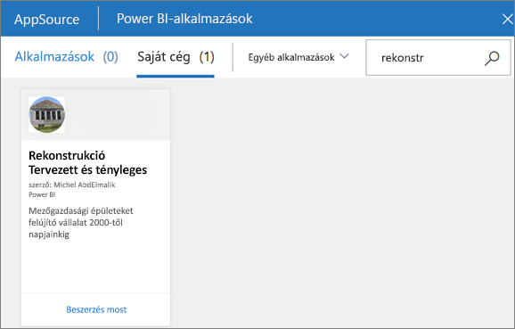
3. A **Letöltés most** lehetőséget választva adhatja hozzá az alkalmazások tárolójához. 

### Irányítópult megtekintése
Ez az alkalmazás egy irányítópultot nyit meg. A Power BI-***irányítópult*** egy gyakran vászonnak is nevezett oldal, amely vizualizációk segítségével mesél el egy történetet. Mivel az irányítópult egyetlen lapon jelenik meg, ezért a jól megtervezett irányítópult csak a történet legfontosabb elemeit tartalmazza.

Az irányítópulton látható vizualizációkat *csempéknek* nevezik, és a jelentésekből *rögzíthetők* az irányítópultra.

### Feliratkozás irányítópultra (vagy jelentésre)
Egy irányítópult monitorozásához nem szükséges megnyitni a Power BI-t.  Helyette feliratkozhat, és a Power BI a megadott ütemezés szerint e-mailben elküldi az adott irányítópultról készült pillanatfelvételt. 

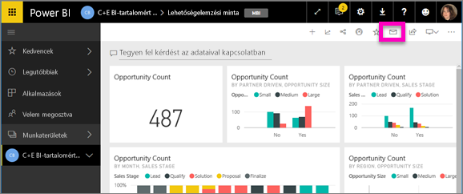.

1. A felső menüsávon válassza a **Feliratkozás** lehetőséget vagy a boríték ikont .
   
   

3. A feliratkozást a sárga csúszkával kapcsolhatja be és ki.  Ha szeretné, az e-mail-üzenet részleteit is megadhatja. 

    Az alábbi képernyőfelvételeken figyelje meg, hogy amikor feliratkozik egy jelentésre, akkor valójában egy jelentés*oldalra* iratkozik fel.  Ha egy jelentésben több oldalra is fel szeretne iratkozni, válassza a **Másik előfizetés hozzáadása** lehetőséget, és válasszon ki egy másik oldalt. 
      
   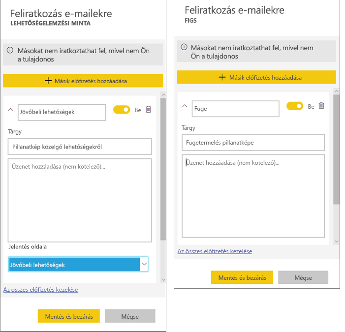
   
    A jelentésoldal frissítésével az adathalmaz nem frissül. Egy adathalmaz manuális frissítését csak annak tulajdonosa végezheti el. Az alapul szolgáló adathalmaz(ok) nevének megkereséséhez kattintson a felső menüsávon található **Kapcsolódó megtekintése** elemre.

### Kapcsolódó tartalom megtekintése
A **Kapcsolódó tartalom** ablaktáblában megtekintheti, hogyan vannak összekapcsolva a különböző Power BI-tartalmak – irányítópultok, jelentések és adatkészletek. Az adattábla nem csak a kapcsolódó tartalmakat jeleníti meg, hanem műveletek elvégzését is lehetővé teszi rajtuk, és megkönnyíti a navigációt is közöttük.

Egy irányítópulton vagy egy jelentésben kattintson a felső menüsávon található **Kapcsolódó megtekintése** elemre.

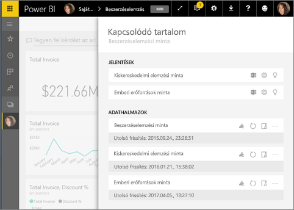

### Kérdések feltétele természetes nyelven a Q&A használatával
Ha válaszokat keres az adatokban, néha az a leggyorsabb megoldás, ha természetes nyelven kérdez. A Q&A kérdésmező az irányítópult tetején található. Pl.: „nagy lehetőségek megjelenítése tölcsérdiagram formájában értékesítési fázis szerint”. 

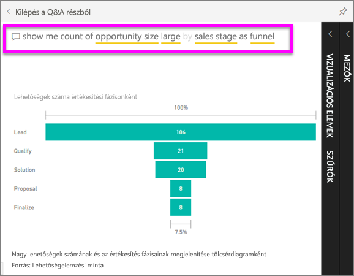

### Irányítópult kedvencnek jelölése
Ha egy tartalmat felvesz a *kedvencek* közé, akkor a bal oldali navigációs sávból is elérheti. A bal oldali navigációs sáv a Power BI szinte minden területéről látható. A kedvencek általában a leggyakrabban látogatott irányítópultok, jelentésoldalak és alkalmazások.

1. Az irányítópulthoz való visszatéréshez lépjen ki a Q&A-ből.    
2. A Power BI szolgáltatás jobb felső sarkában kattintson a **Kedvenc** elemre, vagy a csillag   ikonra.
   
   

### Jelentés, illetve jelentésoldalak megnyitása és megtekintése
A jelentések egy vagy több oldalnyi vizualizációból állnak. A jelentéseket a Power BI *jelentéstervezői* hozzák létre, és [megosztják őket a *felhasználókkal* közvetlenül](end-user-shared-with-me.md) vagy egy [alkalmazás](end-user-apps.md) részeként. 

A jelentések egy irányítópultról nyithatóak meg. A legtöbb estben az irányítópultok csempéi jelentésekből vannak *rögzítve*. Egy adott csempére kattintva megnyílik a csempe létrehozásához használt jelentés. 

1. Egy irányítópult kattintson egy csempére. Ebben a példában a „Revenue” (Árbevétel) oszlopdiagram csempéjét választottuk.

    

2.  Ekkor megnyílik a hozzá tartozó jelentés. Látható, hogy most a „Revenue overview” (Árbevétel áttekintése) oldalon vagyunk. Ez a jelentésoldal tartalmazza azt az oszlopdiagramot, amelyet az irányítópulton választottunk ki.

    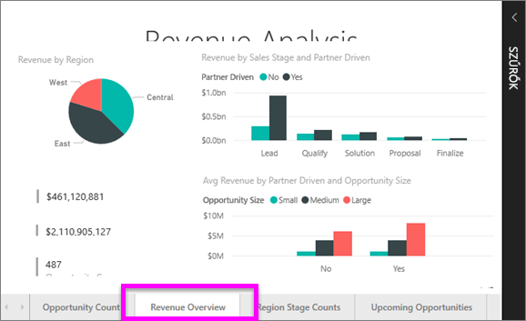

### Megjelenítés méreteinek módosítása
A jelentéseket több különböző eszközön is megtekintik, amelyek képernyőjének eltérő a mérete vagy a méretaránya.  Előfordulhat, hogy nem az alapértelmezett megjelenítést a megfelelő az eszközén.  

1. A beállításhoz a felső menüsávon kattintson a **Nézet** elemre.

    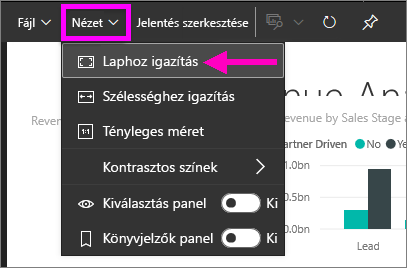

2.  Válasszon az elérhető megjelenítési lehetőségek közül. Ebben a példában a **Laphoz igazítás** lehetőséget választottuk.

    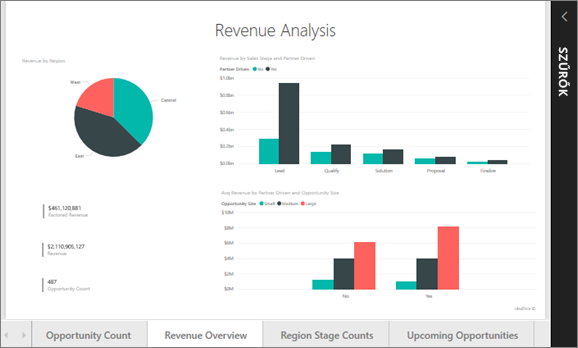    

### A jelentés Szűrők paneljének használata
Ha a jelentés készítője szűrőket adott hozzá egy jelentéshez, azok használhatók, a változások pedig menthetők a jelentésben.

1. Kattintson a **Szűrők** ikonra a jobb felső sarokban.
   
     

2. Tegyen aktívvá egy vizualizációt kijelöléssel. Ekkor megjelenik minden szűrő, amelyet az adott vizualizációra (Vizualizációszintű szűrők), a teljes jelentésoldalra (Lapszintű szűrők), illetve az egész jelentésre (Jelentési szint szűrői) alkalmaztak.
   
   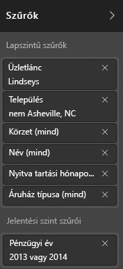

3. Helyezze a kurzort egy szűrő fölé, majd bontsa ki a lefelé mutató nyíl választásával.
   
   

4. Módosítsa a szűrőt, majd nézze meg, hogy ez milyen hatással van a vizualizációkra.  
   
     
     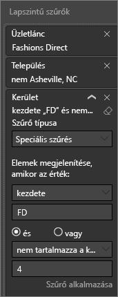

### Látható, hogy az egy oldalon szereplő összes vizualizáció kapcsolódik egymáshoz.
Alkalmazzon keresztkiemelést és keresztszűrést az egy oldalon lévő, egymáshoz kapcsolódó vizualizációkon. Egy jelentésben az egy jelentésoldalon található vizualizációk mind „összeköttetésben” állnak.  Ez azt jelenti, hogy ha egy vizualizációban egy vagy több értéket kiválaszt, az ugyanazt az értéket használó többi vizualizáció is megváltozik a kijelölés alapján.

> 
### Részletek megjelenítése egy vizualizációban
Vizualizáció részleteinek megjelenítése rámutatással

### Vizualizáció rendezése
Az egy jelentésoldalon szereplő vizualizációk rendezhetők, illetve az alkalmazott módosításokkal menthetők. 

1. Tegyen aktívvá egy vizualizációt úgy, hogy fölé viszi az egérmutatót.    
2. A rendezési beállítások megnyitásához kattintson a három pontra (…).

     

###  A **Kiválasztás** panel megnyitása
Könnyedén navigálhat az jelentésoldalon található vizualizációk között. 

1. A Kiválasztás panel megnyitásához kattintson a **Megtekintés > Kiválasztás panel** elemre. A **Kiválasztás panel** beállítást állítsa Be értékre.

    

2. A Kiválasztás panel megnyílik a jelentésvásznon. Tegyen aktívvá egy, a listában szereplő vizualizációt kijelöléssel.

    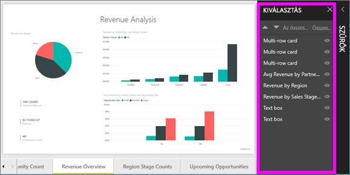

### Önálló vizualizáció nagyítása
Helyezze a kurzort egy vizualizáció fölé, majd válassza a **Fókusz mód** ikont . Ha egy vizualizációt Fókusz módban jelenít meg, akkor az kitölti az egész jelentésvásznat, ahogyan az alábbi képen is látható.

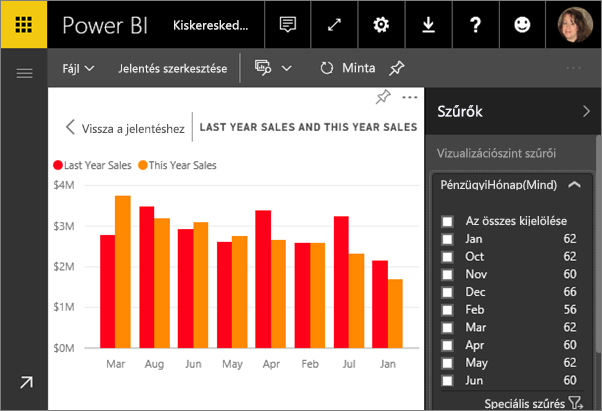

Ha ugyanezt a vizualizációt a zavaró menüsávok, a szűrők ablaktábla vagy egyéb sötét színű elemek nélkül szeretné megjeleníteni, válassza a menüsáv tetején található **Teljes képernyő** ikont  .

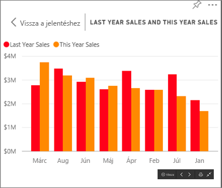

### A vizualizáció létrehozásához használt adatok megjelenítése
A Power BI-vizualizációk az alapul szolgáló adathalmazokból származó adatokból jönnek létre. Ha látni szeretné a háttérfolyamatokat, a Power BI-jal *megjelenítheti* a vizualizáció létrehozásához használt adatokat. Amikor az **Adatok megjelenítése** elemet választja, a Power BI megjeleníti a vizualizáció alatt (vagy mellett) lévő adatokat.

1. Nyisson meg egy jelentést, és válasszon ki egy vizualizációt a Power BI szolgáltatásban.  
2. A vizualizáció mögötti adatok megjelenítéséhez kattintson a három pontra (…), és válassza az **Adatok megjelenítése** elemet.
   
   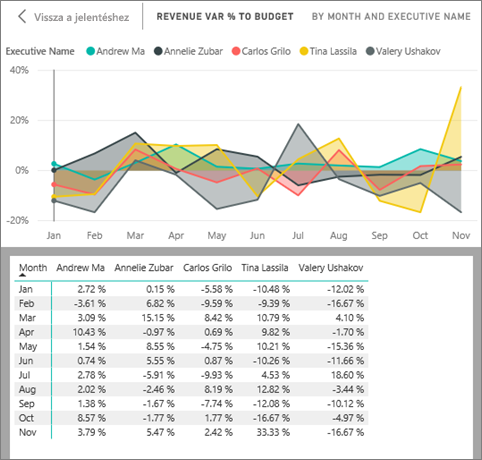

Ez volt a Power BI szolgáltatás **felhasználói** műveleteinek rövid áttekintése.  

## Erőforrások felszabadítása
- Ha alkalmazáshoz csatlakozott, nyissa meg az alkalmazások tartalmának listáját a bal oldali navigációs panelen az **Alkalmazások** elemre kattintva. Vigye az egérmutatót a törölni kívánt alkalmazás fölé, majd kattintson a kukát ábrázoló ikonra.

- Ha egy Power BI-jelentésmintát importált, vagy ahhoz csatlakozott, a bal oldali navigációs sávon nyissa meg a **Saját munkaterületet**. A felül található lapok használatával keresse meg az irányítópultot, jelentést és adathalmazt, és mindegyiknél kattintson a kukát ábrázoló ikonra.

## Következő lépések

