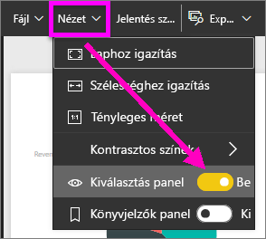

# Rövid útmutató: A Power BI *felhasználói* képességeivel kapcsolatos tudnivalók
Ebből a rövid útmutatóból megtudhatja, hogyan használhatja a Power BI-t az adatokon alapuló üzleti megállapítások felfedezéséhez. Ez a cikk nem részletes ismertető, sokkal inkább a Power BI-**felhasználók** számára elérhető műveletek rövid áttekintése.

Ha még nem regisztrált a Power BI-ra, a kezdés előtt [hozzon létre egy ingyenes próbaverziós fiókot](https://app.powerbi.com/signupredirect?pbi_source=web).

## A Power BI bemutatása 
A Power BI olyan szoftverszolgáltatások, alkalmazások és összekötők gyűjteménye, amellyel az egymástól független adatforrásokat egymással együttműködő, vizuálisan megragadó, interaktív elemzésekké alakítja. Akár egyszerű Excel-táblákból, akár különböző adatforrásokból származó adatgyűjteményekből állnak az adatai, a Power BI segítségével könnyedén összekötheti az adatforrásokat, vizualizálhatja (vagy feltárhatja) a fontos részleteket, és megoszthatja az így kapott információt bárkivel, akivel csak szeretné. 

## Olvasó nézet
A Power BI szolgáltatásban az Olvasó nézet elérhető a *jelentésfelhasználók* számára. Ha egy munkatársa megoszt Önnel egy jelentést, irányítópultot vagy alkalmazást, azt az Olvasó nézetben felfedezheti és kezelheti. 

Mindössze meg kell nyitnia a Power BI szolgáltatást egy böngészőben vagy a mobileszközön. Ön és munkatársai ugyanazokat a megbízható alkalmazásokat, irányítópultokat és jelentéseket használják, amelyek automatikusan frissülnek, így mindenki mindig a legfrissebb tartalommal dolgozhat.   

Mivel a tartalom nem statikus, azokat mélyebben is megvizsgálhatják, és trendeket, információkat és más üzletiintelligencia-elemzéseket tárhatnak fel. A tartalmat szeletelheti és más módon is rendszerezheti, sőt akár saját szavaival is feltehet kérdéseket. Vagy egyszerűen megvárhatja, hogy az adatokból érdekes információk szülessenek, értesítéseket kérhet az adatváltozásokról, és e-mailben kaphat jelentéseket az Ön által megadott ütemezés szerint. Az összes adata bármikor, a felhőben vagy a helyszínen is bármely eszközről elérhető. 

Ha többet szeretne megtudni, olvasson tovább.

## Power BI-tartalom
Amikor a „tartalom” kifejezést használjuk a Power BI-ban, jelentésekről, irányítópultokról és alkalmazásokról beszélünk. Ezek azok az építőelemek, amelyekkel feltárhatja az adatokat, és üzleti döntéseket hozhat. 

> [!NOTE]
> Az irányítópultok, jelentések és alkalmazások megtekinthetők és megoszthatók mobileszközökön is.

###  Alkalmazások

Az *alkalmazás* egy olyan Power BI-tartalomtípus, amely az összetartozó irányítópultokat és jelentéseket egy helyen kombinálja. Egy alkalmazás egy vagy több irányítópultot és egy vagy több jelentést tartalmazhat egy csomagban. Az alkalmazásokat Power BI-*tervezők* hozzák létre, majd terjesztik és osztják meg az olyan *fogyasztókkal*, mint Ön. 

Az alkalmazások megtekintésének egyik lehetősége a navigációs sáv **Alkalmazások** elemének, majd egy alkalmazás kiválasztása.

További információ az alkalmazások megtekintéséről: [Power BI-alkalmazások](end-user-apps.md)

### Jelentések

A Power BI-jelentések az adathalmazok többszempontú nézetei, amelyek az adathalmazból származó különféle eredményeket és megállapításokat bemutató vizualizációkat tartalmaznak. A jelentések egyetlen vagy akár több oldalnyi vizualizációt is tartalmazhatnak. A jelentéseket Power BI-*tervezők* hozzák létre, majd terjesztik és osztják meg az olyan *fogyasztókkal*, mint Ön.

A jelentések megtekintéséről a [Power BI-jelentések](end-user-reports.md) oldalán tájékozódhat

### Irányítópultok

A Power BI-irányítópult egy gyakran vászonnak is nevezett oldal, amely vizualizációk segítségével mesél el egy történetet. Mivel az irányítópult egyetlen lapon jelenik meg, ezért a jól megtervezett irányítópult csak a történet legfontosabb elemeit tartalmazza.

Az irányítópulton látható vizualizációkat csempéknek nevezik, és a *jelentéstervezők* rögzítik őket az irányítópultra. A legtöbb esetben a csempe kiválasztásával arra a jelentésoldalra jut, amelyen a vizualizációt létrehozták. 

Az irányítópultok megtekintéséről a [Power BI-irányítópultok](end-user-dashboards.md) oldalán tájékozódhat
 
## A Power BI szolgáltatás interakciói

### Munkatársakkal való együttműködés
Felejtse el az e-mailezést. Hozzáadhat személyes megjegyzéseket, vagy az irányítópultra vonatkozó beszélgetést kezdeményezhet a munkatársaival közvetlenül az irányítópult felületén. A megjegyzés csak az egyik olyan funkció a sok közül, amely lehetővé teszi a másokkal való együttműködést. 

További információ a [megjegyzésekről](end-user-comment.md)

### Dőljön hátra, és bízza a Power BI-ra a munkát
A Power BI szolgáltatás előfizetésekkel és riasztásokkal segít megkönnyíteni az Ön dolgát. 

#### Feliratkozás irányítópultra (vagy jelentésre)
Egy irányítópult monitorozásához nem szükséges megnyitni a Power BI-t.  Helyette feliratkozhat, és a Power BI a megadott ütemezés szerint e-mailben elküldi az adott irányítópultról készült pillanatfelvételt. 

.

 További információ a [Power BI-előfizetésekről](end-user-subscribe.md)

#### Riasztások az adatok küszöbérték-meghaladásáról
A vizualizációk az automatikus frissítéseknek köszönhetően tükrözik az élő adatokat. Ha értesítést szeretne kapni arról, ha az adatok egy beállított küszöb alá vagy fölé kerülnek, használjon riasztásokat. A riasztások működnek a mérőműszereken, KPI-ken és a kártyákon.    

A Power BI e-mailben értesíti Önt, ha az érték a megadott korlát alá vagy fölé kerül.  

További információ a [Power BI-riasztásokról](end-user-alerts.md)

### Kérdések feltétele természetes nyelven a Q&A használatával
Ha válaszokat keres az adatokban, néha az a leggyorsabb megoldás, ha természetes nyelven kérdez. A Q&A kérdésmező az irányítópult tetején található. Pl.: „nagy lehetőségek megjelenítése tölcsérdiagram formájában értékesítési fázis szerint”. 

További információ a [Power BI Q&A-ről](end-user-q-and-a.md)

### Részletek megjelenítése egy vizualizációban
A vizualizációk adatpontokból állnak, amelyek részleteit megtekintheti, ha föléjük helyezi a kurzort.

### Irányítópult kedvencnek jelölése
Ha egy tartalmat felvesz a *kedvencek* közé, akkor a navigációs sávból is elérheti. A navigációs sáv a Power BI szinte minden területéről látható. A kedvencek általában a leggyakrabban látogatott irányítópultok, jelentésoldalak és alkalmazások.

A Power BI szolgáltatás jobb felső sarkában válassza a **Kedvenc** lehetőséget, vagy ha az nem látható, a **További lehetőségek** (...), majd a legördülő menüben megjelenő **Kedvenc** elemet. 
   

Tekintse meg a legördülő menüben elérhető egyéb műveleteket.  Ebben a cikkben nem tárgyaljuk mindet, azonban más cikkekben igen.  További információ a Power BI tartalomjegyzékének vagy **keresőmezőjének** használatáról. 

További információ a [kedvencekről és a kiemelt funkciókról](end-user-favorite.md)

### Megjelenítés méreteinek módosítása
A jelentéseket több különböző eszközön is megtekintik, amelyek képernyőjének eltérő a mérete vagy a méretaránya.  Előfordulhat, hogy nem az alapértelmezett megjelenítést a megfelelő az eszközén.  

A beállításhoz a jobb felső menüsorban válassza a **Nézet** lehetőséget, majd válasszon egy megjelenítési beállítást. 

### Látható, hogy az egy oldalon szereplő összes vizualizáció kapcsolódik egymáshoz.
Alkalmazzon keresztkiemelést és keresztszűrést az egy jelentésoldalon lévő, egymáshoz kapcsolódó vizualizációkon. Egy jelentésben az egy jelentésoldalon található vizualizációk mind „összeköttetésben” állnak.  Ez azt jelenti, hogy ha egy vizualizációban egy vagy több értéket kiválaszt, az ugyanazt az értéket használó többi vizualizáció is megváltozik a kijelölés alapján.

> 

További információ a [vizualizációk interakcióiról](end-user-interactions.md)

<!-- ###  Open the **Selection** pane
Easily navigate between the visualizations on the report page. 

1. Select **View > Selection pane** to open the Selection pane. Toggle **Selection pane** to On.

    

2. The Selection pane opens on your report canvas. Select a visual from the list to make it active.

     -->

### Önálló vizualizáció nagyítása
Helyezze a kurzort egy vizualizáció fölé, majd válassza a **Fókusz mód** ikont . Ha egy vizualizációt Fókusz módban jelenít meg, akkor az kitölti az egész jelentésvásznat, ahogyan az alábbi képen is látható.

<!-- To display that same visualization without the distraction of menubars, filter pane, and other chrome -- select the **Full Screen** icon from the top menubar    .

 -->

További információ a [fókusz módról és a teljes képernyős módról](end-user-focus.md)

### Vizualizáció rendezése
Az egy jelentésoldalon szereplő vizualizációk rendezhetők, illetve az alkalmazott módosításokkal menthetők. 

Mutasson rá egy vizualizációra annak aktiválásához, majd a rendezési beállítások megnyitásához kattintson a **További lehetőségek** (…) elemre.

 

További információ a [vizualizációk rendezéséről](end-user-search-sort.md)

### A vizualizáció létrehozásához használt adatok megjelenítése
A Power BI-vizualizációk az alapul szolgáló adathalmazokból származó adatokból jönnek létre. Ha látni szeretné a háttérfolyamatokat, a Power BI-jal *megjelenítheti* a vizualizáció létrehozásához használt adatokat. Amikor az **Adatok megjelenítése** elemet választja, a Power BI megjeleníti a vizualizáció alatt (vagy mellett) lévő adatokat.

Ha a vizualizáció aktív, válassza a **További lehetőségek** (...), majd az **Adatok megjelenítése** lehetőséget.
   
   

### Adatok exportálása Excelbe
A vizualizáció létrehozásához használt adatok megjelenítésén kívül exportálhatja is azokat, majd megtekintheti a Microsoft Excelben. Az Excelbe való exportáláskor egy különálló dokumentumot hoz létre, amely nem része Power BI-nak. Az Excel-fájlban végrehajtott módosítások nem érintik a Power BI-adatokat. Akár részletesebben szeretné megvizsgálni az adatokat, akár egy másik alkalmazásban vagy más célra szeretné felhasználni őket, a Power BI rugalmasságot biztosít minden esethez.

<!-- Exporting isn’t limited to individual visuals; you can export entire reports to PowerPoint or PDF to share with your colleagues.

 -->

Ez volt a Power BI szolgáltatás *felhasználói* műveleteinek rövid áttekintése.  

## Erőforrások felszabadítása
- Ha alkalmazáshoz csatlakozott, nyissa meg az alkalmazások tartalmának listáját a bal oldali navigációs panelen az **Alkalmazások** elemre kattintva. Vigye az egérmutatót a törölni kívánt alkalmazás fölé, majd kattintson a kukát ábrázoló ikonra.

- Ha egy Power BI-jelentésmintát importált, vagy ahhoz csatlakozott, a bal oldali navigációs sávon nyissa meg a **Saját munkaterületet**. A felül található lapok használatával keresse meg az irányítópultot, jelentést és adathalmazt, és mindegyiknél kattintson a kukát ábrázoló ikonra.

## Következő lépések
[Power BI felhasználók számára](end-user-consumer.md)

