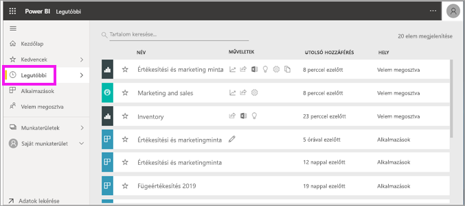
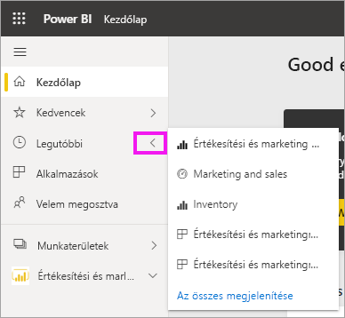
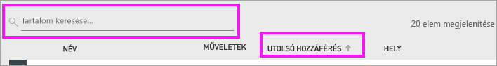

# **Legutóbbi** tartalom keresése a Power BI szolgáltatásban
A legutóbbi tartalom a Power BI szolgáltatásban legutóbb megtekintett legfeljebb 20 tételt jelenti.  Ezek között szerepelhetnek irányítópultok, jelentések, alkalmazások, munkafüzetek.

Tekintse meg Amanda bemutatójában, hogyan alakul ki a Power BI szolgáltatásban a **Legutóbbi** lista, majd a videó alatti utasításokat követve próbálja ki Ön is.

<iframe width="560" height="315" src="https://www.youtube.com/embed/G26dr2PsEpk" frameborder="0" allowfullscreen></iframe>

> [!NOTE]
> Ez a videó a Power BI szolgáltatás egy régebbi verzióját használja.

## A legutóbbi tartalom megjelenítése
Az öt legutóbb megtekintett elem listájának megjelenítéséhez kattintson a **Legutóbbi** lehetőség melletti jobbra mutató nyílra a navigációs panelen.  Innen kiválaszthatja azt a legutóbbi tartalmat, amelyet meg szeretne nyitni. Csak az öt legutóbbi elem jelenik meg a listán.

Ha ötnél több elemet tekintett meg, kattintson az **Összes megjelenítése** lehetőségre a Legutóbbi képernyő megjelenítéséhez. A képernyőt a navigációs panel **Legutóbbi** lehetőségére, illetve a Legutóbbi  ikonjára kattintva is megjelenítheti.

## A **Legutóbbi** tartalomlistában elérhető műveletek
Az elérhető műveletek a tartalom *tervezője* által hozzárendelt beállításoktól függenek. Íme néhány lehetőség:
* [Irányítópult, jelentés vagy alkalmazás kedvencként való megjelöléséhez](end-user-favorite.md) kattintson a .
* Egyes irányítópultok és jelentések újból megoszthatók  .
* [Nyissa meg a jelentést az Excelben](end-user-export.md)  
* Az  megtekintheti a Power BI által az adatokon végzett [elemzéseket](end-user-insights.md).
* Emellett, hosszú listák esetén [a keresőmező és a szűrési lehetőségek használatával kereshet](end-user-search-sort.md). Ha meg szeretné tudni, hogy egy oszlop rendezhető-e, helyezze fölé a kurzort, és várja meg, hogy megjelenik-e egy nyíl. Ebben a példában a **Legutóbbi hozzáférés** fölé helyezett kurzor megjelenít egy nyilat, a legutóbbi tartalmak így a hozzáférés dátuma szerint rendezhetők. 

    

## Következő lépések
[Power BI szolgáltatás ‒ Alkalmazások](end-user-apps.md)

További kérdései vannak? [Kérdezze meg a Power BI közösségét](http://community.powerbi.com/)

