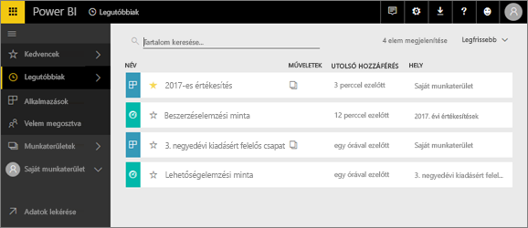
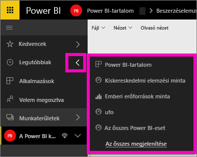
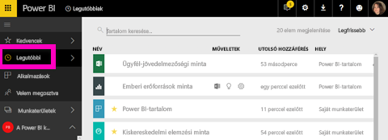

# A **Legutóbbi** tartalom megtekintése a Power BI szolgáltatásban
A legutóbbi tartalom a Power BI szolgáltatásban legutóbb megtekintett legfeljebb 20 tételt jelenti.  Ezek között szerepelhetnek irányítópultok, jelentések, alkalmazások és munkafüzetek az összes munkaterületről.

Tekintse meg Amanda bemutatójában, hogyan alakul ki a Power BI szolgáltatásban a **Legutóbbi** lista, majd a videó alatti utasításokat követve próbálja ki Ön is.

<iframe width="560" height="315" src="https://www.youtube.com/embed/G26dr2PsEpk" frameborder="0" allowfullscreen></iframe>

## A legutóbbi tartalom megjelenítése
Az öt legutóbb megtekintett elem listájának megjelenítéséhez kattintson a **Legutóbbi** lehetőség melletti jobbra mutató nyílra a bal oldali navigációs panelen.  Innen kiválaszthatja azt a legutóbbi tartalmat, amelyet meg szeretne nyitni. Csak az öt legutóbbi elem jelenik meg a listán.

Ha ötnél több elemet tekintett meg, kattintson az **Összes megjelenítése** lehetőségre a Legutóbbi képernyő (lásd alább) megjelenítéséhez. A képernyőt a navigációs panel **Legutóbbi** lehetőségére, illetve a Legutóbbi  ikonjára kattintva is megjelenítheti.

Innen ugyanúgy használhatja a tartalmakat, ahogyan az [**Irányítópultok**](end-user-dashboards.md), [**Jelentések**](end-user-reports.md), **Munkafüzetek** egyes lapjairól, illetve az Alkalmazások <!--[**Apps**](end-user-apps.md)--> képernyőről.

## Következő lépések
<!--[Power BI service Apps](end-user-apps.md)-->

További kérdései vannak? [Kérdezze meg a Power BI közösségét](http://community.powerbi.com/)

